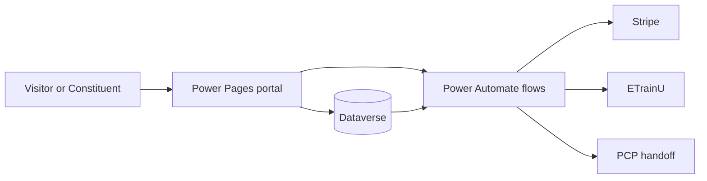

# 00 Platform Overview

## Purpose
Explain what DSR is, what the NFP Data Platform is, and how the main pieces fit together before the reader moves into the detailed process and component pages.

## What is DSR?
DSR is the public-facing portal and process layer implemented in this repository. It lets a visitor discover offerings, start an acceptance, pay when required, complete course or fulfilment steps, and then return to a completion page. The same platform also drives tagging, reporting, and external handoffs after the portal interaction.

## What is the NFP Data Platform?
The NFP Data Platform is the underlying Power Pages, Dataverse, and Power Automate solution pattern that DSR uses. In practice, it provides:
- Power Pages for user-facing pages and forms.
- Dataverse for records, state, and configuration.
- Power Automate for orchestration and external integration.

## What problem does the implementation solve?
It gives DSR a single platform for publishing offerings, capturing acceptance, collecting payment, provisioning course access, and updating engagement or segmentation state without hard-coding every business rule into a portal page.

## Who uses it?
- Site visitors and constituents who browse offerings and complete acceptance journeys.
- Operations and content teams who manage offerings, galleries, navigation, and follow-up processes.
- Support and integration teams who monitor flows, payment state, course provisioning, and tag updates.

## Major business capabilities
- Navigation and menu system.
- Page rendering and portal composition.
- Web gallery configuration and content discovery.
- Offering management and acceptance capture.
- Payment processing.
- Course management and ETrainU provisioning.
- Segment tag management.
- External export and fulfilment handoff.
- PCP export boundary for outbound call-list files.

## Major user journeys
- A visitor opens the site, navigates, and browses a gallery.
- A visitor opens an offering and starts acceptance.
- A visitor pays when the offering requires payment.
- A learner or organisation completes the course-access path and is provisioned into ETrainU.
- Support or automation processes update segment tags for routing, reporting, or suppression.

## Major technical components
- Power Pages page templates and web templates.
- Dataverse tables for offerings, acceptance, payments, course mapping, and segment tags.
- Power Automate child flows and orchestration flows.
- Stripe webhook and payment APIs.
- ETrainU API calls.
- PCP file-export boundary processes.

## External systems integrated
- Stripe.
- ETrainU.
- Azure Logic App / SharePoint handoff for PCP exports.
- Customer Insights / Journeys dependencies, where present in solution metadata.

## How a new team member should approach the detailed documentation
1. Read this overview.
2. Read [01-business-capability-model.md](01-business-capability-model.md) and [02-solution-architecture.md](02-solution-architecture.md).
3. Use [03-end-to-end-process-map.md](03-end-to-end-process-map.md) and [06-system-walkthrough.md](06-system-walkthrough.md) to understand the journeys.
4. Use the reference matrices to trace tables, flows, templates, integrations, and security.
5. Use the domain deep-dives when a process needs more detail.

## Platform at a glance

## Evidence summary
- Confirmed portal patterns: acceptance router, gallery routing, payment sections, and course acceptance sections.
- Confirmed automation patterns: acceptance orchestration, Stripe webhooks, ETrainU child flows, and segment tag flows.
- Confirmed data patterns: offerings, acceptances, payment transactions, course mappings, and segment tag membership rows.

## Related documents
- [01-business-capability-model.md](01-business-capability-model.md)
- [02-solution-architecture.md](02-solution-architecture.md)
- [03-end-to-end-process-map.md](03-end-to-end-process-map.md)
- [04-dataverse-process-map.md](04-dataverse-process-map.md)
- [PCP documentation](pcp/README.md)
- [reference/repository-discovery.md](reference/repository-discovery.md)
