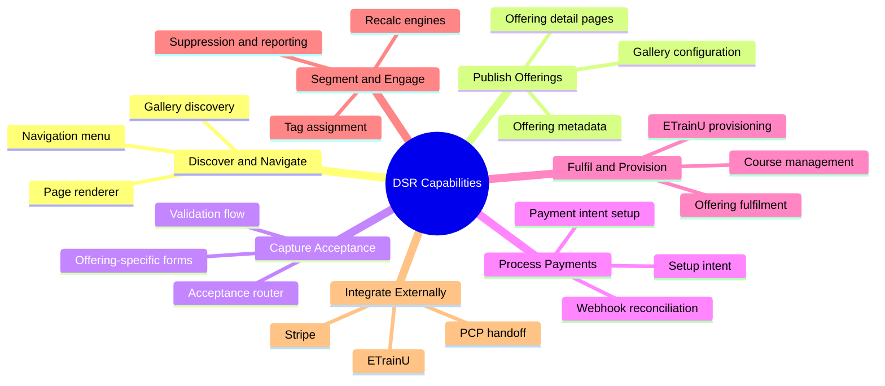

# 01 Business Capability Model

## Purpose
Define the business capabilities implemented by DSR and map each capability to the processes, systems, and documents that support it.

## Capability model

## Capability matrix
| Capability | Business purpose | Users | Supporting processes | Supporting systems | Documentation links |
|---|---|---|---|---|---|
| Discover and navigate | Help people find relevant parts of the site | Site visitor, content admin | Navigation rendering, page rendering, gallery browsing | Power Pages, Dataverse | [navigation](navigation/navigation.md), [portal rendering](portal-rendering/portal-rendering.md), [web gallery](web-gallery/web-gallery.md) |
| Publish offerings | Present the public catalogue and the right next step | Content admin, visitor | Offering management, detail page rendering | Dataverse, Power Pages | [offering management](offerings/offering-management.md), [offering framework](offerings/offering-framework-overview.md) |
| Capture acceptance | Record the constituent’s intent and required inputs | Visitor, constituent, operations support | Acceptance router, template-specific forms, validation | Power Pages, Dataverse, Power Automate | [offerings acceptance](offerings/offerings-acceptance.md), [acceptance router analysis](offerings/acceptance-router-analysis.md) |
| Process payments | Collect and reconcile payment when required | Constituent, support team | Payment intent creation, setup intent, webhook reconciliation | Stripe, Power Pages, Dataverse, Power Automate | [payment overview](payments/payment-overview.md), [payment technical process](payments/payment-technical-process.md) |
| Fulfil and provision | Route the accepted journey into downstream completion | Operations team, external provisioning service | Fulfilment orchestration, course branch, export boundary | Dataverse, Power Automate, ETrainU, PCP handoff | [course management](etrainu/course-management.md), [ETrainU integration](etrainu/etrainu-integration.md) |
| Segment and engage | Keep audience state current for reporting and suppression | Operations team, automation | Tag add/remove, recalculation, import staging | Dataverse, Power Automate, reporting views | [segment tag overview](segment-tags/segment-tag-overview.md), [segment tag business rules](segment-tags/segment-tag-business-rules.md) |
| Integrate externally | Send the right data to the right external system | Integration and support team | Stripe, ETrainU, PCP export boundary | Stripe, ETrainU, SharePoint/Logic App | [integration landscape](05-integration-landscape.md), [flow matrix](reference/flow-matrix.md) |
| PCP export handoff | Prepare outbound call-list files for downstream phone-queue processing | Integration and support team | Segment tags, export buckets, SharePoint staging | Dataverse, Power Automate, SharePoint, Logic App boundary | [PCP README](pcp/README.md), [PCP overview](pcp/pcp-overview.md) |

## Operating model by audience
- Constituent:
  - uses the portal to browse, accept, pay, and complete journeys.
- Content and operations teams:
  - manage offerings, galleries, route decisions, tags, and follow-up.
- Integration services:
  - receive trigger data from Dataverse and return external identifiers or status.

## Constraints and assumptions
- Security and behaviour depend on Dataverse role and table-permission setup, plus environment-specific site settings.
- Some process behaviour is configuration-driven, so runtime can differ between environments.

## Evidence summary
- Discovery and navigation are confirmed by the navigation and renderer templates.
- Acceptance and payment are confirmed by the acceptance router, payment sections, and Stripe flows.
- Course and tag capabilities are confirmed by child flows and Dataverse membership tables.

## Related documents
- [00-platform-overview.md](00-platform-overview.md)
- [02-solution-architecture.md](02-solution-architecture.md)
- [03-end-to-end-process-map.md](03-end-to-end-process-map.md)
- [04-dataverse-process-map.md](04-dataverse-process-map.md)
- [PCP README](pcp/README.md)
