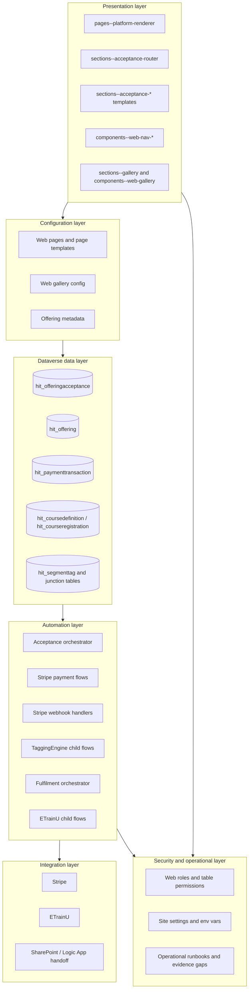

# 02 Solution Architecture

## Purpose
Describe the technical architecture and dependency boundaries of the DSR solution set in terms a new team member can understand.

## Architecture layers

## What each layer does
- Presentation layer:
  - renders navigation, page shells, galleries, offerings, acceptance, payment, and confirmation experiences.
- Configuration layer:
  - decides which routes, templates, galleries, and offering branches are active.
- Dataverse data layer:
  - holds the authoritative record state for acceptance, payment, course mapping, and segment tags.
- Automation layer:
  - moves the process forward and keeps external systems in sync.
- Integration layer:
  - exchanges data with Stripe, ETrainU, and the PCP handoff boundary.
- Security layer:
  - constrains who can read or write records and which API surfaces are available.
- Operational layer:
  - tracks support boundaries, failure recovery, and unresolved gaps.

## Solution layering observed
- BaseSchema:
  - foundational Dataverse entities and relationships.
- Automation:
  - orchestration and reusable child flow logic.
- DSRCustomisations:
  - business-specific portal, integration, and state transitions.

## Configuration dependencies
- Site settings provide runtime endpoints and API controls:
  - `Flow/PaymentIntentUrl`
  - `Flow/SetupIntentUrl`
  - `WebApi/Enabled`
  - `WebApi/EntityPermissionsEnabled`
- Environment variables control threshold and integration behaviour.

## Security architecture summary
- Portal security:
  - table permissions and web roles gate record access.
- API surface:
  - portal Web API is explicitly enabled and field-scoped.
- Flow security:
  - HTTP endpoints accept payloads from portal and webhook providers; downstream validation and token checks are used in portal templates and flows.

## Architectural risks
- Secret-like values appear in unpacked flow JSON in source control.
- Some endpoint/key management is environment-specific and can drift.
- Customer Insights / Journeys artifacts are present but runtime coupling is only partially evidenced.

## Evidence summary
- Presentation layer is evidenced by page templates, section templates, and gallery components.
- Automation layer is evidenced by acceptance, payment, tagging, ETrainU, and fulfilment child flows.
- Integration layer is evidenced by Stripe and ETrainU HTTP actions plus the PCP boundary.

## Related documents
- [00-platform-overview.md](00-platform-overview.md)
- [05-integration-landscape.md](05-integration-landscape.md)
- [PCP README](pcp/README.md)
- [reference/component-evidence-register.md](reference/component-evidence-register.md)
