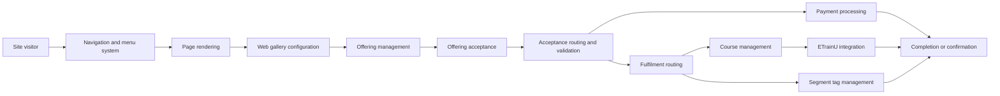
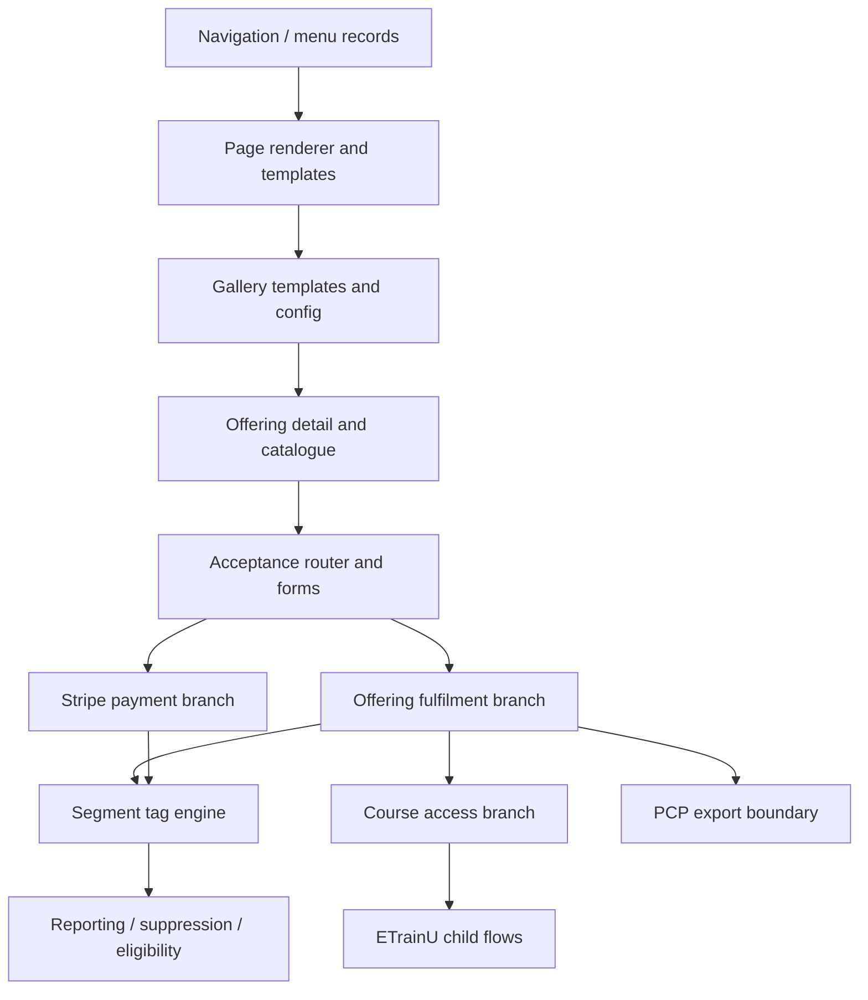

# 03 End-to-End Process Map

## Purpose
Show how the major DSR capabilities work together from first site visit to completion, follow-on provisioning, and audience updates.

## Business story
The DSR site starts with navigation and page rendering, moves into gallery browsing and offering discovery, then captures an acceptance. From there the platform either completes the process immediately or routes the visitor through payment, fulfilment, course provisioning, and segmentation updates.

## Complete platform context

## Cross-process dependency map

## Evidence summary
- Navigation and page rendering are confirmed by the navigation and renderer templates.
- Gallery routing is confirmed by the gallery configuration and source adapters.
- Offering acceptance, payment, course provisioning, and tag updates are confirmed by the relevant templates and child flows.
- Customer Insights / Journeys is only documented here as a dependency where the solution metadata shows it.

## What changes the route
- The active menu model decides how a visitor enters the site, but the page template decides what is actually rendered.
- Gallery configuration decides which records are surfaced and which detail route is used.
- Offering type and acceptance status decide which acceptance template is shown.
- Payment-required acceptances move into the Stripe branch.
- Course access acceptances move into ETrainU provisioning.
- Segment tags update as part of fulfilment, suppression, lifecycle, and import processes.
- PCP exports branch off the same segment-tag and support process layer.

## Read this with the supporting matrices
- [Process matrix](reference/process-matrix.md)
- [Dataverse table matrix](reference/table-matrix.md)
- [Flow matrix](reference/flow-matrix.md)
- [Web template matrix](reference/web-template-matrix.md)
- [Integration matrix](reference/integration-matrix.md)
- [Status transition matrix](reference/status-transition-matrix.md)
- [Security matrix](reference/security-matrix.md)
- [Component dependency matrix](reference/component-dependency-matrix.md)

## Capability links
- [00-platform-overview.md](00-platform-overview.md)
- [01-business-capability-model.md](01-business-capability-model.md)
- [02-solution-architecture.md](02-solution-architecture.md)
- [Navigation](navigation/navigation.md)
- [Page rendering](portal-rendering/portal-rendering.md)
- [Web gallery](web-gallery/web-gallery.md)
- [Offering management](offerings/offering-management.md)
- [Offering acceptance](offerings/offerings-acceptance.md)
- [Payment processing](payments/payment-overview.md)
- [Course management](etrainu/course-management.md)
- [ETrainU integration](etrainu/etrainu-integration.md)
- [Segment tag management](segment-tags/segment-tagging.md)
- [PCP overview](pcp/pcp-overview.md)
- [PCP business process](pcp/pcp-business-process.md)
- [Evidence gaps](reference/evidence-gaps.md)
