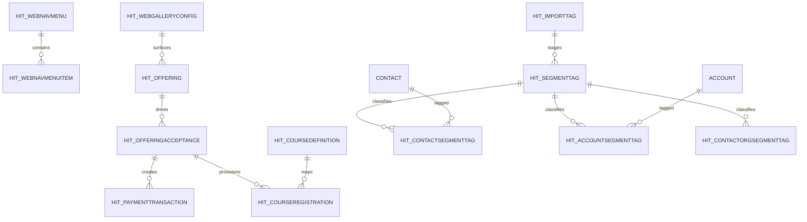
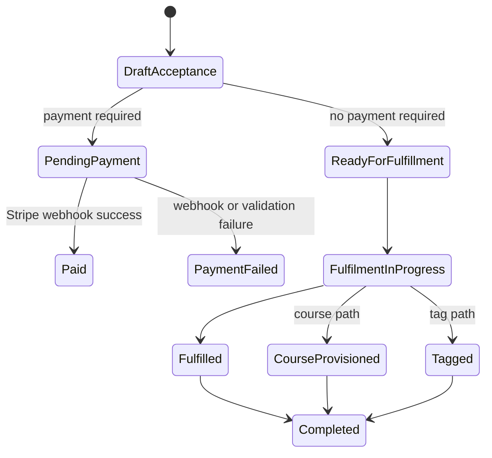

# 04 Dataverse Process Map

## Purpose
Show how the DSR process state is stored in Dataverse and how the major tables hand off work between portal, flows, and external systems.

## Core data model

## Platform configuration layer
- Navigation records can be stored in standard web link sets or custom nav tables, but the runtime header currently uses the custom header path.
- Page rendering is driven by page template, page section, and slot records.
- Gallery behaviour is driven by gallery configuration records.

## Operational data layer
- Offerings define the public catalogue and process behaviour.
- Acceptance records are the process anchor for every downstream branch.
- Payment transactions store Stripe intent and attempt state.
- Course definitions and registrations hold the ETrainU mapping state.
- Segment tag memberships store classification state.
- PCP export selection uses `hit_segmenttag`, `hit_contactsegmenttag`, and `hit_accountsegmenttag` as the outbound handoff boundary.

## Data handoff pattern
1. Portal templates read Dataverse records and create or update the current process record.
2. Power Automate reads the same record and updates the next state.
3. External systems return IDs or status values.
4. Dataverse stores the authoritative result for the next template or flow.

## Major record lifecycle

## Table ownership summary
| Table | Role in the platform | Main writers | Main readers |
|---|---|---|---|
| `hit_offering` | catalogue and behaviour metadata | solution import / content admins | galleries, offering detail, acceptance router |
| `hit_offeringacceptance` | process anchor for each constituent journey | portal forms and orchestrator | router, payment, fulfilment, validation |
| `hit_paymenttransaction` | Stripe transaction state | payment flows and webhooks | router, reconciliation, support |
| `hit_coursedefinition` | ETrainU location or organisation mapping | course fulfilment flows | course flows, reporting |
| `hit_courseregistration` | learner mapping and stream state | ETrainU child flows | course management, reporting |
| `hit_segmenttag` | tag definition and metadata | solution import / admins | tagging flows, imports, reporting |
| `hit_contactsegmenttag` | contact membership | tagging flows | tag views, suppression, reporting |
| `hit_accountsegmenttag` | organisation membership | tagging flows | tag views, suppression, reporting |
| `hit_contactorgsegmenttag` | relationship-level membership | tagging flows | downstream relationship use cases |
| `hit_importtag` | import and migration staging | import validation flows | tag migration and cleanup |

## Data quality and operations notes
- Summary fields such as `hit_segmenttags` on contact and account are convenience fields, not the system of record.
- The reviewed solution does not show a separate history table for segment tags; lifecycle is captured by membership state, removal timestamps, and import staging.

## Evidence summary
- The table relationships are confirmed by solution metadata and entity exports.
- The status lifecycle is confirmed by entity state/status fields and the relevant flows.
- The contact and organisation membership tables are confirmed as the source of truth for segmentation.

## Related documents
- [00-platform-overview.md](00-platform-overview.md)
- [01-business-capability-model.md](01-business-capability-model.md)
- [03-end-to-end-process-map.md](03-end-to-end-process-map.md)
- [segment-tags/segment-tagging.md](segment-tags/segment-tagging.md)
- [PCP data model](pcp/pcp-data-model.md)
- [PCP contact selection](pcp/pcp-contact-selection.md)
- [reference/table-matrix.md](reference/table-matrix.md)
- [reference/status-transition-matrix.md](reference/status-transition-matrix.md)
