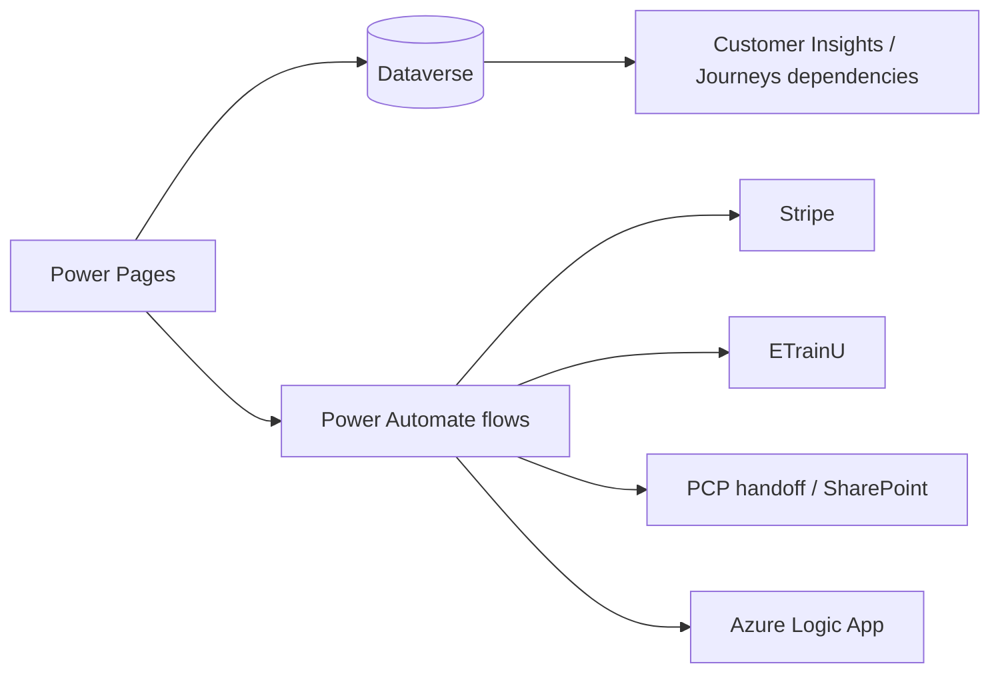
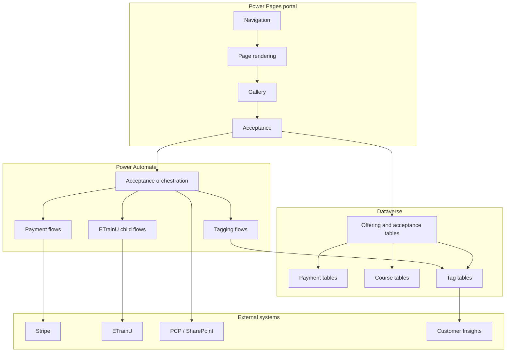

# 05 Integration Landscape

## Purpose
Describe the external and platform-to-platform integrations that support the DSR journey.

## Integration landscape

## Integration inventory
| External system | Business purpose | Calling component | Authentication method | Data sent | Data received | Dataverse records affected | Failure handling |
|---|---|---|---|---|---|---|---|
| Stripe | Collect and reconcile payment | `sections--payment`, payment flows, webhook flows | secret-key based API plus webhook processing | payment amount, customer, intent payload, event payload | payment intent id, setup intent id, payment status, charge state | `hit_offeringacceptance`, `hit_paymenttransaction` | router polling, webhook reconciliation, failure branch in payment UI |
| ETrainU | Provision course access | ETrainU child flows | API key + bearer token pattern in flow HTTP actions | organisation/location and participant details | ETrainU ids and search results | `hit_coursedefinition`, `hit_courseregistration` | create-or-get pattern and Dataverse retry path |
| Azure Logic App / SharePoint PCP handoff | Export downstream call list | PCP file-generation flows | flow-to-flow / HTTP handoff | phone-queue export rows | transport acknowledgement only | export staging and related queue records | handoff boundary documented; downstream closed-loop not fully evidenced |
| Customer Insights / Journeys | Audience and journey dependency | solution metadata and tag/reporting processes | internal Dataverse coupling; direct runtime call not evidenced | contact state, tag state, event metadata | journeys / segments / campaign targeting data | contact, account, segment-tag rows | treat as partially confirmed; validate live configuration before relying on it |

## Failure handling patterns
- Payment waits for webhook confirmation instead of trusting the browser alone.
- ETrainU child flows use create-or-get behaviour so repeated calls do not create duplicate learners or organisations.
- Tagging flows check for existing membership before insert.
- PCP handoff is exported as a boundary process; the repository does not show a closed-loop downstream acknowledgement.

## Evidence summary
- Stripe integration is confirmed by flow HTTP actions and webhook handlers.
- ETrainU integration is confirmed by child flows and API calls.
- PCP handoff is confirmed as a boundary pattern, but the downstream system is not fully documented in this repository.
- Customer Insights / Journeys is only treated as a dependency because the export does not expose the active runtime journey inventory.

## System boundary diagram

## Related documents
- [00-platform-overview.md](00-platform-overview.md)
- [02-solution-architecture.md](02-solution-architecture.md)
- [PCP README](pcp/README.md)
- [PCP overview](pcp/pcp-overview.md)
- [payments/payment-overview.md](payments/payment-overview.md)
- [etrainu/etrainu-integration.md](etrainu/etrainu-integration.md)
- [segment-tags/segment-tagging.md](segment-tags/segment-tagging.md)
- [reference/integration-matrix.md](reference/integration-matrix.md)
- [reference/security-matrix.md](reference/security-matrix.md)
