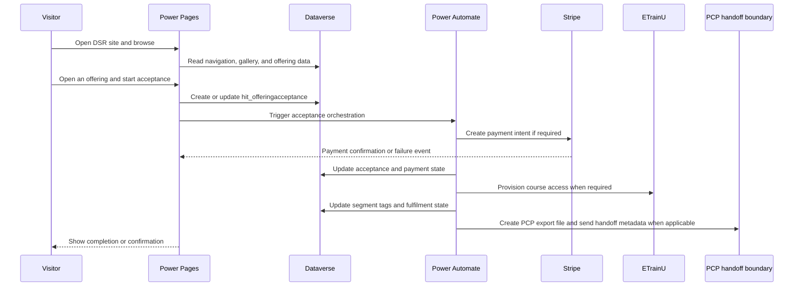
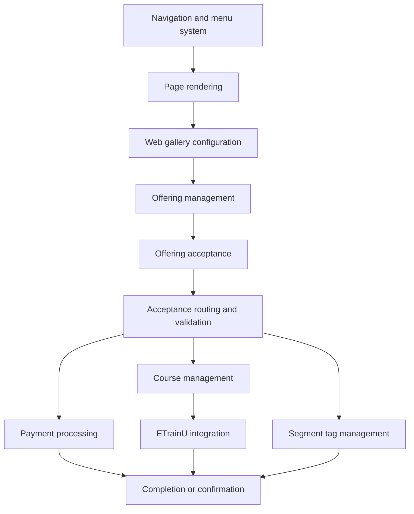

# 06 System Walkthrough

## Purpose
Tell the story of one representative DSR journey in plain language, while keeping the implementation trace visible for support and handover.

## Walkthrough scenario
A visitor opens the DSR site, discovers an offering, starts an acceptance, completes payment if required, and then flows into fulfilment, course provisioning, and segment updates before seeing the final confirmation.

## Representative journey

## Step-by-step story

| Step | What the user sees | Business event | Power Pages component | Web template | Dataverse record read or written | Flow that runs | Status changes | External system | What happens next | How errors are handled |
|---|---|---|---|---|---|---|---|---|---|---|
| 1. Site visitor opens DSR site | Home page and header navigation appear | The portal resolves the entry point | Navigation header and page shell | `components--web-nav-header`, `Header`, `pages--platform-renderer` | read menu/page config records | none | none | none | Visitor can move into the site | Missing menu data falls back to the rendered header path |
| 2. Navigation is rendered | Menu and page chrome load | The chosen navigation model is displayed | Header / navigation container | `components--web-nav-header` or legacy header | read web page and navigation records | none | none | none | Visitor reaches a list or page | If a link is missing, the page still renders and the link is simply absent |
| 3. Visitor opens a gallery | Gallery cards or tiles appear | Gallery configuration picks the source content | Gallery section and gallery component | `sections--gallery`, `components--web-gallery` | read `hit_webgalleryconfig` and gallery source tables | none | none | none | Visitor clicks through to detail | Unsupported or missing source type shows a safe error block |
| 4. Visitor opens an offering | Offering detail and call-to-action appear | Offering metadata is resolved | Offering detail section | `sections--offering-detail`, `components--offering-cta`, `components--offering-card` | read `hit_offering` | none | none | none | Visitor starts the acceptance journey | If the offering is inactive or unavailable, it does not show in the public path |
| 5. Acceptance is initiated | A form is displayed for the chosen offering | The portal creates the acceptance anchor | Acceptance form / router | `sections--acceptance-router` and the relevant `sections--acceptance-*` template | write `hit_offeringacceptance` | `trigger_OfferingAcceptance-Orchestrator` later picks up the row | Draft to pending or initial acceptance state | none | Router chooses the right next branch | Missing acceptance id or missing route context shows an explicit warning |
| 6. Router selects an offering-specific section | The correct form variant is shown | Acceptance status and offering type decide the branch | Acceptance router | `sections--acceptance-router` | read `hit_offeringacceptance`, `hit_offering` | `Http_AcceptanceStatusValidation` may be polled | Pending information, pending payment, or terminal state | none | Visitor completes the relevant form | If payment is pending, the router moves to the payment branch; otherwise it stays on the form branch |
| 7. Information is collected | Visitor enters details and submits | The acceptance draft is updated | Acceptance-specific section | `sections--acceptance-course`, `sections--acceptance-donation`, `sections--acceptance-event`, and others | update `hit_offeringacceptance` and related lookups | none or router validation polling | Draft to pending information or ready for next step | none | Data is stored for orchestration | Portal validation and Web API checks keep the form from advancing on invalid input |
| 8. Dataverse is updated | The page returns to the next state | The acceptance row now anchors the journey | Acceptance routing and form sections | same as above | update `hit_offeringacceptance` and related child rows | `trigger_OfferingAcceptance-Orchestrator` | Status advances toward payment or fulfilment | none | Orchestration reads the saved state | The browser alone does not decide success; Dataverse remains the source of truth |
| 9. Acceptance orchestration runs | The page may switch to waiting or processing | The orchestration flow branches by offering type and state | Acceptance router + orchestrator | `sections--acceptance-router` | read `hit_offeringacceptance`, `hit_offering` | `trigger_OfferingAcceptance-Orchestrator` | Pending payment, pending approval, or ready for fulfilment | none | The next branch is selected | If the state does not match the expected branch, the router keeps the user on the safe page |
| 10. Payment is requested if required | The payment screen or waiting screen appears | Stripe intent is created | Payment section | `sections--payment-preparing`, `sections--payment` | write `hit_paymenttransaction` and update acceptance payment fields | `Stripe_CreatePaymentIntent`, `StripeCreateCustomerSetupIntent` | Pending payment | Stripe | User confirms payment or setup | The payment-preparing screen waits for intent creation and retries via status polling |
| 11. Payment is validated | The user returns from Stripe or sees a failure message | Stripe confirms or rejects the payment | Payment and confirmation sections | `sections--payment`, `sections--confirmation`, `sections--confirmation-nonpayment` | update `hit_offeringacceptance`, `hit_paymenttransaction` | `StripeWebhookHandler-PaymentIntentUpdateDataverse`, `StripeWebhookHandler-SetupIntentUpdateDataverse`, `Http_AcceptanceStatusValidation` | Paid, completed, failed, or cancelled | Stripe | Fulfilment can start or the user is told what failed | Webhook reconciliation is the final authority; browser return alone is not enough |
| 12. Fulfilment is routed | The visitor sees completion, course access, or a next-step outcome | Offering-specific fulfilment starts | Fulfilment branch and downstream sections | `Offering-Acceptance---Complete`, `sections--acceptance-course` | update `hit_offeringacceptance`, `hit_coursedefinition`, `hit_courseregistration`, `hit_segmenttag` tables as needed | `OfferingSpecificFulfillmentHandlerchild`, `ETrainU-CreateorGetOrganisationChild`, `ETrainU-CreateorGetParticipantChild`, tagging flows | Fulfilled, course provisioned, tagged, or completed | ETrainU, segment tag engine | Visitor is shown the final completion or confirmation page | If a downstream system fails, the flow can stop at the process boundary and leave the record in a recoverable state |
| 13. PCP export is prepared when a supporter enters the calling cycle | DSR prepares the outbound call-list file | The phone-queue export flow runs from the tagged supporter set | PCP export boundary and SharePoint staging | PCP export flows | read `hit_segmenttag`, `hit_contactsegmenttag`, `hit_accountsegmenttag`, `contact`, `account` | `PCPContactFileGeneration-EscalatetoPhoneQueueChild`, `PCPOrganisationFileGeneration-EscalatetoPhoneQueue` | Exported into Active or Prospect CSV files | SharePoint and Logic App handoff | PCP-side processing can consume the staged file | The repository confirms the export and handoff, but not the downstream PCP import or call allocation |

## What the user sees versus what the platform does
- The user mostly sees page changes and form states.
- The business process is actually driven by Dataverse records and Power Automate state changes.
- Stripe, ETrainU, and segment tags are downstream system actions, not isolated portal tricks.

## Journey variants documented here
- Offering acceptance journey.
- Payment journey.
- Course and ETrainU journey.
- Segment tag update journey.

## Evidence summary
- Each journey step is tied back to a template, a Dataverse record, and a flow.
- Payment state is intentionally shown as asynchronous because Stripe webhooks are the source of truth.
- Course and tagging journeys are presented as downstream branches from the same acceptance anchor.

## Business capability map

## Orientation notes for new team members
- Acceptance records are the anchor for the whole handover story.
- Payment success is confirmed by webhook and validation flows, not just by the browser redirect.
- Course access is provisioned outside DSR in ETrainU, with Dataverse holding the mapping.
- Segment tags are operational state, not decorative labels.
- PCP export is a separate handoff boundary; the walkthrough stops at the DSR side of that boundary.

## Related documents
- [03-end-to-end-process-map.md](03-end-to-end-process-map.md)
- [portal-rendering/portal-rendering.md](portal-rendering/portal-rendering.md)
- [offerings/offerings-acceptance.md](offerings/offerings-acceptance.md)
- [payments/payment-overview.md](payments/payment-overview.md)
- [etrainu/etrainu-overview.md](etrainu/etrainu-overview.md)
- [segment-tags/segment-tag-overview.md](segment-tags/segment-tag-overview.md)
- [PCP overview](pcp/pcp-overview.md)
- [PCP business process](pcp/pcp-business-process.md)
