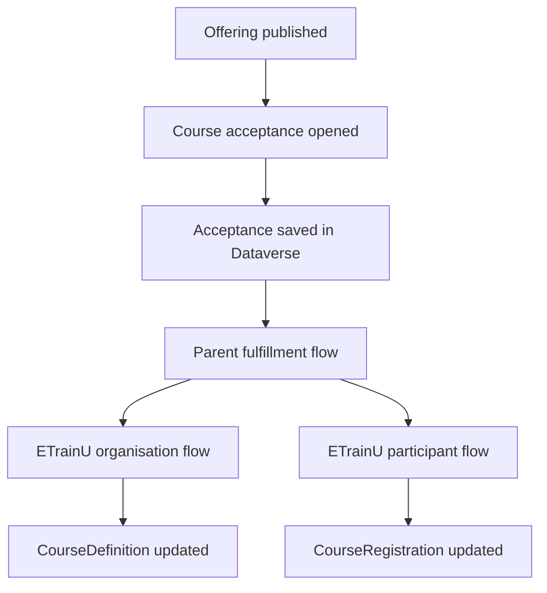
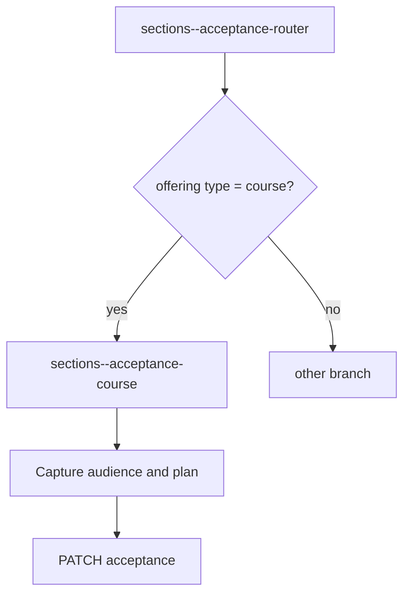
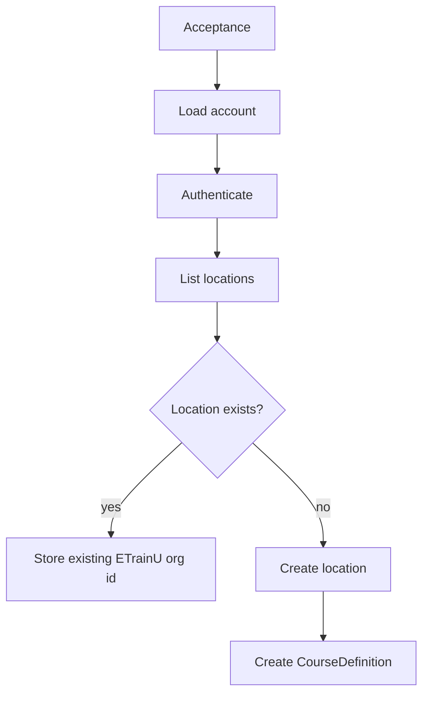
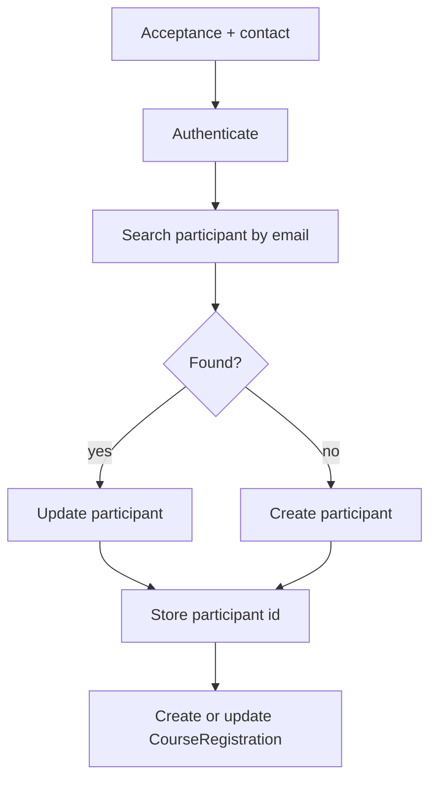
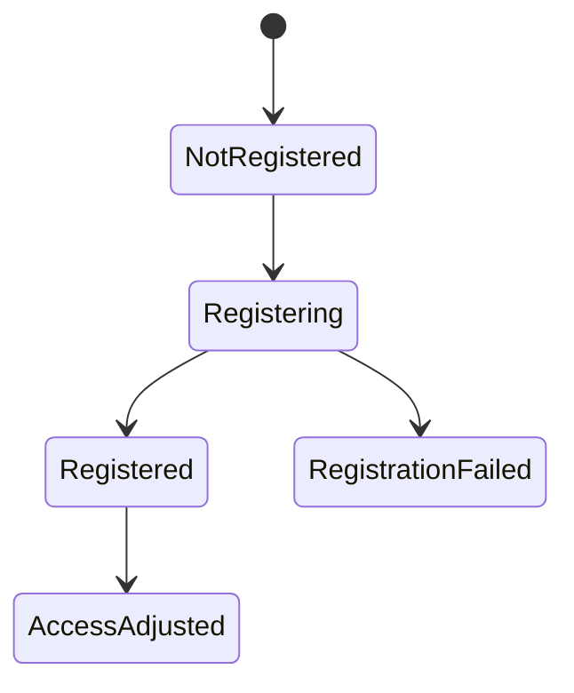
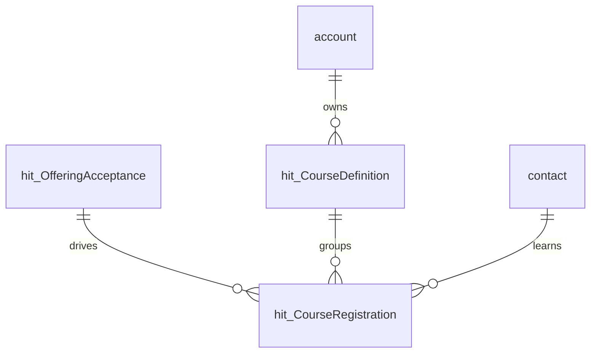
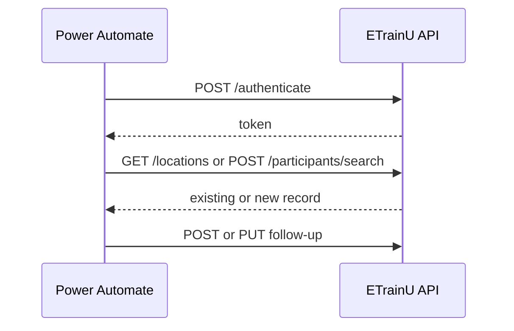
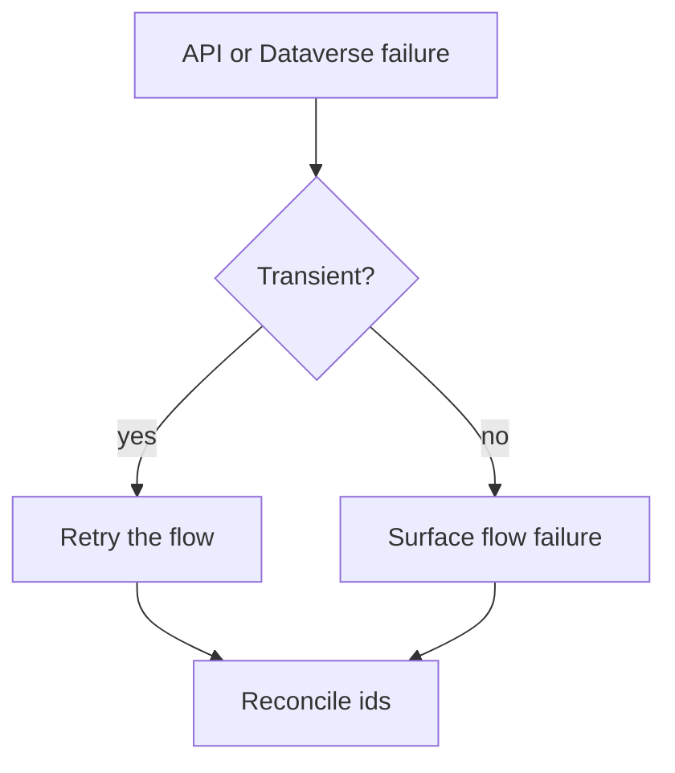
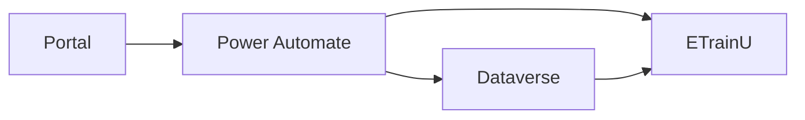
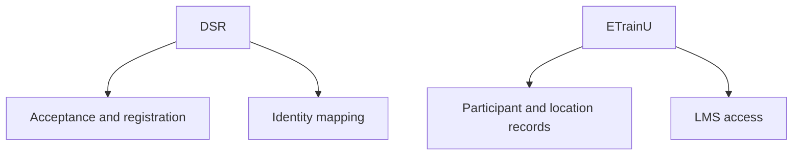

# ETrainU Diagrams

## 1. End-to-end course access

## 2. Acceptance to course branch

## 3. Organisation provisioning

## 4. Participant provisioning

## 5. Enrolment sync

## 6. Data ownership

## 7. API interaction

## 8. Error path

## 9. Process-component matrix

## 10. Responsibility split
