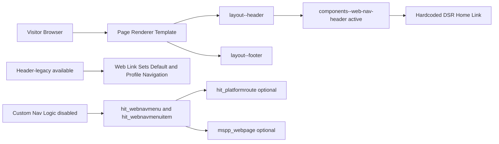
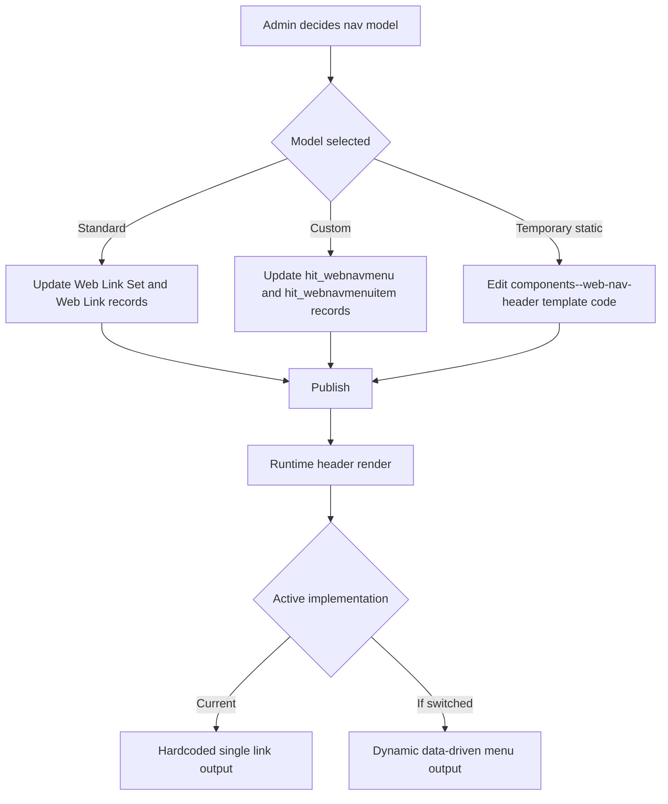
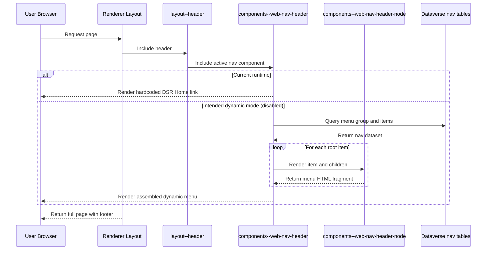
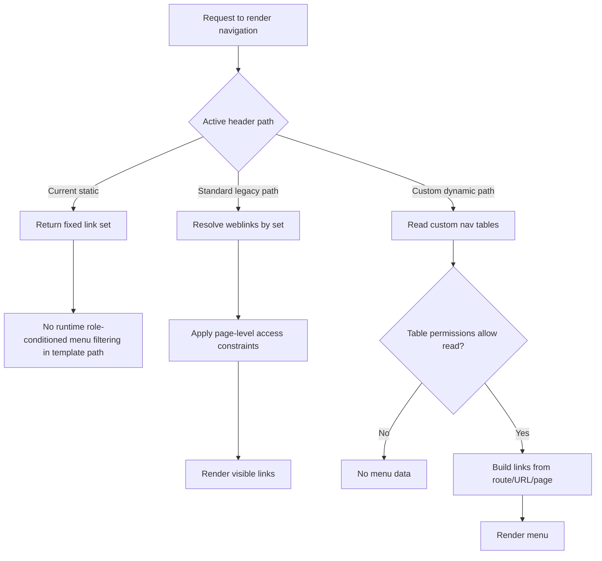
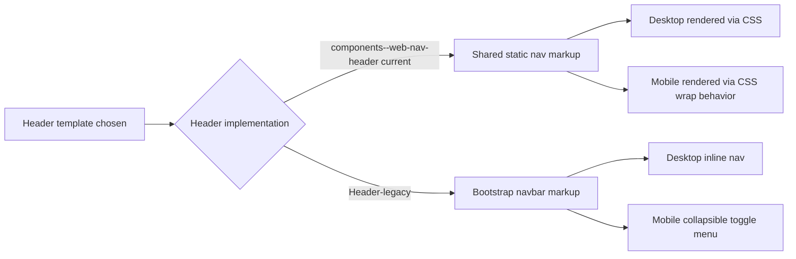

[Top: Documentation Home](../README.md) | [Navigation Security](navigation-security.md)

# Navigation Diagrams

## Purpose
Provide visual architecture and behavior diagrams for the DSR navigation system using current repository evidence.

## 1) Navigation context diagram

## 2) Menu configuration flow

## 3) Runtime rendering sequence

## 4) Role-based visibility decision diagram

## 5) Desktop and mobile rendering distinction

## Notes on interpretation
- These diagrams separate current behavior from available but inactive behavior.
- They do not assume role filtering is currently active in the live header path unless evidenced in template execution.

## Related references
- [navigation-overview.md](navigation-overview.md)
- [navigation-configuration.md](navigation-configuration.md)
- [navigation-technical-design.md](navigation-technical-design.md)
- [navigation-security.md](navigation-security.md)
- [../reference/evidence-gaps.md](../reference/evidence-gaps.md)

[Bottom: Back](navigation-security.md)
