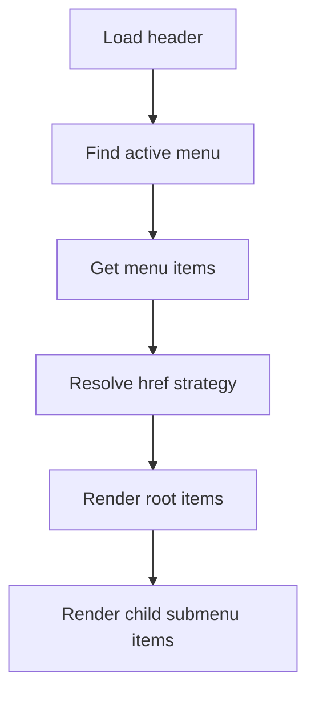

[Top: Documentation Home](../README.md) | [Portal Rendering](../portal-rendering/portal-rendering.md) | [Web Gallery](../web-gallery/web-gallery.md)

# Navigation

## Purpose
Document current portal navigation behavior and highlight temporary implementation state.

## Business context
Navigation impacts discovery and conversion into offering journeys. A temporary static menu can hide intended dynamic navigation behavior.

## Participants and systems
- Header templates:
  - components--web-nav-header
  - components--web-nav-header-node
- Dataverse navigation tables (intended path):
  - hit_webnavmenu
  - hit_webnavmenuitem
  - hit_platformroute

## Current observed state
- Active code renders a hardcoded single link (DSR Home).
- Original dynamic menu logic exists but is commented out.

## High-level process (intended dynamic path)
1. Fetch active header menu for website and menu location.
2. Fetch menu items and route/page joins.
3. Resolve root and child items.
4. Build href from platform route, URL, or CMS fallback.
5. Render active-state and submenu classes.

## Business rules
- href resolution order in node template:
  - platform route first
  - explicit URL second
  - CMS partial URL fallback third
- normalize dangling or blank query delimiters.
- active class set when nav path equals current request path.

## Error and exception handling
- If no href can be built, item becomes non-clickable text.
- Debug mode outputs diagnostic blocks for item hierarchy and link resolution.

## Security and permissions
- Dynamic menu data visibility depends on Dataverse read permissions.

## Operational considerations
- Temporary hardcoded header should be tracked as a release risk if dynamic nav is expected in production.

## Known limitations
- Production parity risk while hardcoded menu remains active.
- Multi-level recursion is intentionally constrained in current node implementation.

## Evidence and source references
- power-pages/nfp-base/web-templates/components--web-nav-header/components--web-nav-header.webtemplate.source.html
- power-pages/nfp-base/web-templates/components--web-nav-header-node/components--web-nav-header-node.webtemplate.source.html

## Related documents
- [../portal-rendering/portal-rendering.md](../portal-rendering/portal-rendering.md)
- [../reference/evidence-gaps.md](../reference/evidence-gaps.md)

[Bottom: Back](../portal-rendering/portal-rendering.md) | [Next: Web Gallery](../web-gallery/web-gallery.md)
