[Top: Framework Overview](./offering-framework-overview.md)

# Acceptance Diagrams

## 1) Offering capability context
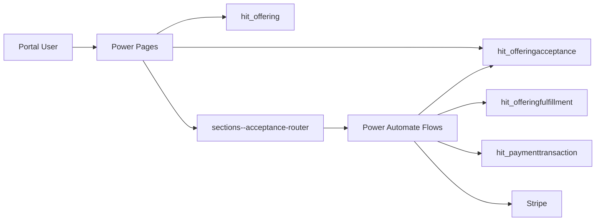

## 2) Offering publication process
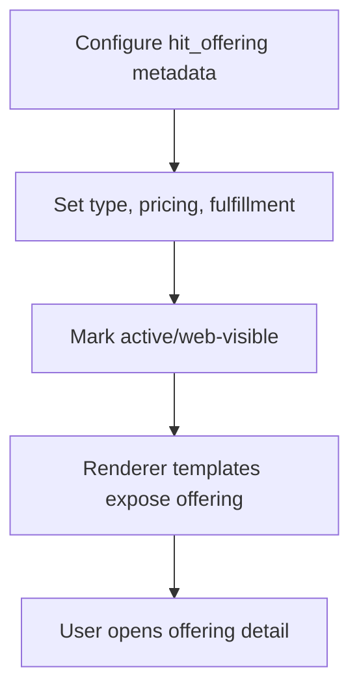

## 3) User acceptance journey
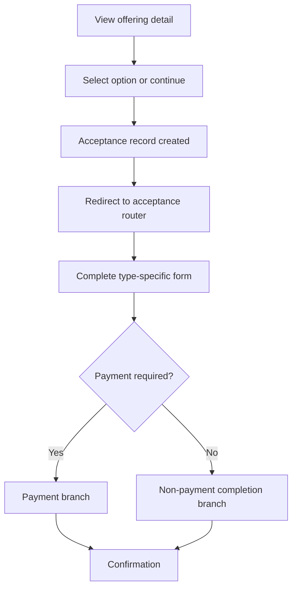

## 4) Acceptance orchestration sequence
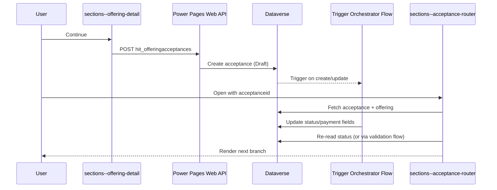

## 5) Acceptance router decision tree
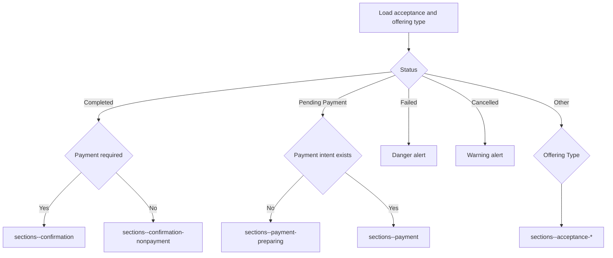

## 6) Acceptance state diagram
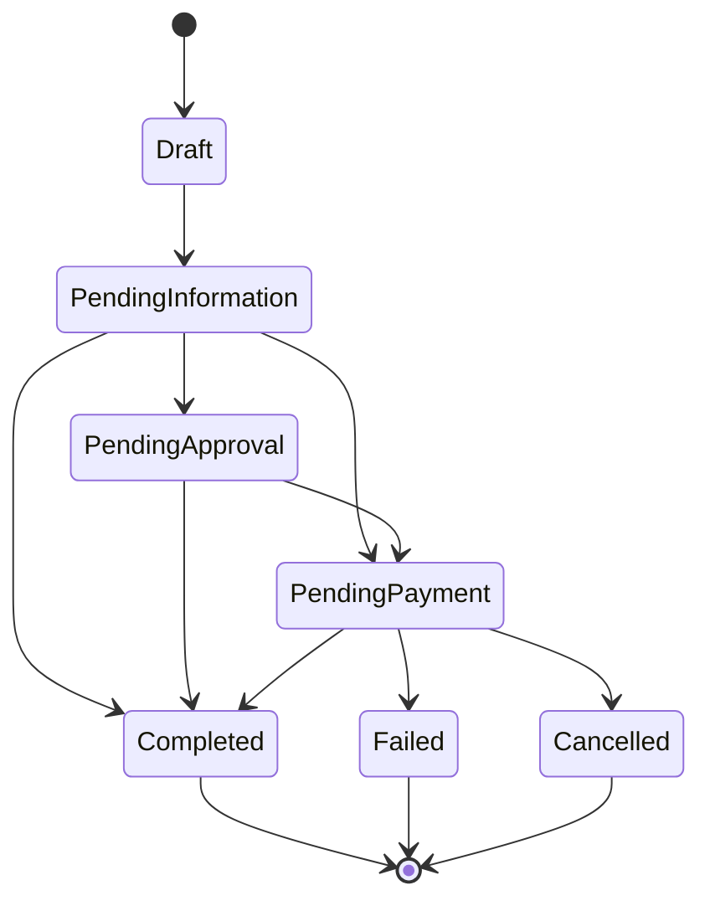

## 7) Payment-required branch
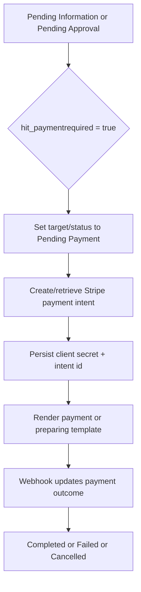

## 8) No-payment branch
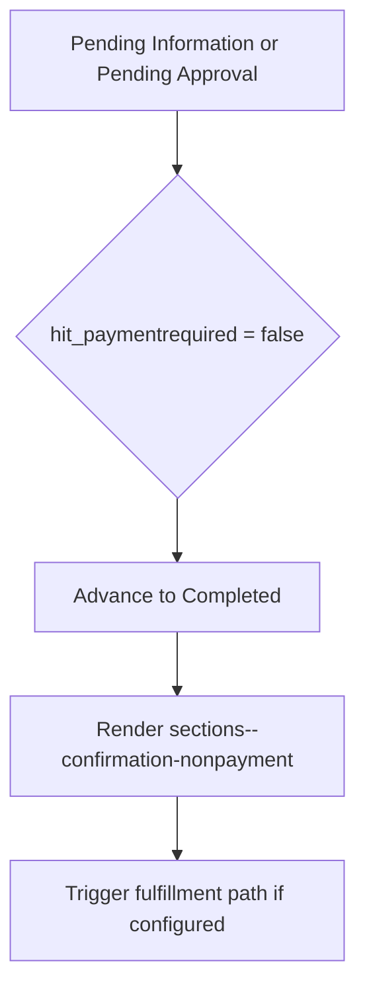

## 9) Type-specific fulfilment branch
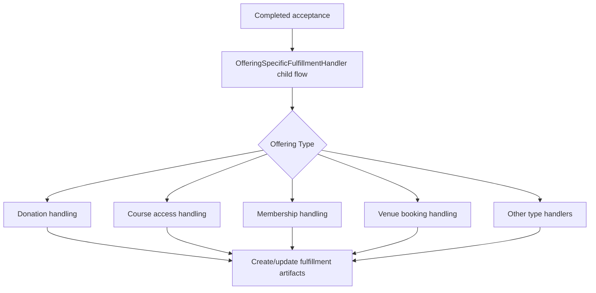

## 10) HTTP status-validation sequence
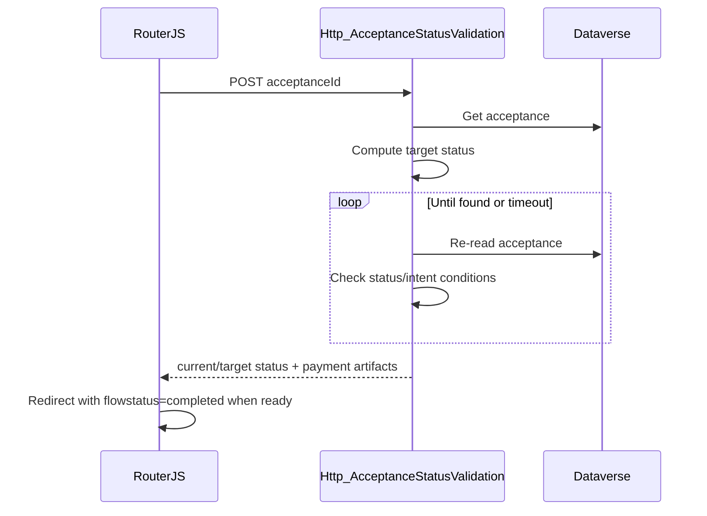

## 11) Dataverse ERD
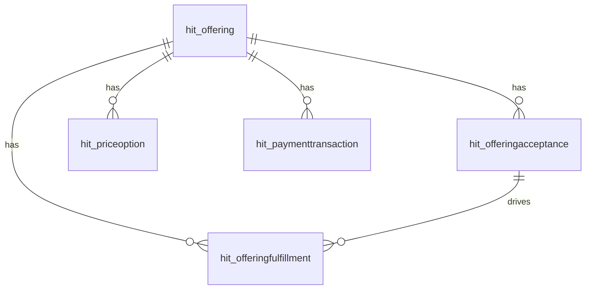

## 12) Exception and recovery routes
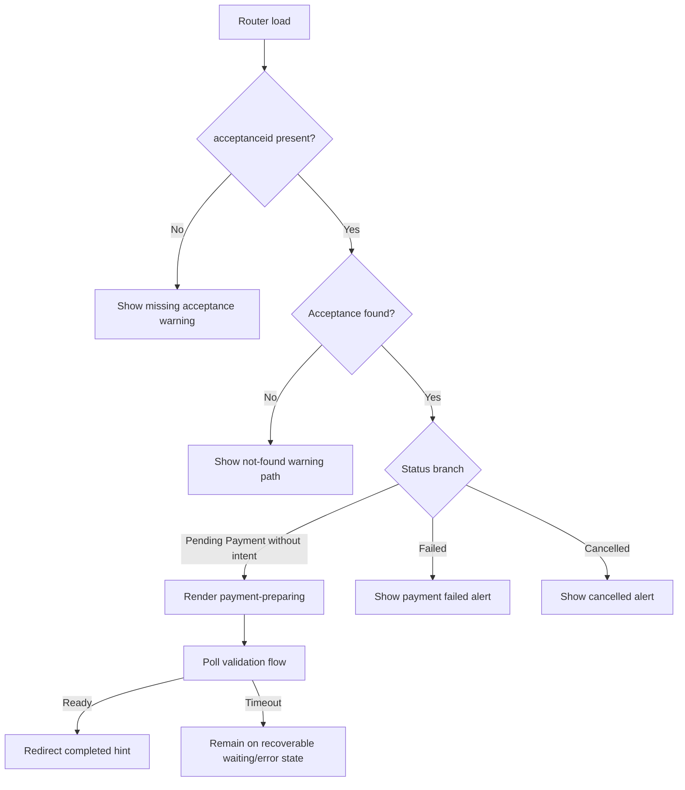

## Evidence
- [router status/type branch logic](power-pages/nfp-base/web-templates/sections--acceptance-router/sections--acceptance-router.webtemplate.source.html#L202)
- [offering detail fetch and acceptance initiation](power-pages/nfp-base/web-templates/sections--offering-detail/sections--offering-detail.webtemplate.source.html#L557)
- [acceptance bootstrap create and redirect](power-pages/nfp-base/web-files/acceptance-bootstrap.js#L33)
- [orchestrator status/payment progression](solutions/exports/unpacked/dsr/DSRCustomisations/Workflows/trigger_OfferingAcceptance-Orchestrator-7510A0ED-7913-F111-8342-000D3A7A0323.json#L567)
- [HTTP validation loop and target transitions](solutions/exports/unpacked/dsr/DSRCustomisations/Workflows/Http_AcceptanceStatusValidation-6EC587EA-F3AB-F111-AAAB-7CED8DD12657.json#L403)
