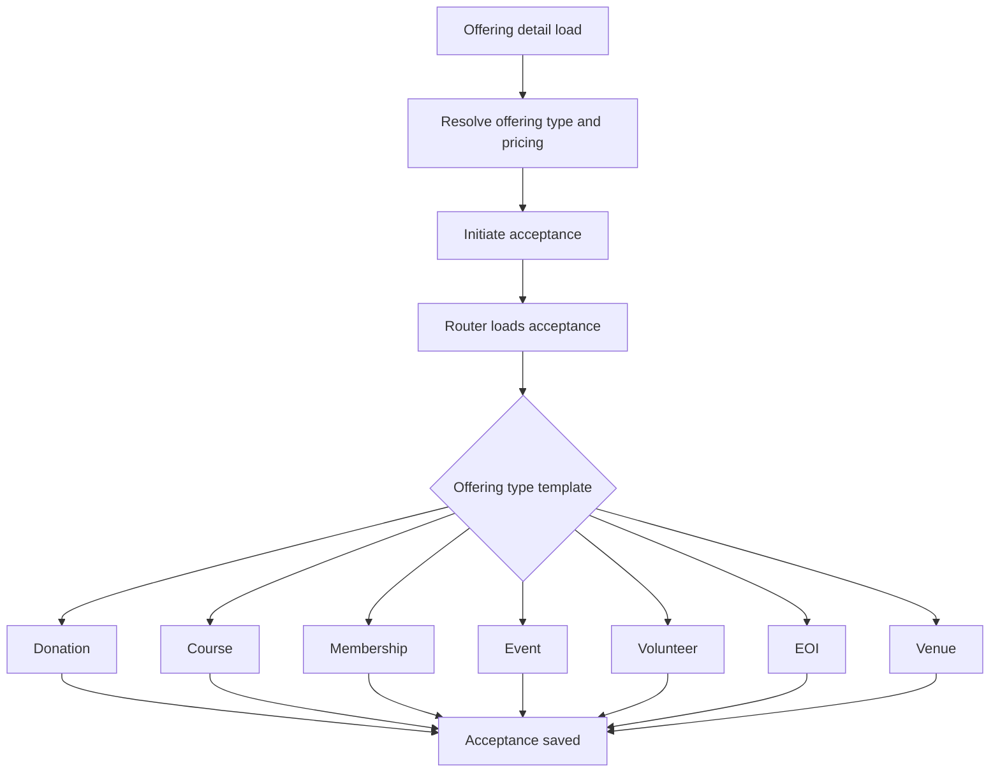
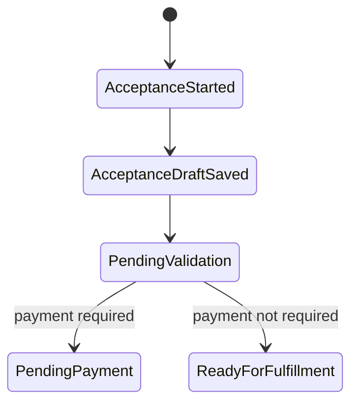

[Top: Documentation Home](../README.md) | [End-to-End Process](../03-end-to-end-process-map.md) | [Payments](../payments/payments-stripe.md)

# Offerings and Acceptance

## Purpose
Detail how offering discovery, acceptance capture, and route logic work across portal and Dataverse.

## Business context
Offerings are the externally visible products/services. Acceptance is the process envelope that captures intent, participant details, and downstream requirements.

## Participants and systems
- pages--platform-renderer
- sections--acceptance-router
- offering-detail page/template
- acceptance templates by offering type
- Dataverse tables: hit_offering, hit_offeringacceptance and related entities

## Preconditions
- offering is active and web-visible.
- acceptance template exists for offering type.

## Trigger
- user enters offering detail and initiates acceptance.

## High-level process
1. Offering detail loads by id or slug.
2. Pricing and CTA behavior derived from offering type/pricing model.
3. Acceptance router loads acceptance record and status context.
4. Router selects sections--acceptance-* template.
5. Template captures/updates acceptance data and routes to next state.

## Sub-processes
- offering-detail pricing model resolution:
  - free, fixed one-off, option one-off, fixed subscription, option subscription.
- acceptance-template specialization:
  - type-specific fields and validation flows.
- pending validation:
  - router polling invokes status validation endpoint to determine transition outcomes.

## Business rules
- active and web-visible offering required for catalog display.
- router status and offering type jointly determine template and next action.
- payment-required acceptances route into payment branch.

## Dataverse records and relationships
- hit_offering -> hit_offeringacceptance (lookup).
- optional related tables by template, for example venue request entities.

## Power Pages components
- Offering-Detail.
- sections--acceptance-router.
- sections--acceptance-donation/event/course/membership/volunteer/download/sponsorship/eoi/venue/form.

## Web templates
- power-pages/nfp-base/web-templates/offering-detail/Offering-Detail.webtemplate.source.html
- power-pages/nfp-base/web-templates/sections--acceptance-router/sections--acceptance-router.webtemplate.source.html
- power-pages/nfp-base/web-templates/sections--acceptance-*/

## Power Automate flows
- trigger_OfferingAcceptance-Orchestrator.
- Http_AcceptanceStatusValidation.
- downstream payment and fulfillment flows.

## External integrations
- indirect at this stage; payment and fulfillment integrations occur after acceptance branch decisions.

## Status and state transitions

## Error and exception handling
- missing id/slug on offering detail returns explicit error.
- missing acceptance context in router branches to fail-safe or pending states depending on implementation path.

## Security and permissions
- offering public read via table permissions.
- acceptance create/write controlled by acceptance table permission and role scope.

## Operational considerations
- template consistency matters: mismatched field names or status mappings can break route transitions.

## Known limitations
- full branch-level state mapping for all template variants is not fully extracted from flow + client-script combinations.

## Evidence and source references
- ../reference/component-evidence-register.md
- ../reference/repository-discovery.md
- ../../analysis/business-processes-from-flows.md

## Related documents
- [../payments/payments-stripe.md](../payments/payments-stripe.md)
- [../operations/operations-runbook.md](../operations/operations-runbook.md)

[Bottom: Back](../web-gallery/web-gallery.md) | [Next: Payments](../payments/payments-stripe.md)
