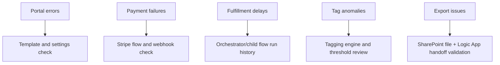

[Top: Documentation Home](../README.md) | [System Walkthrough](../06-system-walkthrough.md) | [Evidence Gaps](../reference/evidence-gaps.md)

# Operations Runbook

## Purpose
Provide practical operational guidance for supporting the DSR platform.

## Business context
DSR operations span portal rendering, acceptance processing, payment reconciliation, fulfillment progression, and integration health.

## Operational checkpoints
1. Portal availability and page render integrity.
2. Acceptance routing and state transition integrity.
3. Payment intent/webhook reconciliation health.
4. Fulfillment orchestration progression.
5. Segment recalculation and outbound eligibility cadence.
6. Integration endpoint health (ETrainU, Logic App handoff paths).

## Monitoring map

## Incident triage sequence
1. Confirm affected process and exact acceptance/transaction/tag identifiers.
2. Validate site settings and endpoint values.
3. Check Dataverse record state against expected branch.
4. Review relevant flow run history and branch outcomes.
5. Confirm downstream system acknowledgment when integration is involved.
6. Capture findings in evidence-gaps register when process certainty is incomplete.

## Security and compliance tasks
- Rotate and secure integration credentials.
- Audit source-control exposure of secret-like values from unpacked artifacts.
- Validate role and table-permission assignments after deployment.

## Change management guidance
- Treat acceptance/router and payment flows as tightly coupled changes.
- Re-test end-to-end journey after any offering type/template update.
- Re-test segmentation outcomes when threshold environment values are updated.

## Known operational risks
- Hardcoded header menu currently bypasses intended dynamic navigation.
- Incomplete branch documentation for fulfillment and some webhook/error paths.
- CI/Journey runtime coupling not fully documented in current repo evidence.

## Escalation hints
- Payment incidents:
  - validate webhook updates before marking manual success/failure.
- Provisioning incidents:
  - verify ETrainU create/get outcome and id synchronization.
- Outbound file incidents:
  - validate SharePoint file generation and Logic App invoke payloads.

## Evidence and source references
- ../reference/repository-discovery.md
- ../reference/component-evidence-register.md
- ../reference/evidence-gaps.md
- ../../analysis/pcp-file-integration-business-process.md

## Related documents
- [../payments/payments-stripe.md](../payments/payments-stripe.md)
- [../etrainu/etrainu-integration.md](../etrainu/etrainu-integration.md)
- [../segment-tags/segment-tagging.md](../segment-tags/segment-tagging.md)

[Bottom: Back](../segment-tags/segment-tagging.md) | [Next: Evidence Gaps](../reference/evidence-gaps.md)
