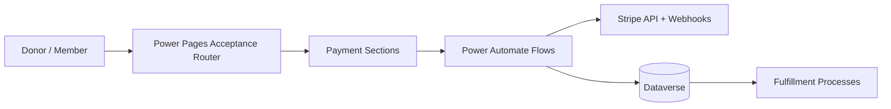
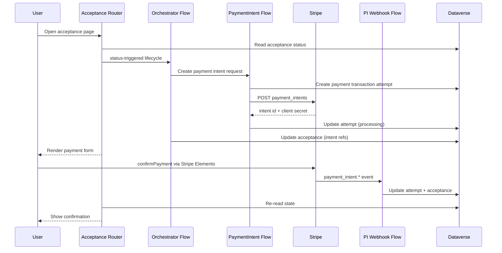
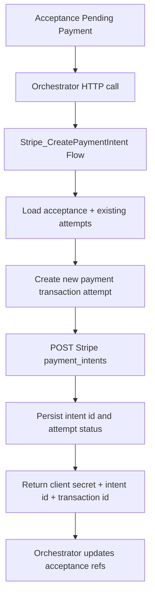
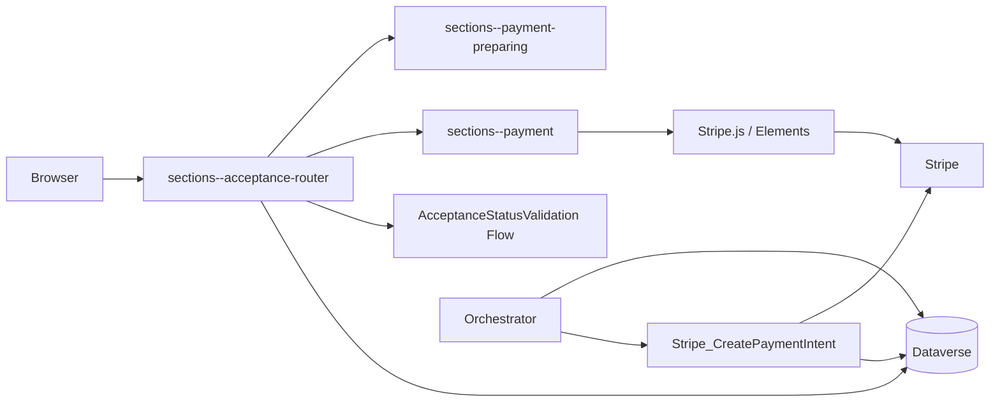
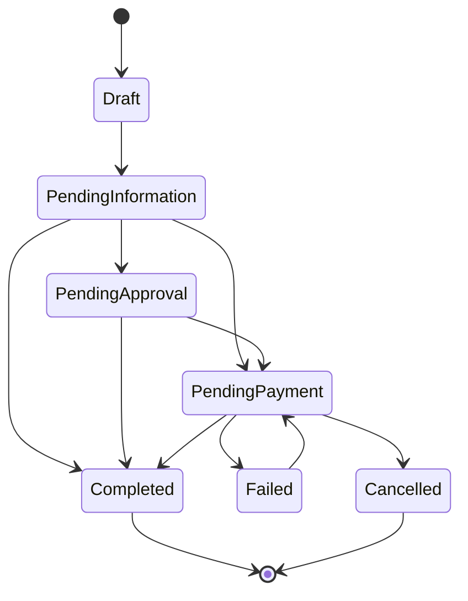
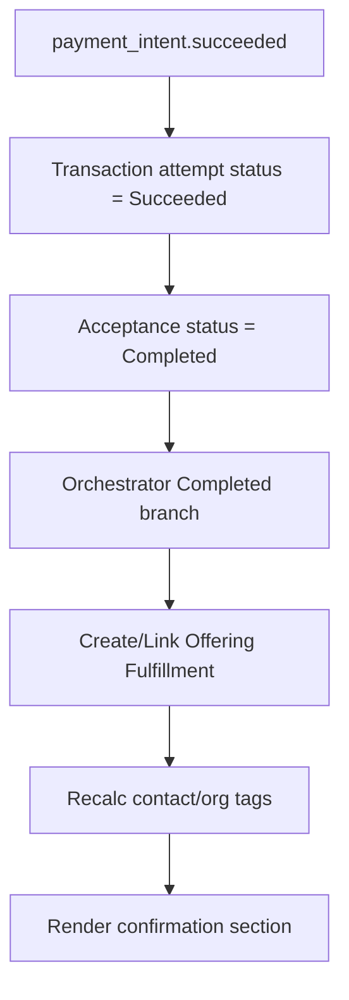
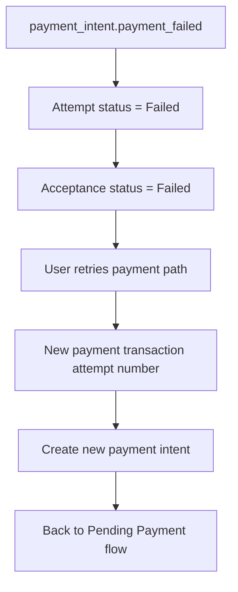
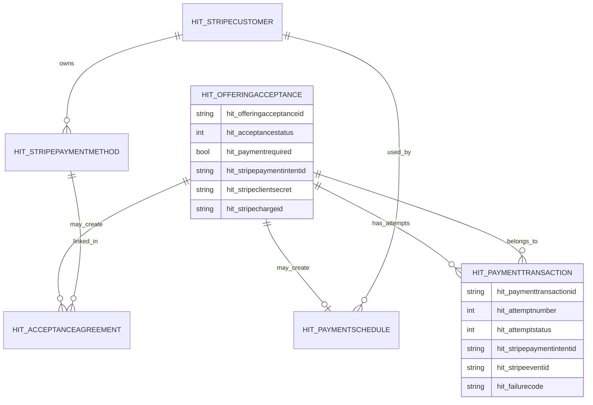
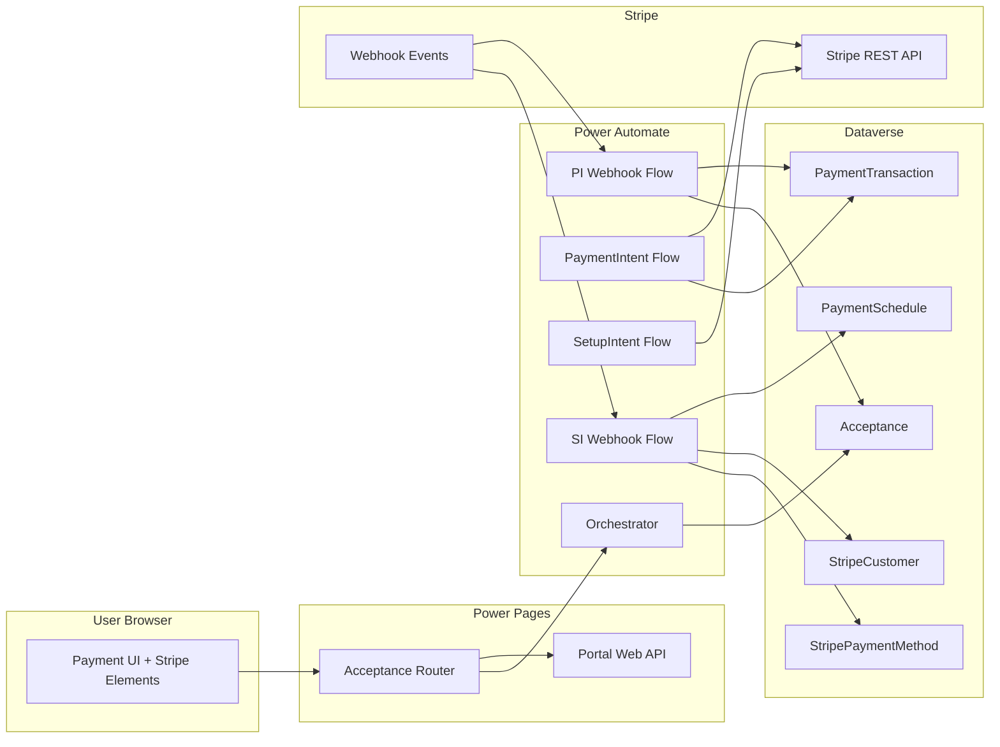

# Payment Diagrams

## 1. Capability Context Diagram


## 2. End-to-End Sequence Diagram


## 3. Session / Intent Creation Diagram


## 4. Browser, Pages, Flows, Dataverse, Stripe Interaction Diagram


## 5. Webhook Processing Diagram
```mermaid
flowchart TD
  StripeEvt[Stripe Event] --> PIWH[PaymentIntent Webhook Flow]
  StripeEvt --> SIWH[SetupIntent Webhook Flow]

  PIWH --> PIGet[GET /v1/events/{id}]
  PIGet --> PISwitch{Event Type}
  PISwitch -->|succeeded| PIUpdS[Attempt Succeeded + Acceptance Completed]
  PISwitch -->|payment_failed| PIUpdF[Attempt Failed + Acceptance Failed]
  PISwitch -->|requires_action| PIUpdR[Attempt Requires Action]
  PISwitch -->|processing| PIUpdP[Attempt Processing]

  SIWH --> PMGet[GET /v1/payment_methods/{id}]
  PMGet --> UpsertPM[Upsert Stripe Payment Method]
  UpsertPM --> CreateAgr[Create Acceptance Agreement]
  CreateAgr --> CreateSched[Create Payment Schedule]
  CreateSched --> UpdAcc[Mark Acceptance Completed + recurring flags]
```

## 6. Status State Machine Diagram


## 7. Success to Fulfillment Diagram


## 8. Failure and Retry Diagram


## 9. Payment Data Model Diagram


## 10. Security Boundary Diagram

