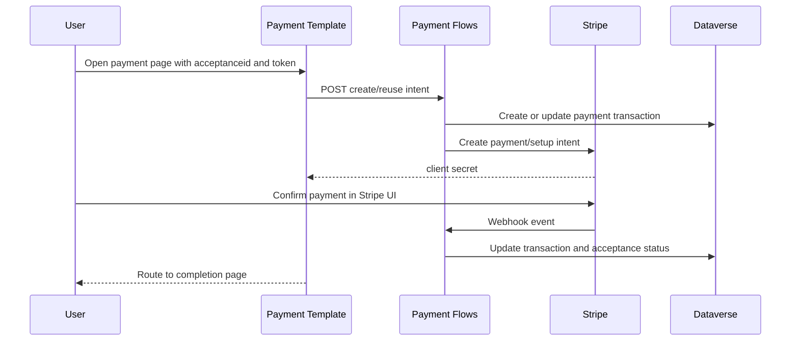
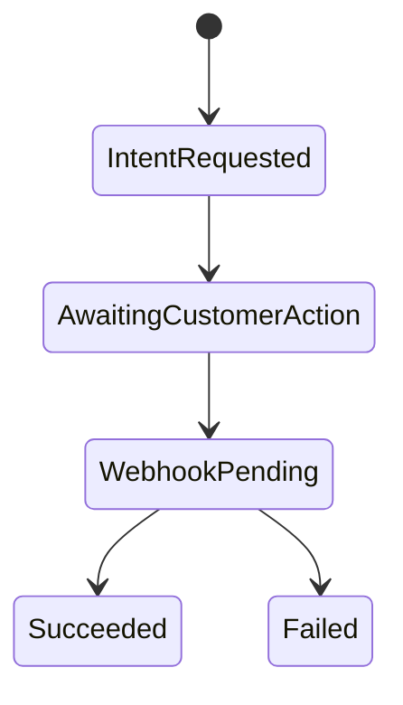

[Top: Documentation Home](../README.md) | [Offerings](../offerings/offerings-acceptance.md) | [Operations](../operations/operations-runbook.md)

# Payments (Stripe)

## Purpose
Document the Stripe-integrated payment process, including intent creation and webhook reconciliation.

## Business context
Payment completion is a controlled state transition for paid acceptances and must be confirmed server-side via webhook updates.

## Participants and systems
- offering-acceptance---payment template.
- site settings for payment/setup flow endpoints.
- Stripe CreatePaymentIntent and SetupIntent flows.
- Stripe webhook handler flows.
- Dataverse payment and acceptance tables.

## Preconditions
- acceptance exists and token is valid.
- Flow/PaymentIntentUrl and Flow/SetupIntentUrl configured.
- Stripe publishable key available in portal settings.

## Trigger
- user lands on payment page with acceptanceid and token.

## High-level process
1. Payment template validates acceptance and token.
2. Template calls payment/setup intent flow endpoint.
3. Flow creates or reuses transaction records and Stripe intent.
4. Frontend confirms payment with Stripe Element.
5. Stripe sends webhook event.
6. Webhook flow verifies event and updates Dataverse states.

## Sub-processes
- intent preparation:
  - payment intent for one-off payment.
  - setup intent for recurring/payment-method scenarios.
- reconciliation:
  - webhook handlers process event updates and map to Dataverse records.

## Business rules
- token mismatch blocks payment session usage.
- acceptance-driven amount and transaction links determine payment context.
- webhook event handling is authoritative for final payment status updates.

## Dataverse records and relationships
- hit_offeringacceptance links to payment state and stripe identifiers.
- hit_paymenttransaction stores attempt counts/status and stripe ids.
- hit_stripecustomer and hit_stripepaymentmethod used for setup-intent pathways.

## Power Pages components
- offering-acceptance---payment.
- offering-acceptance---complete.

## Web templates
- power-pages/nfp-base/web-templates/offering-acceptance---payment/Offering-Acceptance---Payment.webtemplate.source.html

## Power Automate flows
- Stripe_CreatePaymentIntent-*.json.
- StripeCreateCustomerSetupIntent-*.json.
- StripeWebhookHandler-PaymentIntentUpdateDataverse-*.json.
- StripeWebhookHandler-SetupIntentUpdateDataverse-*.json.

## External integrations
- Stripe API endpoints for intents/customers/payment methods/events.

## Status and state transitions

## Error and exception handling
- invalid acceptance/token yields terminal page error.
- webhook mismatch/unknown event paths depend on flow branch logic.

## Security and permissions
- endpoint URLs and keys sourced from site settings/environment variables.
- repository contains secret-like artifacts in unpacked flow definitions; hygiene review required.

## Operational considerations
- payment observability should include webhook failures and reconciliation lag.
- retry/idempotency behavior should be validated in each environment.

## Known limitations
- complete flow branch matrix (all Stripe event types and failure compensations) not fully extracted.

## Evidence and source references
- ../reference/component-evidence-register.md
- ../reference/repository-discovery.md
- ../../analysis/business-processes-from-flows.md

## Related documents
- [../offerings/offerings-acceptance.md](../offerings/offerings-acceptance.md)
- [../05-integration-landscape.md](../05-integration-landscape.md)

[Bottom: Back](../offerings/offerings-acceptance.md) | [Next: ETrainU](../etrainu/etrainu-integration.md)
