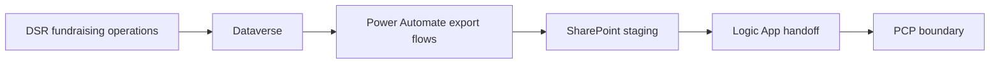
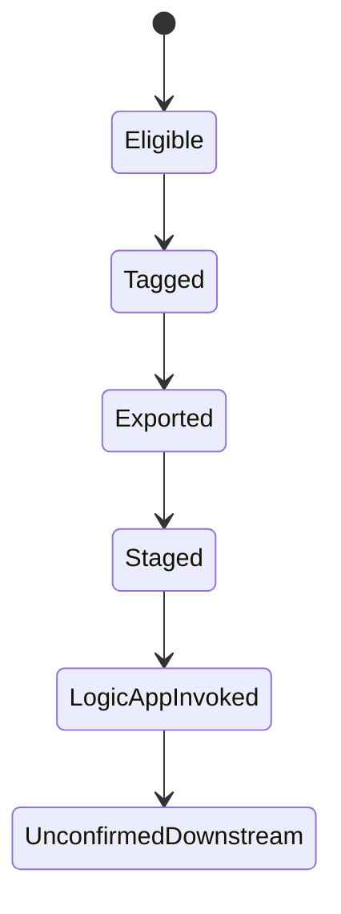

# PCP Diagrams

## Purpose
Provide the main Mermaid diagrams for the PCP documentation set.

## Business Capability Context

## File Lifecycle

## Contact Export Lifecycle

## Related Documents
- [Overview](pcp-overview.md)
- [End-to-end technical process](pcp-end-to-end-technical-process.md)
