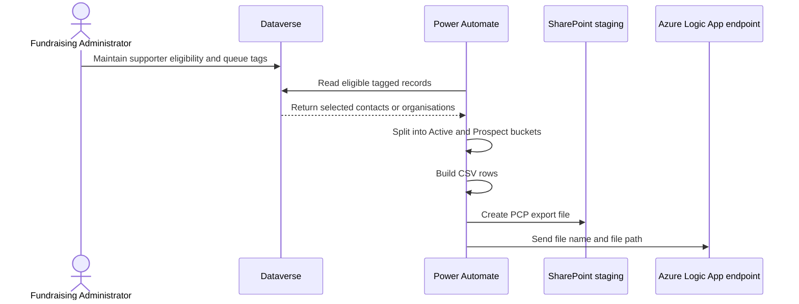

# PCP End-to-End Technical Process

## Purpose
Show the technical path from Dataverse selection to SharePoint staging and Logic App handoff.

## Technical Sequence

## Confirmed Technical Components
- Dataverse connector: `shared_commondataserviceforapps`
- SharePoint connector: `shared_sharepointonline`
- SharePoint site: the site configured in the export flow
- SharePoint folder: `/Shared Documents/PCP Files`
- Logic App trigger: HTTP request received

## What the Repository Confirms
- Two export flows exist: one for contacts and one for organisations.
- Both flows query `hit_segmenttags` for `ESC__PHONE_QUEUE`.
- Both flows create CSV files in the same SharePoint folder.
- Both flows call the same Logic App endpoint with `fileName` and `filePath`.

## What the Repository Does Not Confirm
- The Logic App workflow logic.
- Any SFTP transfer after the Logic App.
- PCP import rules or queue allocation logic.

## Related Documents
- [Overview](pcp-overview.md)
- [File staging](pcp-file-staging.md)
- [Logic App transfer](pcp-logic-app-transfer.md)
- [Secure file transfer](pcp-secure-file-transfer.md)
- [Evidence gaps](pcp-evidence-gaps.md)
