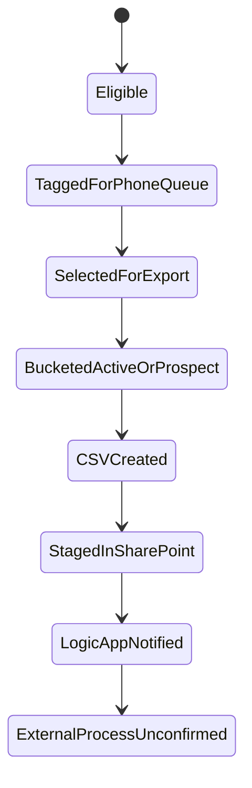

# PCP Status Model

## Purpose
Describe the confirmed and inferred state transitions around the PCP export.

## Confirmed Status Areas
- Contact eligibility.
- Queue membership.
- Export bucket: Active or Prospect.
- File creation and file handoff.

## Confirmed Status Values
- `ESC__PHONE_QUEUE`
- `JRN__CONTACT_DUE`
- `DLF__PROSPECT`

## Current Export Lifecycle

## Unconfirmed PCP Statuses
- PCP import status.
- PCP queue allocation status.
- Call completion status.
- Reconciliation status back to Dataverse.

## Related Documents
- [Queue management](pcp-queue-management.md)
- [Monitoring and reconciliation](pcp-monitoring-and-reconciliation.md)
- [Current and future state](pcp-current-and-future-state.md)
