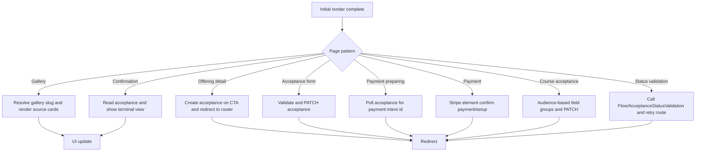

[Top: Documentation Home](../README.md) | [Data Access Patterns](data-access-patterns.md) | [Rendering Security](rendering-security.md)

# Client-Side Processing

## Purpose
Document browser-side JavaScript behavior after HTML render, including redirects, polling, Web API operations, and flow calls.

## JavaScript loading model
- Global script loaded on most pages via partials--footer-js:
  - /js/acceptance-bootstrap.js
- Many section templates inject inline JavaScript with page-specific logic.

## Global acceptance bootstrap behavior
- Listens for event hit:offeringDetail:continue.
- Retrieves CSRF token from /_layout/tokenhtml.
- POSTs acceptance to /_api/hit_offeringacceptances.
- Redirects to /accept/?acceptanceid=<guid>.

## Acceptance template client behaviors
Common patterns across sections--acceptance-* templates:
- Validate fields client-side with field and summary error display.
- Retrieve CSRF token.
- PATCH acceptance record by id.
- Redirect to router URL with waitforpayment and routeattempt.
- Retry routing loops with max-attempt guard and user-facing failure fallback.

## Payment preparation and payment behaviors
- sections--payment-preparing:
  - polls acceptance record every 3s for payment intent id.
  - max 30 polling attempts.
  - redirects back to router when ready.
- sections--payment:
  - loads Stripe.js.
  - supports one-off and recurring donation mode.
  - recurring mode calls setup intent endpoint (if configured).
  - on success, patches acceptance status and reloads router URL.

## Completion/status behaviors
- offering-acceptance---complete polls acceptance status through Web API and updates UI from Processing to Confirmed state.
- sections--confirmation and sections--confirmation-nonpayment are primarily read-only rendered views.

## Redirect map
- sections--offering-detail -> ?page=offering-acceptance&acceptanceid=...
- acceptance templates -> router with waitforpayment=1 routeattempt=n
- payment-preparing -> router refresh with cache-bust parameter
- venue acceptance -> /confirmation/?acceptanceId=...

## Polling and refresh behavior
- Router-level status retry:
  - maximumRouteAttempts generally 20
  - routeRetryDelayMilliseconds around 1250ms in router path
- payment-preparing polling:
  - 3-second interval
  - 90-second cap
- completion polling:
  - repeated fetch with 2-3 second fallback delay

## Error handling patterns
- Web API errors parsed from JSON or text fallback.
- Network/polling errors trigger delayed retry until cap.
- Missing acceptance id or missing secrets show warning/alert sections.
- validation endpoint absence stops retry and surfaces fallback behavior.

## Page-specific pattern diagram

## Browser-side dependencies
- /js/acceptance-bootstrap.js
- inline scripts in acceptance/payment/venue/complete templates
- Stripe runtime script https://js.stripe.com/v3/
- CSS from css--site.css and css--theme-client.css controls layout and responsive behavior for these components

## Source references
- power-pages/nfp-base/web-files/acceptance-bootstrap.js
- power-pages/nfp-base/web-templates/partials--footer-js/partials--footer-js.webtemplate.source.html
- power-pages/nfp-base/web-templates/sections--acceptance-router/sections--acceptance-router.webtemplate.source.html
- power-pages/nfp-base/web-templates/sections--acceptance-donation/sections--acceptance-donation.webtemplate.source.html
- power-pages/nfp-base/web-templates/sections--acceptance-course/sections--acceptance-course.webtemplate.source.html
- power-pages/nfp-base/web-templates/sections--payment-preparing/sections--payment-preparing.webtemplate.source.html
- power-pages/nfp-base/web-templates/sections--payment/sections--payment.webtemplate.source.html
- power-pages/nfp-base/web-templates/offering-acceptance---complete/Offering-Acceptance---Complete.webtemplate.source.html

[Bottom: Back](data-access-patterns.md) | [Next](rendering-security.md)
