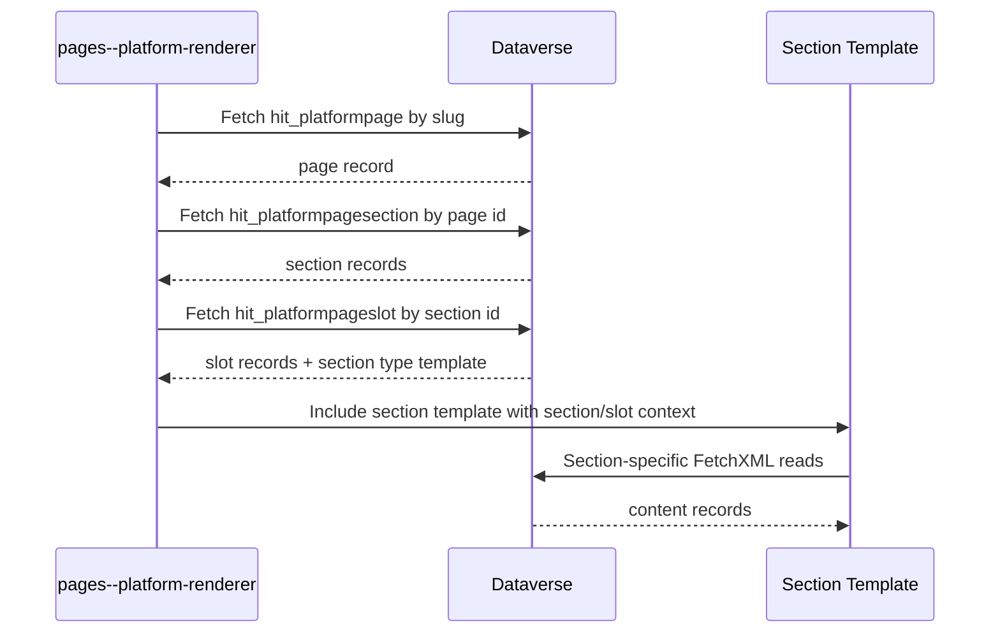
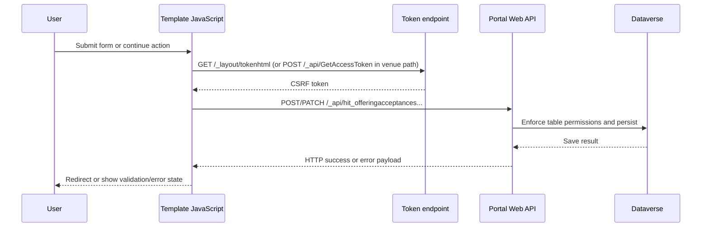
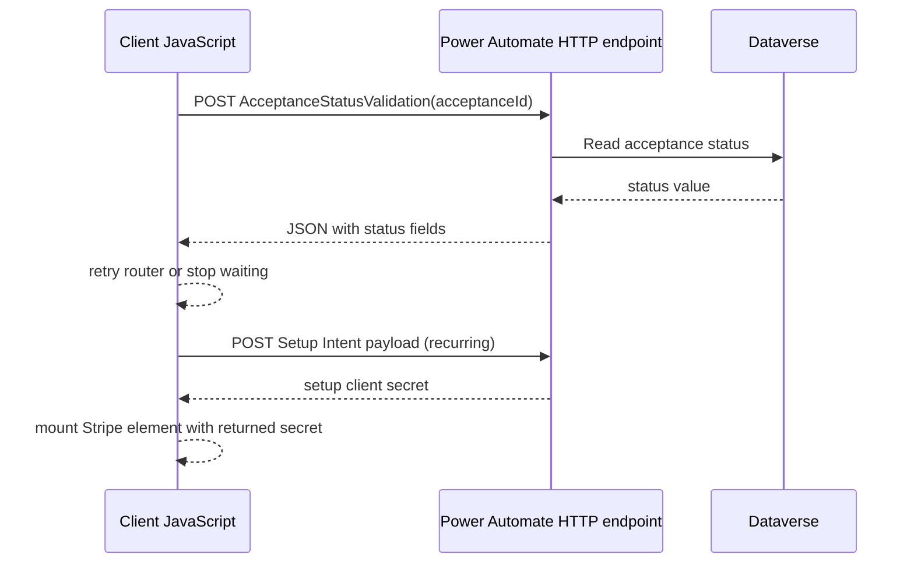

[Top: Documentation Home](../README.md) | [Template Composition](template-composition.md) | [Client Side Processing](client-side-processing.md)

# Data Access Patterns

## Purpose
Document DSR-specific data retrieval and mutation patterns across server-side Liquid rendering and client-side Web API usage.

## Server-side retrieval patterns (Liquid)

### Platform metadata retrieval
Used by pages--platform-renderer:
- hit_platformpage by slug and active flag
- hit_platformpagesection by page id and sort order
- hit_platformpageslot by section id, joined with hit_platformpagesectiontype for template names

### Acceptance router retrieval
Used by sections--acceptance-router:
- hit_offeringacceptance by acceptance id
- joined hit_offering fields for offering type/name

### Gallery retrieval
Used by sections--gallery and components--web-gallery:
- hit_webgalleryconfig lookup by id or slug
- source templates retrieve records from source-specific tables such as hit_offering, hit_persona, hit_program, hit_featuredcontent, article-like records

### Search retrieval
Used by search templates:
- searchindex query (standard runtime search index retrieval, not explicit FetchXML)

## Client-side retrieval patterns (Web API)
- Poll acceptance record for payment preparation and completion:
  - GET /_api/hit_offeringacceptances(id)?$select=...
- Route retry/status checks:
  - POST settings['Flow/AcceptanceStatusValidation'] with acceptanceId when configured

## Dataverse write operations (Web API)

### Acceptance create
- POST /_api/hit_offeringacceptances
- Triggered by:
  - sections--offering-detail
  - acceptance-bootstrap.js
  - some acceptance variants that create record when missing

### Acceptance update
- PATCH /_api/hit_offeringacceptances(id)
- Triggered by acceptance forms and payment completion logic.
- Fields commonly patched:
  - contact fields
  - organisation fields
  - course audience/plan
  - monetary fields
  - acceptance status in selected templates

### Venue booking write
- POST /_api/hit_venuespacebookingrequests
- Triggered by sections--acceptance-venue after acceptance patch.

## Dataverse read sequence diagram

## Dataverse write sequence diagram

## Flow invocation sequence diagram

## Notes on standard runtime boundaries
- FetchXML execution and searchindex are server-side runtime features.
- Web API permission enforcement is runtime behavior governed by table permissions and site settings.
- CSRF token generation is runtime behavior; template code only consumes it.

## Known data-access gaps
- settings key Flow/AcceptanceStatusValidation is referenced in templates but not visible in exported sitesetting.yml.
- settings key Stripe/PublishableKey is referenced in templates but not visible in exported sitesetting.yml.
- settings key Stripe/CreateCustomerSetupIntentUrl is referenced in sections--payment but not visible in exported sitesetting.yml.

## Source references
- power-pages/nfp-base/web-templates/pages--platform-renderer/pages--platform-renderer.webtemplate.source.html
- power-pages/nfp-base/web-templates/sections--acceptance-router/sections--acceptance-router.webtemplate.source.html
- power-pages/nfp-base/web-templates/sections--offering-detail/sections--offering-detail.webtemplate.source.html
- power-pages/nfp-base/web-templates/sections--payment-preparing/sections--payment-preparing.webtemplate.source.html
- power-pages/nfp-base/web-templates/sections--payment/sections--payment.webtemplate.source.html
- power-pages/nfp-base/web-templates/sections--acceptance-venue/sections--acceptance-venue.webtemplate.source.html
- power-pages/nfp-base/sitesetting.yml

[Bottom: Back](template-composition.md) | [Next](client-side-processing.md)
