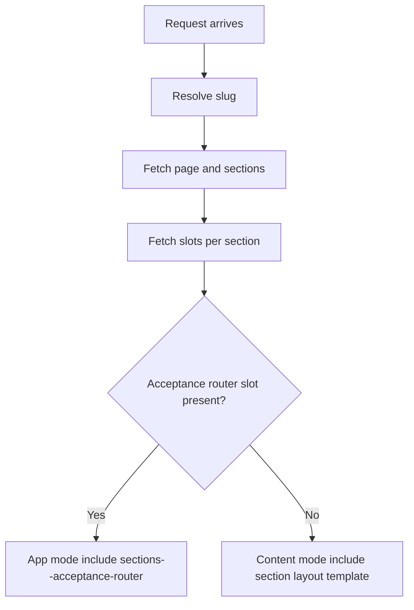

[Top: Documentation Home](../README.md) | [Architecture](../02-solution-architecture.md) | [System Walkthrough](../06-system-walkthrough.md)

# Portal Rendering

## Purpose
Explain how DSR pages are dynamically assembled in Power Pages and where acceptance journeys bypass standard content rendering.

## Business context
The same portal host supports both content pages and application-like acceptance journeys. The renderer must branch cleanly between those modes.

## Participants and systems
- Power Pages Liquid templates.
- Dataverse tables for platform page, section, slot, and section type metadata.

## Preconditions
- hit_platformpage, hit_platformpagesection, and hit_platformpageslot data exist and are active.
- Relevant section templates are present in web templates.

## Trigger
- User requests a portal URL resolved through pages--platform-renderer.

## High-level process
1. Resolve target page slug from query or path fallback.
2. Fetch platform page and page sections.
3. For each section, fetch slots and section-type template names.
4. If sections include acceptance router slot, run app mode path.
5. Otherwise render content mode using layout template include.

## Sub-processes
- App mode:
  - short-circuit content layout and directly delegate to acceptance router logic.
- Content mode:
  - apply section style parameters (colour, bleed, width, media).
  - include section layout template.

## Business rules
- Router mode takes precedence when acceptance router is present.
- Home fallback applies when no slug/path route is present.
- Invisible sections are skipped.

## Dataverse records and relationships
- hit_platformpage -> hit_platformpagesection -> hit_platformpageslot.
- hit_platformpageslot -> hit_platformpagesectiontype (template name).
- section links to hit_platformsectionlayout for content mode layout.

## Power Pages components
- pages--platform-renderer.
- sections--acceptance-router.
- layout templates referenced by section metadata.

## Web templates
- pages--platform-renderer.webtemplate.source.html.
- sections--acceptance-router.webtemplate.source.html.

## Power Automate flows
- Not directly invoked by platform renderer itself.
- Downstream flows are invoked by acceptance-router pathways.

## External integrations
- None at renderer stage.

## Status and state transitions
- Transition is rendering-mode based, not record-state based:
  - Content mode -> section layout include.
  - App mode -> acceptance-router include.

## Error and exception handling
- Missing page/section/slot data leads to partial or empty render output.
- Debug branch exists in template for diagnostics.

## Security and permissions
- Rendered content visibility still depends on portal security and Dataverse access constraints.

## Operational considerations
- Renderer behavior is metadata-driven; data misconfiguration can break routing without template changes.

## Known limitations
- No centralized runtime validation document for section metadata integrity.

## Evidence and source references
- power-pages/nfp-base/web-templates/pages--platform-renderer/pages--platform-renderer.webtemplate.source.html
- power-pages/nfp-base/web-templates/sections--acceptance-router/sections--acceptance-router.webtemplate.source.html
- ../reference/component-evidence-register.md

## Related documents
- [../navigation/navigation.md](../navigation/navigation.md)
- [../offerings/offerings-acceptance.md](../offerings/offerings-acceptance.md)

[Bottom: Home](../README.md) | [Next: Navigation](../navigation/navigation.md)
