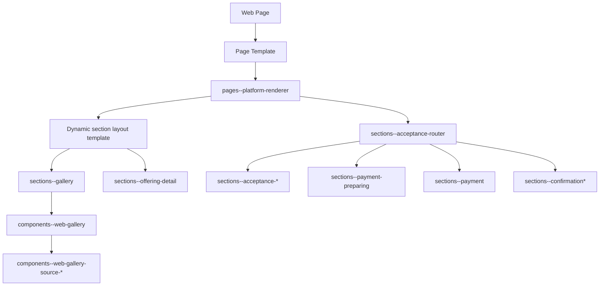

[Top: Documentation Home](../README.md) | [Rendering Security](rendering-security.md)

# Rendering Dependency Map

## Purpose
Provide a template-by-template dependency matrix for important rendering components in the DSR portal.

## Template dependency diagram

## Important Web Template matrix

| Template | Business purpose | Caller or parent template | Included templates | Input parameters | Dataverse tables read | Dataverse tables written | Flows invoked | Browser-side scripts used | Output generated | Redirect behaviour | Failure behaviour | Security dependencies | Repository-relative source path |
|---|---|---|---|---|---|---|---|---|---|---|---|---|---|
| pages--platform-renderer | Primary metadata-driven renderer for content/app modes | Page Template Platform Renderer | dynamic slot template include, dynamic layout include | request.params.page, request.params.gallery, request.params.debug | hit_platformpage, hit_platformpagesection, hit_platformpageslot, hit_platformpagesectiontype, hit_platformsectionlayout | none | none | none directly | section-based HTML output | none directly | page not found message, empty sections if metadata missing | Platform page/section/slot table permissions read | power-pages/nfp-base/web-templates/pages--platform-renderer/pages--platform-renderer.webtemplate.source.html |
| layout--platform-page | Structural shell for platform pages | Page template content shell | partials--head-css, layout--header, layout--footer, partials--footer-js | settings['Site/LayoutMode'], request.params.devcss | none | none | none | none | full page chrome wrapper | none | none | header/footer/template availability | power-pages/nfp-base/web-templates/layout--platform-page/layout--platform-page.webtemplate.source.html |
| header | Active header chrome with branding fetch and nav include | layout--header or direct header binding | components--web-nav-header | website, branding fetch result | hit_brandsettings | none | none | inline runtime guards only | header HTML and CSS variables | none | no explicit fallback if brand query empty | Brand settings table permission read | power-pages/nfp-base/web-templates/header/Header.webtemplate.source.html |
| components--web-nav-header | Active top nav renderer (currently static output) | header, layout--header | components--web-nav-header-node (dynamic block present but disabled) | request.path, request.params.navdebug | hit_webnavmenu and hit_webnavmenuitem in disabled path | none | none | none | nav list markup | none | can render minimal/static output | nav table permissions if dynamic path enabled | power-pages/nfp-base/web-templates/components--web-nav-header/components--web-nav-header.webtemplate.source.html |
| sections--gallery | Resolve gallery source and render gallery section | section layout template include | components--web-gallery | section, slot, request.params.gallery, debug | hit_webgalleryconfig (lookup by id path) | none | none | inline debug only | gallery section wrapper and include | none | no gallery output when unresolved slug | Web Gallery Config read permission | power-pages/nfp-base/web-templates/sections--gallery/sections--gallery.webtemplate.source.html |
| components--web-gallery | Resolve gallery config and route to source-specific renderer | sections--gallery and similar | components--web-gallery-source-programs/personas/featuredcontent/article/offering | gallerySlug, galleryOverride, displayStyle, displayVariant, maxColumns, maxRows, debug | hit_webgalleryconfig and source tables via child includes | none | none | none | gallery grid/carousel/tiles markup | none | explicit hard-fail block for missing override slug | Web Gallery Config and source table read permissions | power-pages/nfp-base/web-templates/components--web-gallery/components--web-gallery.webtemplate.source.html |
| sections--offering-detail | Offering detail display and acceptance creation entry point | section layout include from renderer | none | slot.hit_offering or request.params.id | hit_offering, hit_priceoption | hit_offeringacceptance via Web API POST | none directly | inline JS for selection, create, redirect | offering detail and capture panel UI | redirects to router query page with acceptance id | API error surfaced in error box | Offerings read + Offering Acceptance create/write + WebApi enabled | power-pages/nfp-base/web-templates/sections--offering-detail/sections--offering-detail.webtemplate.source.html |
| sections--acceptance-router | Acceptance state machine and page composition orchestrator | pages--platform-renderer app mode | sections--acceptance-*, sections--payment-preparing, sections--payment, sections--confirmation* | acceptanceid, waitforpayment, flowstatus, routeattempt, debug | hit_offeringacceptance + hit_offering | none directly (delegates to child templates) | Flow/AcceptanceStatusValidation via JS when configured | inline JS for retry/redirect | state-dependent acceptance/payment/confirmation UI | redirects via router URL rebuild | retry loop with max attempts and fallback stop | Offering Acceptance read permission + flow endpoint availability | power-pages/nfp-base/web-templates/sections--acceptance-router/sections--acceptance-router.webtemplate.source.html |
| sections--acceptance-donation | Donation acceptance form capture and handoff | sections--acceptance-router | none | acceptanceid, waitforpayment, routeattempt, debug | hit_offeringacceptance + hit_offering | hit_offeringacceptance PATCH | Flow/AcceptanceStatusValidation via JS when configured | inline JS validation, patch, retry/redirect | donation form UI | redirects to router waitforpayment flow | validation summary, retry cap fallback | Offering Acceptance write/read + WebApi + token endpoint | power-pages/nfp-base/web-templates/sections--acceptance-donation/sections--acceptance-donation.webtemplate.source.html |
| sections--acceptance-course | Course audience-aware registration form | sections--acceptance-router | none | acceptanceId, offeringName, debug, waitforpayment | hit_offeringacceptance + hit_offering | hit_offeringacceptance PATCH | none direct in visible path; router handles validation flow | inline JS for audience config, patch, route retries | course registration form UI | redirects back to router waitforpayment flow | field validation and retry cap | Offering Acceptance write/read + WebApi + token endpoint | power-pages/nfp-base/web-templates/sections--acceptance-course/sections--acceptance-course.webtemplate.source.html |
| sections--acceptance-event | Event registration acceptance path | sections--acceptance-router | none | offeringid, eventid, acceptanceid, debug | hit_offering, event data, acceptance context | hit_offeringacceptance create/update | none explicit in reviewed lines | inline JS create/update and redirect | event registration UI | redirects to payment router URL with token parameters | API failure messages in UI | Offerings read, Event read, Acceptance create/write permissions | power-pages/nfp-base/web-templates/sections--acceptance-event/sections--acceptance-event.webtemplate.source.html |
| sections--acceptance-venue | Venue booking acceptance and booking request creation | sections--acceptance-router | none | acceptanceid, debug | hit_offeringacceptance, hit_offering, hit_venuespace, hero/images/inclusions/bookings/holds/blackouts | hit_offeringacceptance PATCH, hit_venuespacebookingrequest POST | none direct | inline JS, custom token endpoint /_api/GetAccessToken | venue booking form and calendar UI | redirect to /confirmation/?acceptanceId=... | API parse errors and unexpected error fallback | Venue and booking table permissions + WebApi enabled | power-pages/nfp-base/web-templates/sections--acceptance-venue/sections--acceptance-venue.webtemplate.source.html |
| sections--payment-preparing | Payment session waiting screen | sections--acceptance-router | none | acceptanceid | hit_offeringacceptance via Web API polling | none | none | inline polling script | preparing state UI with spinner | redirects to router with cache-bust when payment intent appears | timeout UI after poll cap | Offering Acceptance read + WebApi | power-pages/nfp-base/web-templates/sections--payment-preparing/sections--payment-preparing.webtemplate.source.html |
| sections--payment | Stripe payment capture UI (one-off and recurring) | sections--acceptance-router | none | acceptanceid, debug, stripe settings | hit_offeringacceptance + hit_offering via FetchXML and Web API retrieval paths | hit_offeringacceptance PATCH for completion fields | Stripe/CreateCustomerSetupIntentUrl endpoint for recurring setup (if configured) | inline Stripe integration script + Stripe.js | payment form UI and status messaging | reloads router URL after payment/setup completion | error summary for missing keys, Stripe errors, API patch errors | Offering Acceptance write/read, WebApi, Stripe settings presence | power-pages/nfp-base/web-templates/sections--payment/sections--payment.webtemplate.source.html |
| sections--confirmation | Post-payment confirmation view | sections--acceptance-router | none | acceptanceid | hit_offeringacceptance + hit_offering | none | none | inline display only | confirmation HTML | none | warning if acceptance missing | Offering Acceptance read permission | power-pages/nfp-base/web-templates/sections--confirmation/sections--confirmation.webtemplate.source.html |
| sections--confirmation-nonpayment | Non-payment completion view | sections--acceptance-router | none | acceptanceid | hit_offeringacceptance + hit_offering | none | none | inline display only | nonpayment confirmation HTML | none | warning if acceptance missing | Offering Acceptance read permission | power-pages/nfp-base/web-templates/sections--confirmation-nonpayment/sections--confirmation-nonpayment.webtemplate.source.html |
| search-results | Search result rendering for query pages | Search page template chain | Page Header, Pagination | request.params.q, request.params.page | searchindex runtime index | none | none | none | result list and pagination HTML | none | no-results snippet fallback | Search site settings and snippet dependencies | power-pages/nfp-base/web-templates/search-results/Search-Results.webtemplate.source.html |

## Notes
- offering-acceptance---payment and offering-acceptance---complete templates exist as alternate payment/complete implementations but are not included by sections--acceptance-router in the current active path.
- Header-legacy is present and snippet/sitemarker-driven but not the active header binding in website.yml.

## Source references
- power-pages/nfp-base/web-templates/**/*.webtemplate.source.html
- power-pages/nfp-base/page-templates/*.pagetemplate.yml
- power-pages/nfp-base/web-pages/**/*.webpage.yml
- power-pages/nfp-base/sitesetting.yml
- power-pages/nfp-base/table-permissions/*.tablepermission.yml

[Bottom: Back](rendering-security.md)
