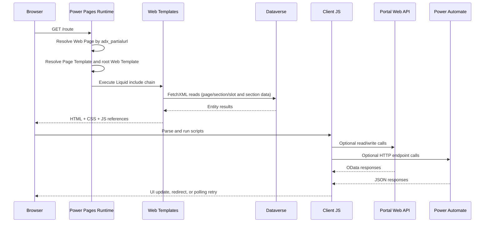
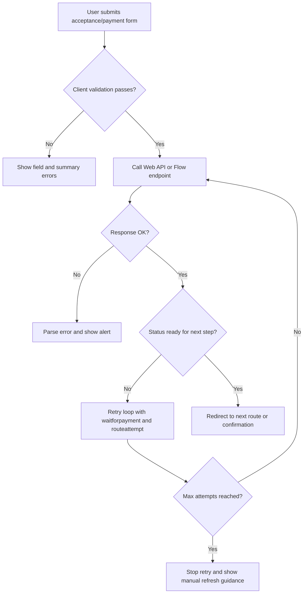

[Top: Documentation Home](../README.md) | [Rendering Overview](rendering-overview.md) | [Data Access Patterns](data-access-patterns.md)

# Rendering Lifecycle

## Purpose
Provide the complete request-to-render lifecycle for DSR pages, including redirects, polling loops, error handling, and flow-driven status transitions.

## Lifecycle steps

### 1. Browser request and route resolution
- Browser requests a path such as /, /donate, /search.
- Standard runtime resolves adx_partialurl in Web Page records.
- Example: home and donate pages are bound to Page Template Platform Renderer.

### 2. Web Page to Page Template resolution
- Web Page adx_pagetemplateid selects a Page Template.
- Platform Renderer page template maps to web template pages--platform-renderer.
- Search and Profile use rewrite templates to standard runtime pages (~\/Pages/Search.aspx and ~\/Pages/Profile.aspx).

### 3. Web Template execution and include composition
- Layout shell includes head CSS, header, content, footer, and footer JS.
- Header includes components--web-nav-header.
- pages--platform-renderer chooses between:
  - app mode (acceptance router) when slot template is sections--acceptance-router.
  - content mode (section layout include chain) for content pages.

### 4. Server-side Dataverse retrieval during render
- pages--platform-renderer fetches:
  - hit_platformpage by slug
  - hit_platformpagesection records
  - hit_platformpageslot records with hit_platformpagesectiontype template names
- section templates run their own FetchXML queries depending on section type.

### 5. HTML response generation
- Liquid output becomes final HTML for initial response.
- Inline scripts are embedded in many acceptance/payment templates.

### 6. Browser render and client processing
- Browser loads CSS:
  - /bootstrap.min.css
  - /theme.css
  - /css--site.css
  - /css--theme-client.css
- Browser loads global script:
  - /js/acceptance-bootstrap.js
- Inline scripts execute for current section template.

### 7. Optional client-side API/flow calls
- Portal Web API reads/writes (examples):
  - POST /_api/hit_offeringacceptances
  - PATCH /_api/hit_offeringacceptances(id)
  - GET /_api/hit_offeringacceptances(id)?$select=...
  - POST /_api/hit_venuespacebookingrequests
- Flow endpoint calls:
  - settings['Flow/AcceptanceStatusValidation'] POST with acceptanceId
  - settings['Stripe/CreateCustomerSetupIntentUrl'] POST for recurring setup intent (if configured)

### 8. Redirect, polling, and final UI state
- Acceptance forms usually redirect back to router URL with:
  - page=offering-acceptance
  - acceptanceid
  - waitforpayment=1
  - routeattempt and cache-busting timestamp
- Router and form templates apply retry loops with route attempt caps.
- Payment-preparing template polls acceptance for stripepaymentintentid.
- sections--payment handles Stripe confirmation and routes back to router.
- Confirmation templates render final UX by acceptance status and payment-required path.

## Acceptance/payment state-driven lifecycle
- Draft-like initial acceptance -> details capture form
- Payment required branch -> preparing -> payment
- Completed branch -> confirmation
- Non-payment branch -> nonpayment confirmation
- Failed/cancelled branch -> alert states

## Error handling lifecycle
- Missing required request parameters show warning alerts.
- Missing acceptance records show not found alerts.
- Validation errors render field-level and summary errors in forms.
- Web API non-OK responses are parsed and shown to users.
- Polling retries stop after max attempts and present manual-retry guidance.

## Flow invocation sequence
- Acceptance templates can trigger acceptance status validation endpoint.
- Recurring setup calls setup-intent endpoint.
- Payment intent creation is referenced by site setting and legacy payment template path.
- Dataverse status transitions after payment depend on external flow/webhook behavior beyond this repository’s direct template code.

## Rendering lifecycle sequence

## Error/validation path diagram

## Source references
- power-pages/nfp-base/web-pages/home/Home.webpage.yml
- power-pages/nfp-base/web-pages/donate/Donate.webpage.yml
- power-pages/nfp-base/page-templates/Platform-Renderer.pagetemplate.yml
- power-pages/nfp-base/web-templates/pages--platform-renderer/pages--platform-renderer.webtemplate.source.html
- power-pages/nfp-base/web-templates/sections--acceptance-router/sections--acceptance-router.webtemplate.source.html
- power-pages/nfp-base/web-templates/sections--payment-preparing/sections--payment-preparing.webtemplate.source.html
- power-pages/nfp-base/web-templates/sections--payment/sections--payment.webtemplate.source.html
- power-pages/nfp-base/web-templates/sections--confirmation/sections--confirmation.webtemplate.source.html

[Bottom: Back](rendering-overview.md) | [Next](template-composition.md)
