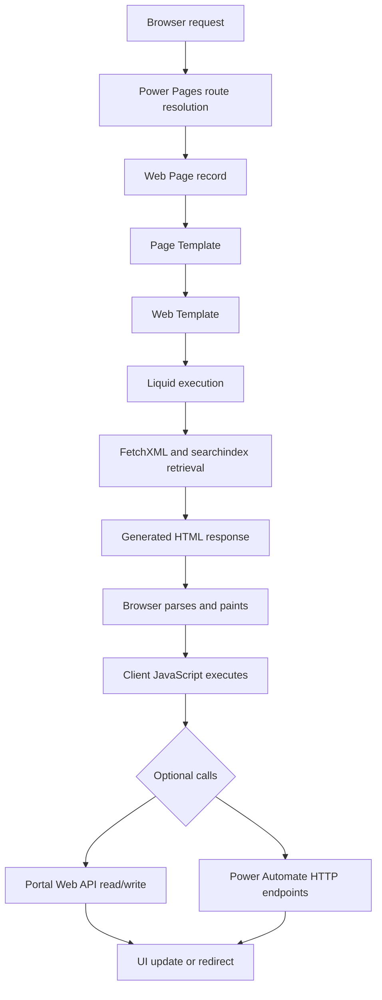
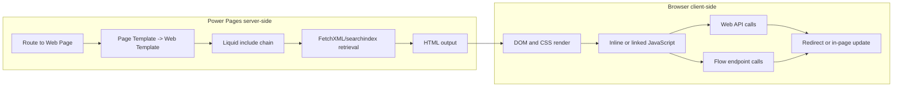

[Top: Documentation Home](../README.md) | [Rendering Lifecycle](rendering-lifecycle.md) | [Template Composition](template-composition.md)

# DSR Rendering Overview

## Purpose
Document how DSR portal pages are rendered from browser request through final UI, with clear boundaries between standard Power Pages runtime behavior and DSR repository code.

## Scope reviewed
- Web Pages
- Page Templates
- Web Templates
- Liquid includes
- Content Snippets
- Site Markers
- Site Settings
- Dataverse retrieval (FetchXML and searchindex)
- Web API calls
- JavaScript
- CSS
- Authentication context
- Web Roles
- Table Permissions
- Column permissions
- Flow endpoint usage from template JavaScript

## Runtime summary
DSR uses one dominant rendering path:
1. Route resolves to a Web Page record.
2. Web Page uses Page Template Platform Renderer for most pages.
3. Platform Renderer Web Template (pages--platform-renderer) executes Liquid and FetchXML to resolve page sections and slots.
4. Slot section types dynamically include section templates.
5. Sections render HTML and optionally run client JavaScript.
6. Client-side code may call Web API and Flow HTTP endpoints.
7. Browser updates UI or redirects.

## What is standard runtime vs repository custom code
- Standard Power Pages runtime:
  - URL route resolution to Web Page records by adx_partialurl.
  - Web Page to Page Template binding and render pipeline.
  - Liquid runtime and include execution.
  - Built-in Search/Profile rewrite templates (~\/Pages\/*.aspx).
  - Portal Web API security enforcement by table permissions.
  - CSRF token issuance at /_layout/tokenhtml.
- DSR/NFP repository implementation:
  - Metadata-driven platform renderer using hit_platformpage, hit_platformpagesection, hit_platformpageslot.
  - Acceptance state machine in sections--acceptance-router.
  - Custom acceptance forms and payment orchestration in sections--acceptance-* and sections--payment* templates.
  - Gallery framework components and slot-driven gallery source routing.
  - DSR CSS and client script assets loaded via partials--head-css and partials--footer-js.

## Process-specific rendering patterns
- Gallery pages:
  - sections--gallery -> components--web-gallery -> source-specific gallery templates.
- Offering pages:
  - sections--offering-detail (slot-driven), plus legacy-style offering-detail route logic in standalone template.
- Acceptance pages:
  - sections--acceptance-router includes offering-type templates by acceptance status and offering type.
- Payment pages:
  - sections--payment-preparing polls acceptance record for stripe payment intent id.
  - sections--payment renders Stripe Payment Element and handles one-off or recurring flows.
- Course pages:
  - sections--acceptance-course drives audience/plan form variants and patches acceptance fields.
- Confirmation pages:
  - sections--confirmation (payment) and sections--confirmation-nonpayment (no payment required).
- Status validation pages/behaviors:
  - waitforpayment and routeattempt loops in router and acceptance templates.
  - validation endpoint from settings['Flow/AcceptanceStatusValidation'] is called by JavaScript when configured.

## Forms, lists, and page-builder artifacts
- Evidence shows custom HTML/JavaScript forms are primary for acceptance journeys.
- No exported Basic Form, Multistep Form, or List YAML artifacts were found under power-pages/nfp-base.
- Search page uses standard searchindex Liquid query, not Dataverse List metadata in repository exports.

## Key risks in current evidence
- settings keys referenced by runtime templates are not fully present in exported sitesetting.yml:
  - Flow/AcceptanceStatusValidation
  - Stripe/PublishableKey
  - Stripe/CreateCustomerSetupIntentUrl
- These may exist in environment but are not evidenced in this export set.

## Generic lifecycle diagram

## Server/client boundary diagram

## Source references
- power-pages/nfp-base/website.yml
- power-pages/nfp-base/web-pages/**/*.webpage.yml
- power-pages/nfp-base/page-templates/*.pagetemplate.yml
- power-pages/nfp-base/web-templates/pages--platform-renderer/pages--platform-renderer.webtemplate.source.html
- power-pages/nfp-base/web-templates/sections--acceptance-router/sections--acceptance-router.webtemplate.source.html
- power-pages/nfp-base/web-templates/sections--payment/sections--payment.webtemplate.source.html
- power-pages/nfp-base/web-templates/sections--payment-preparing/sections--payment-preparing.webtemplate.source.html
- power-pages/nfp-base/web-files/acceptance-bootstrap.js
- power-pages/nfp-base/sitesetting.yml
- power-pages/nfp-base/table-permissions/*.tablepermission.yml

[Bottom: Next](rendering-lifecycle.md)
