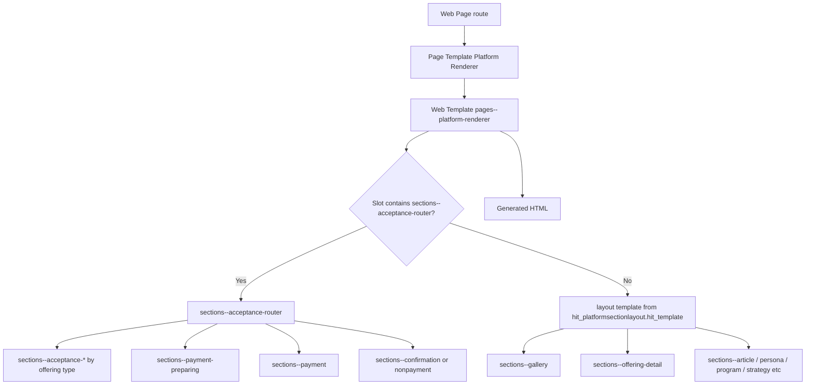

[Top: Documentation Home](../README.md) | [Rendering Lifecycle](rendering-lifecycle.md) | [Rendering Dependency Map](rendering-dependency-map.md)

# Template Composition

## Purpose
Document how DSR web templates compose from top-level shell to page-specific sections, including include boundaries and mode switching.

## Active top-level composition
1. Website header template is Header (custom) and footer template is Footer.
2. Layout shells include:
- partials--head-css
- layout--header
- page content
- layout--footer
- partials--footer-js
3. layout--header includes components--web-nav-header.

## Primary page renderer path
- Most active pages resolve to Page Template Platform Renderer.
- Platform Renderer executes pages--platform-renderer.
- pages--platform-renderer fetches page metadata and includes section/layout templates dynamically.

## Mode branching inside pages--platform-renderer
- App mode:
  - if section slots include sections--acceptance-router.
  - acceptance router takes over UI flow.
- Content mode:
  - include layout template from section metadata.
  - layout includes section slot templates.

## Composition diagram

## Header/navigation composition
- Active path:
  - header template -> components--web-nav-header (currently hardcoded menu output)
- Legacy available path:
  - Header-legacy -> weblinks and snippets and sitemarkers

## Search/profile composition boundary
- Search and Profile pages use rewrite URL page templates.
- Search template uses standard searchindex Liquid block and snippets.
- Profile page rendering behavior is primarily standard runtime via rewrite URL path.

## Layout and section contracts
- Section template receives slot and section context from dynamic include.
- Gallery section resolves effective gallery slug and delegates to components--web-gallery.
- components--web-gallery delegates to source templates by gallery source type.

## Template include boundary rules observed
- Most includes pass explicit parameters: section, slot, debug, galleryParam, galleryOverride.
- Acceptance router passes acceptanceId/offeringName/debug into course, eoi, and venue variants.
- Layout templates are metadata driven, so incorrect hit_template values can fail rendering without compile-time checks.

## Process-specific composition patterns
- Gallery pages:
  - sections--gallery -> components--web-gallery -> components--web-gallery-source-* -> card template.
- Offering pages:
  - sections--offering-detail does data retrieval and acceptance-create workflow in-template.
- Acceptance pages:
  - router and acceptance templates own composition; not standard Power Pages Basic Form composition.
- Payment pages:
  - sections--payment-preparing and sections--payment are router-included components.
- Confirmation pages:
  - sections--confirmation / sections--confirmation-nonpayment are terminal includes from router.

## Source references
- power-pages/nfp-base/website.yml
- power-pages/nfp-base/web-templates/layout--platform-page/layout--platform-page.webtemplate.source.html
- power-pages/nfp-base/web-templates/layout--header/layout--header.webtemplate.source.html
- power-pages/nfp-base/web-templates/partials--head-css/partials--head-css.webtemplate.source.html
- power-pages/nfp-base/web-templates/partials--footer-js/partials--footer-js.webtemplate.source.html
- power-pages/nfp-base/web-templates/pages--platform-renderer/pages--platform-renderer.webtemplate.source.html
- power-pages/nfp-base/web-templates/sections--acceptance-router/sections--acceptance-router.webtemplate.source.html
- power-pages/nfp-base/web-templates/sections--gallery/sections--gallery.webtemplate.source.html

[Bottom: Back](rendering-lifecycle.md) | [Next](data-access-patterns.md)
