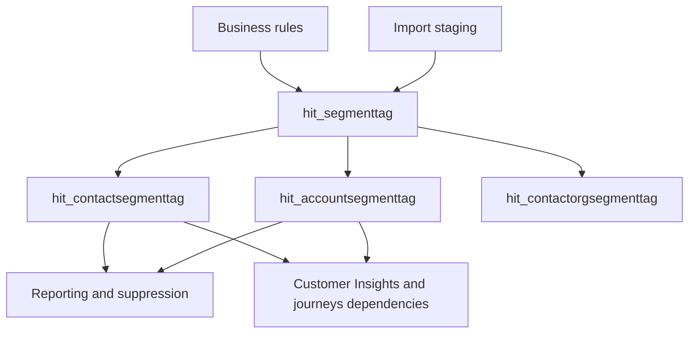
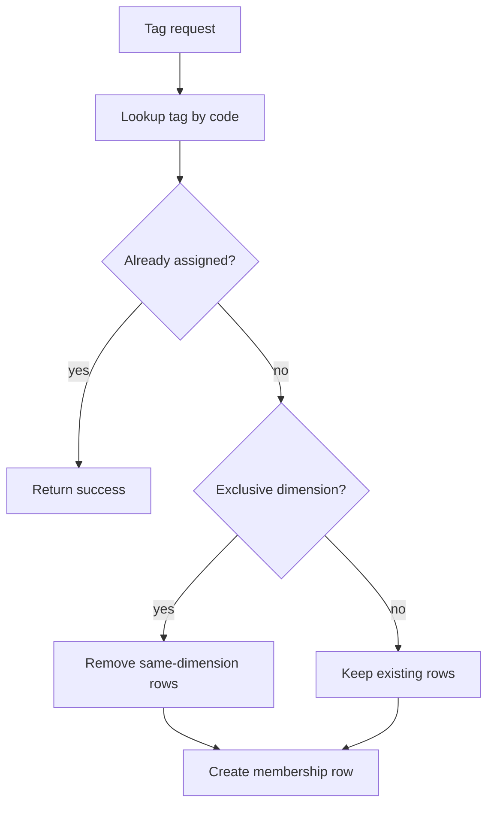
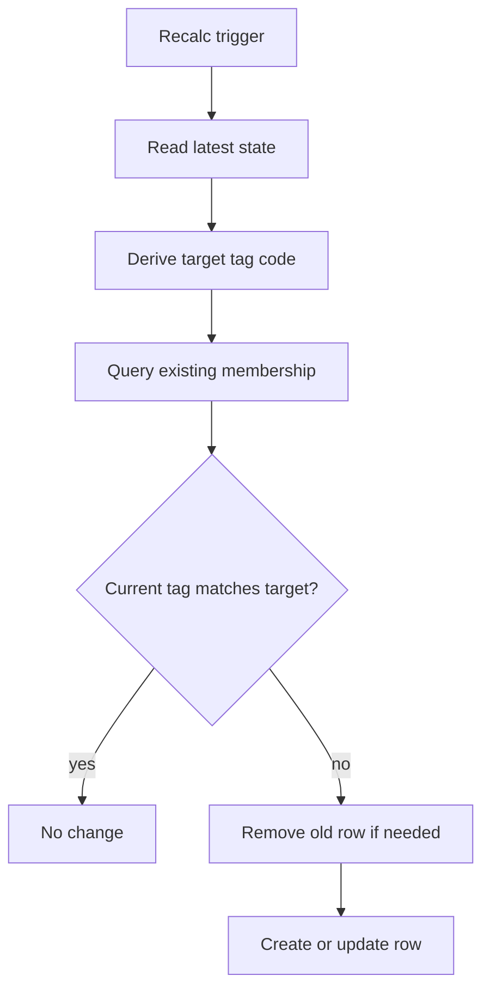
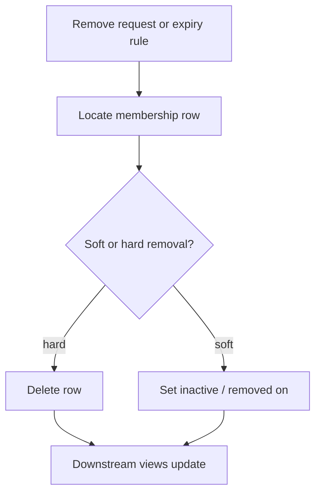
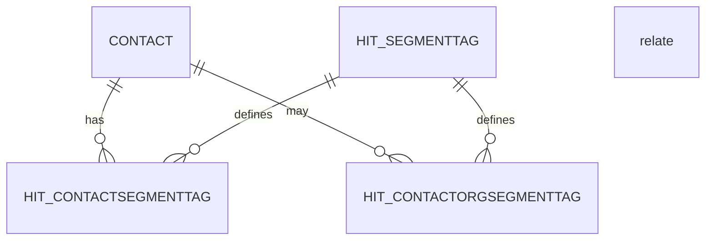
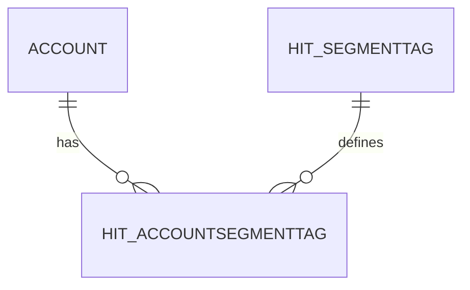
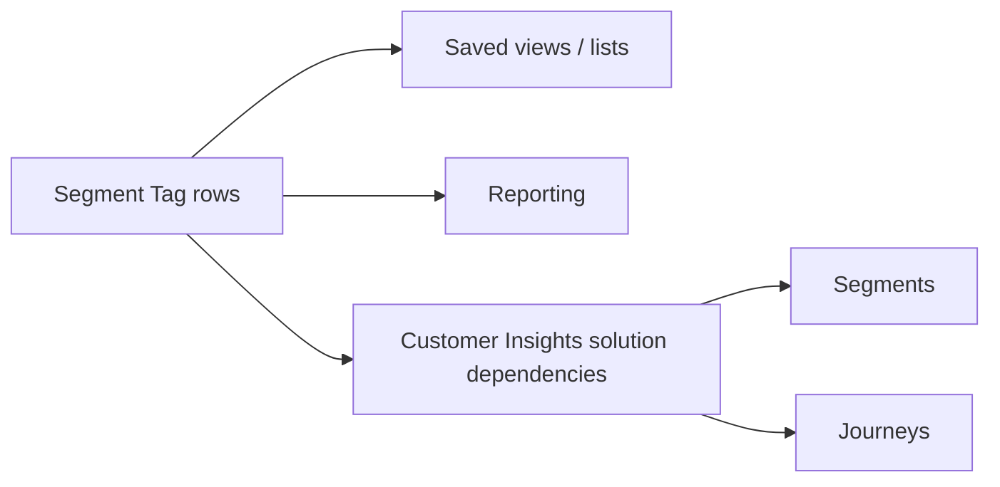
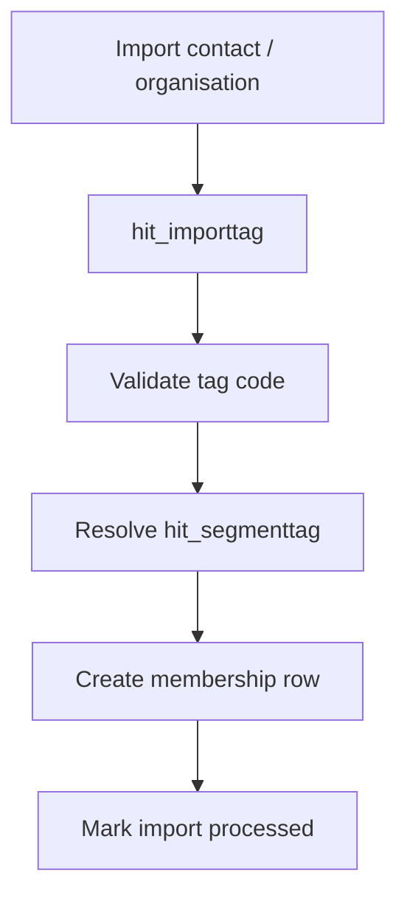
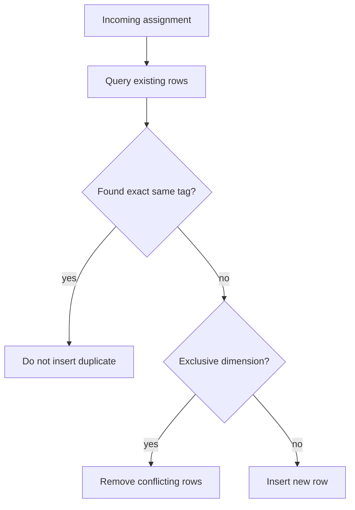
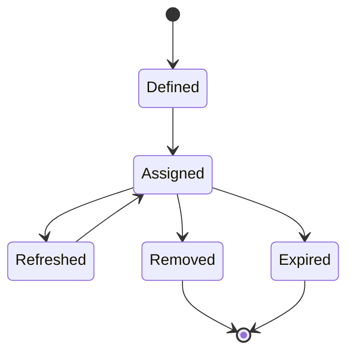

# Segment Tag Diagrams

## 1. Segment Tag capability context

## 2. Tag assignment process

## 3. Tag refresh process

## 4. Tag removal or expiry process

## 5. Contact Tag entity relationship diagram

## 6. Organisation Tag entity relationship diagram

## 7. Tag consumption by Customer Insights and journeys

## 8. Import and migration tag process

## 9. Duplicate-prevention decision flow

## 10. Tag lifecycle state diagram
