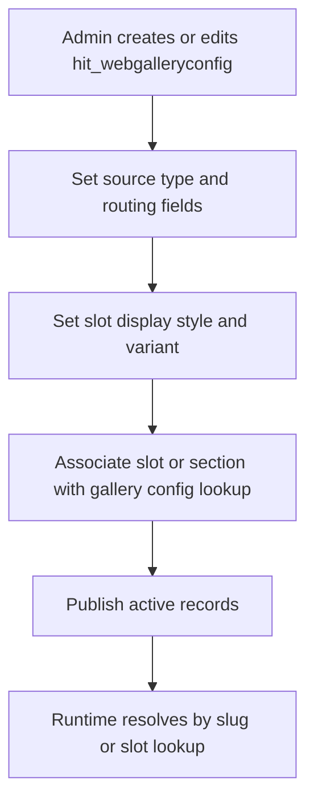
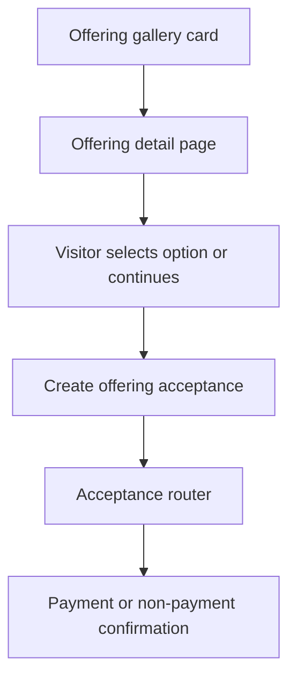

# Gallery Business Process

## Purpose
Describe the business process from administrator configuration through visitor interaction and progression to the next business process.

## End-to-end business process

### 1. Administrator configures gallery
- Admin creates or updates Web Gallery Config records in Dataverse (entity visible in DSR app module sitemap as Gallery Configs).
- Admin sets source type, target page, id parameter name, offering type constraint, and link behavior.
- Admin (or web configuration process) links gallery config to slot/section context through platform page metadata.

### 2. Gallery configuration is stored
- Primary configuration record is stored in hit_webgalleryconfig.
- Related assignment metadata can be stored through relationships to:
  - platform slot/section references
  - program/persona/initiative lookups
  - hit_webgallerytag relationships to segment tags (schema-level relationship exists).

### 3. Eligible content is associated or selected
- Runtime selection is query-based, not explicit item membership lists.
- Source adapters retrieve entity records that pass active/visible/published conditions.
- For offering source, optional offering type constraint narrows the result set.

### 4. Site visitor opens gallery
- Visitor requests a page that resolves to Platform Renderer.
- Page metadata resolves to a slot whose section type template is sections--gallery.
- Querystring override can switch gallery slug when slot allows it.

### 5. Records are retrieved
- components--web-gallery resolves gallery config by slug and active status.
- Source adapter executes FetchXML against selected source entity.
- Results are ordered and limited by maxItems.

### 6. Items are rendered
- Adapter maps each row into card input model (title, summary, image, label, href).
- Card template variant renders visual tiles/list/cards.
- CSS classes apply style and columns/rows from configuration context.

### 7. Visitor filters or selects an item
- No end-user filter controls are implemented in gallery templates.
- Effective filtering occurs pre-render from Dataverse query conditions.
- Visitor selects an item by clicking card, title, or CTA.

### 8. Visitor reaches the next process
- Route target is generated by item web URL or target page + id query parameter.
- For offering items, destination commonly enters offering detail and can progress to offering acceptance journey.

## Business controls and guardrails
- Inactive gallery configs are not resolved in query override path.
- Invalid override slug produces explicit error state.
- Unsupported source type emits fallback message.
- Empty results produce no-items message.

## Business process notes on categories and filters
- Category-style segmentation currently evidenced as:
  - offering type option set constraints in offering source
  - source type choice selecting entity family
- Schema supports gallery tags and segment tags relationships, but no active template logic consumes those relationships for runtime filtering.

## Diagram: gallery business context

## Diagram: gallery configuration process

## Diagram: gallery relationship to offering acceptance

## Evidence sources
- solutions/exports/unpacked/dsr/DSRCustomisations/AppModuleSiteMaps/new_DSRMVP/AppModuleSiteMap.xml
- power-pages/nfp-base/web-templates/sections--gallery/sections--gallery.webtemplate.source.html
- power-pages/nfp-base/web-templates/components--web-gallery/components--web-gallery.webtemplate.source.html
- power-pages/nfp-base/web-templates/components--web-gallery-source-offering/components--web-gallery-source-offering.webtemplate.source.html
- power-pages/nfp-base/web-templates/sections--offering-detail/sections--offering-detail.webtemplate.source.html
- solutions/exports/unpacked/dsr/BaseSchema/Other/Relationships/hit_WebGalleryConfig.xml
- solutions/exports/unpacked/dsr/BaseSchema/Other/Relationships/hit_SegmentTag.xml
