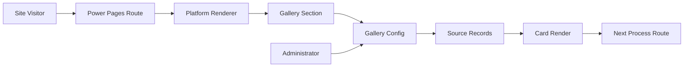
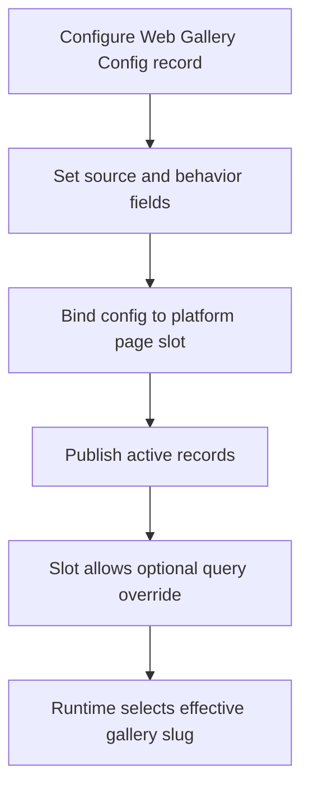
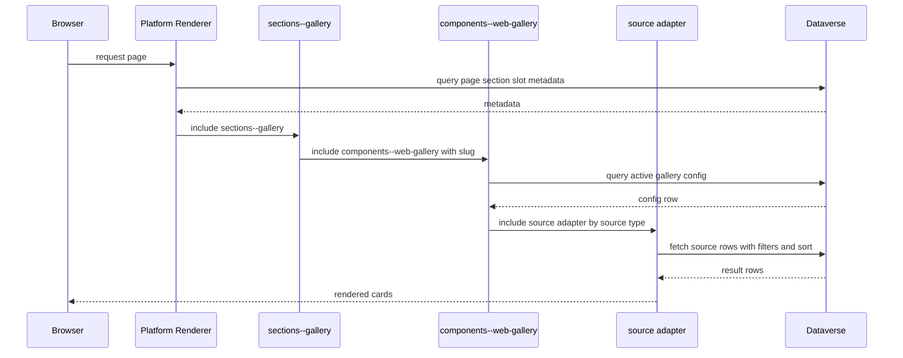
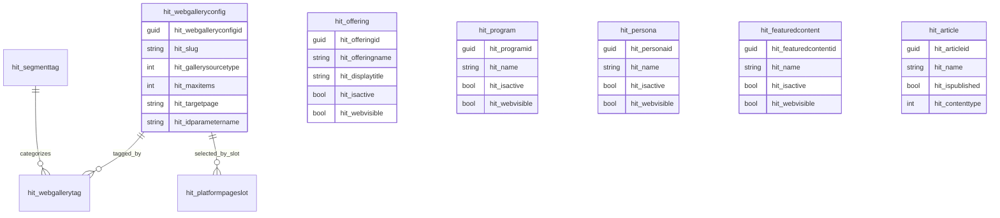
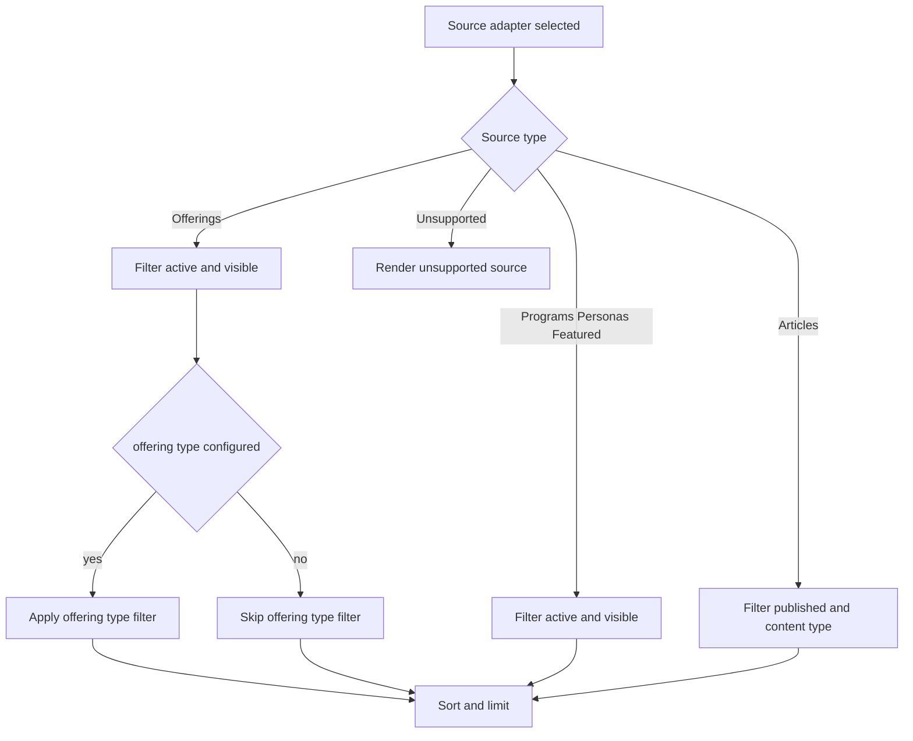
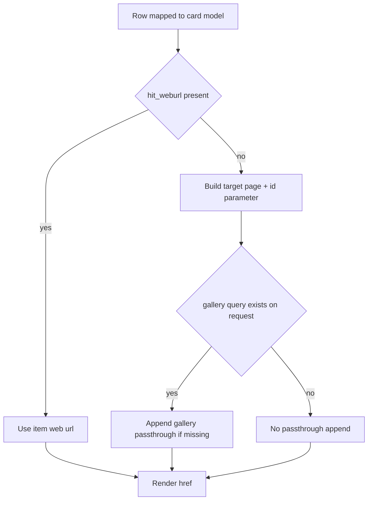
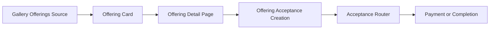

# Gallery Diagrams

## 1) Business context diagram

## 2) Configuration process diagram

## 3) Runtime rendering sequence diagram

## 4) Data model diagram

## 5) Filtering decision flow diagram

## 6) Item selection and routing diagram

## 7) Gallery to offering acceptance relationship diagram

## Notes on evidence boundaries
- Tag relationship entities are represented in schema diagrams because relationships exist in metadata.
- No active gallery template evidence confirms runtime filtering by segment tags.
- Impact story and web content entities are excluded from active routing diagrams because source dispatch branch does not route to those adapters in active components--web-gallery.
