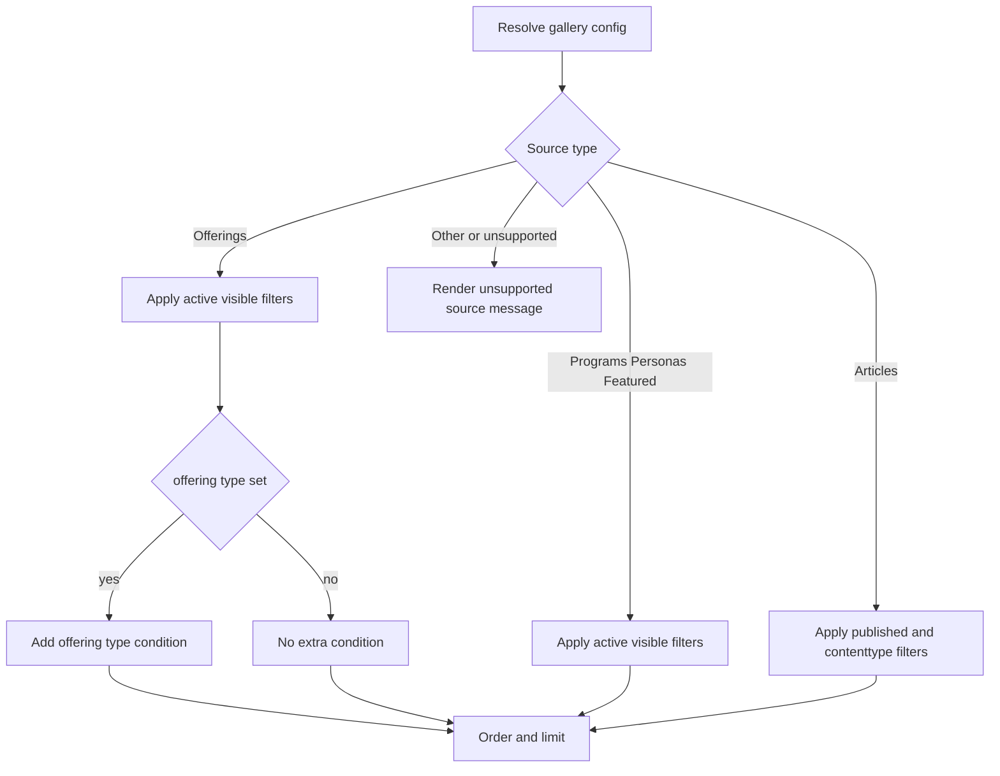
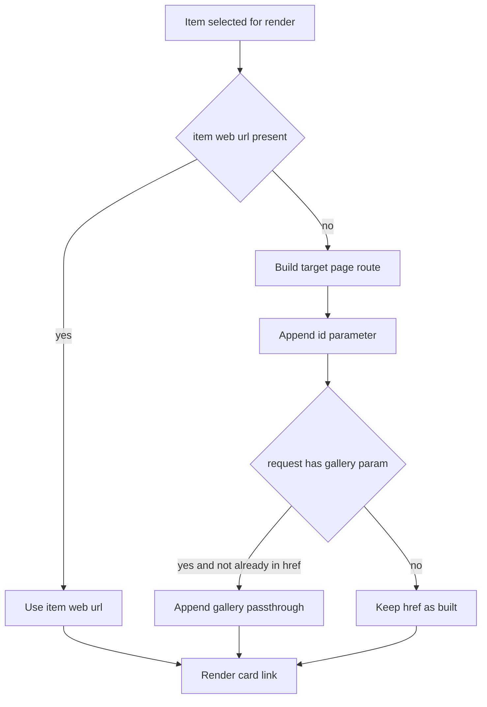

# Gallery Filtering and Routing

## Purpose
Describe exactly how active templates filter records, sort records, and generate routes.

## Filtering behavior by source

### Offerings source
Template: components--web-gallery-source-offering

Applied filter conditions:
- hit_isactive = 1
- hit_webvisible = 1
- if gallery.hit_offeringtype has value then hit_offeringtype = that value

### Programs source
Template: components--web-gallery-source-programs

Applied filter conditions:
- hit_isactive = 1
- hit_webvisible = 1

### Personas source
Template: components--web-gallery-source-personas

Applied filter conditions:
- hit_isactive = 1
- hit_webvisible = 1

### Featured content source
Template: components--web-gallery-source-featuredcontent

Applied filter conditions:
- hit_isactive = 1
- hit_webvisible = 1

### Article source
Template: components--web-gallery-source-article

Applied filter conditions:
- hit_ispublished = 1
- hit_contenttype = 815390000

### Impact story and web content source templates
Templates exist but are not reachable from active components--web-gallery source-type branch.
If manually included elsewhere, they apply:
- hit_isactive = 1
- hit_webvisible = 1

## Sorting behavior by source
- offerings/programs/personas/featuredcontent/articles: order by createdon descending
- impactstory/webcontent adapters: order by displaytitle then name ascending
- legacy offerings gallery: order by offering name ascending

## Max item behavior
Each adapter receives maxItems, defaulting to 12 if not set.
Fetch uses top attribute with maxItems.

## Gallery slug resolution and query override

### sections--gallery resolution
1. read incoming request parameter gallery
2. if slot allows query override and param exists, use that slug
3. else if slot has hit_webgalleryconfig lookup, query by id and use hit_slug
4. if no slug, skip include

### components--web-gallery resolution
1. if allowQueryOverride and gallerySlug set, query hit_webgalleryconfig by slug and active status
2. if query returns no row, emit Gallery slug not found error
3. else use provided gallery object

## Routing behavior

### Card href generation precedence
Across active source adapters:
1. item-level hit_weburl when present
2. fallback route from gallery target page + query parameter

Fallback route construction:
- base: gallery.hit_targetpage default source-specific page
- ensure leading slash on target page
- joiner: ? or & depending on existing query string
- parameter name: gallery.hit_idparametername default id
- parameter value: source record primary id (adapter variable)

### Query passthrough behavior
In modern adapters, if current request has gallery parameter and generated href does not already contain gallery=, adapter appends gallery parameter to preserve context.

### Open in new tab
Adapters inspect gallery hit_openinnewtab value/label and append target and rel attributes when true.

## Error and empty-state behavior
- unresolved override slug: explicit error message and no cards
- unsupported source type: explicit unsupported message
- empty result set: source-specific no-items message

## Confirmed unsupported or unimplemented states
- source type value Other is not implemented in active dispatch branch
- segment-tag filtering is not implemented in active source queries
- no client-side runtime filter controls are implemented in gallery templates

## Known implementation risks from evidence
- components--web-gallery-source-offering references components--web-gallery-card-prominent, file not present in export.
- impactstory and webcontent adapters contain inconsistent variable names in href fallback logic that can produce invalid links if those adapters are activated.

## Diagram: filtering decision flow

## Diagram: item selection and routing flow

## Evidence sources
- power-pages/nfp-base/web-templates/sections--gallery/sections--gallery.webtemplate.source.html
- power-pages/nfp-base/web-templates/components--web-gallery/components--web-gallery.webtemplate.source.html
- power-pages/nfp-base/web-templates/components--web-gallery-source-offering/components--web-gallery-source-offering.webtemplate.source.html
- power-pages/nfp-base/web-templates/components--web-gallery-source-programs/components--web-gallery-source-programs.webtemplate.source.html
- power-pages/nfp-base/web-templates/components--web-gallery-source-personas/components--web-gallery-source-personas.webtemplate.source.html
- power-pages/nfp-base/web-templates/components--web-gallery-source-featuredcontent/components--web-gallery-source-featuredcontent.webtemplate.source.html
- power-pages/nfp-base/web-templates/components--web-gallery-source-article/components--web-gallery-source-article.webtemplate.source.html
- power-pages/nfp-base/web-templates/components--web-gallery-source-impactstory/components--web-gallery-source-impactstory.webtemplate.source.html
- power-pages/nfp-base/web-templates/components--web-gallery-source-webcontent/components--web-gallery-source-webcontent.webtemplate.source.html
- power-pages/nfp-base/web-templates/components-offerings-gallery/components-offerings-gallery.webtemplate.source.html
