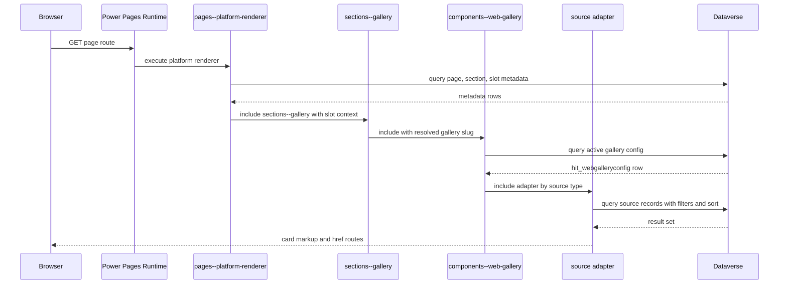

# Gallery Technical Design

## Purpose
Provide end-to-end technical trace from Web Page through rendered card destination route.

## Runtime trace

### Web Page
Most active gallery-capable pages use Web Page records with page template id 665a986d-1a3a-f111-bec6-000d3a7a0cab.

### Page Template
Platform Renderer page template resolves to pages--platform-renderer web template.

### Web Template
pages--platform-renderer:
- computes resolved page slug
- fetches hit_platformpage and hit_platformpagesection records
- fetches hit_platformpageslot records and section type template names
- includes section templates based on slot section type

Gallery path occurs when slot section type template is sections--gallery.

### Gallery configuration retrieval
sections--gallery:
- resolves slug from query override or slot hit_webgalleryconfig
- includes components--web-gallery with resolved gallerySlug and slot display controls

components--web-gallery:
- loads active hit_webgalleryconfig for override slug
- maps source type and style classes
- dispatches to source adapter include

### Offering or content retrieval
Source adapter executes FetchXML against one source table.
Example offering source fields:
- hit_offeringid
- hit_displaytitle
- hit_offeringname
- hit_summary
- hit_imageurl
- hit_typelabel
- hit_weburl

### Filtering and sorting
Applied server-side in FetchXML:
- active and visible filters
- optional offering type filter
- explicit order clauses

### Card or item rendering
Adapter computes:
- title
- summary
- imageUrl
- typeLabel
- href
Then includes card template variant.

### Route generation
Route algorithm:
1. Use item hit_weburl if present.
2. Else build from gallery target page and id parameter.
3. Append gallery passthrough parameter when absent.

### Destination page
Destination depends on source and config.
Offering destinations commonly resolve to offering detail page patterns that can start acceptance process.

## Web templates participating

| Name | Repository-relative path | Responsibility | Input configuration | Dataverse queries | Rendered output | Related templates | Destination route |
|---|---|---|---|---|---|---|---|
| pages--platform-renderer | power-pages/nfp-base/web-templates/pages--platform-renderer/pages--platform-renderer.webtemplate.source.html | page and slot orchestration | request params page, gallery, debug | hit_platformpage, hit_platformpagesection, hit_platformpageslot, hit_platformpagesectiontype | section-level HTML shell | layout templates, section templates | indirect via included templates |
| sections--gallery | power-pages/nfp-base/web-templates/sections--gallery/sections--gallery.webtemplate.source.html | gallery slug resolution and single include call | section, slot, request gallery override, slot display fields | hit_webgalleryconfig lookup by id when slot fallback used | section wrapper and include call | components--web-gallery | indirect |
| components--web-gallery | power-pages/nfp-base/web-templates/components--web-gallery/components--web-gallery.webtemplate.source.html | gallery config load and source adapter dispatch | gallerySlug or gallery record, allowQueryOverride, displayStyle, displayVariant, maxColumns, maxRows | hit_webgalleryconfig by slug and active status | gallery wrapper and source include | source adapters, card templates | indirect |
| components--web-gallery-source-offering | power-pages/nfp-base/web-templates/components--web-gallery-source-offering/components--web-gallery-source-offering.webtemplate.source.html | fetch offerings and route cards | gallery config, style, variant, limits | hit_offering | cards list | web gallery card templates | item weburl or targetpage+id |
| components--web-gallery-source-programs | power-pages/nfp-base/web-templates/components--web-gallery-source-programs/components--web-gallery-source-programs.webtemplate.source.html | fetch programs and route cards | same as above | hit_program | cards list | web gallery card templates | item weburl or targetpage+id |
| components--web-gallery-source-personas | power-pages/nfp-base/web-templates/components--web-gallery-source-personas/components--web-gallery-source-personas.webtemplate.source.html | fetch personas and route cards | same as above | hit_persona | cards list | web gallery card templates | item weburl or targetpage+id |
| components--web-gallery-source-featuredcontent | power-pages/nfp-base/web-templates/components--web-gallery-source-featuredcontent/components--web-gallery-source-featuredcontent.webtemplate.source.html | fetch featured content and route cards | same as above | hit_featuredcontent | cards list | web gallery card templates | item weburl or targetpage+id |
| components--web-gallery-source-article | power-pages/nfp-base/web-templates/components--web-gallery-source-article/components--web-gallery-source-article.webtemplate.source.html | fetch article records and route cards | same as above | hit_article | cards list | web gallery card templates | item weburl or targetpage+id |
| components--web-gallery-card-standard | power-pages/nfp-base/web-templates/components--web-gallery-card-standard/components--web-gallery-card-standard.webtemplate.source.html | standard card rendering | title, summary, imageUrl, href, label | none | standard card markup | called by source adapters | href passed in |
| components--web-gallery-card-compact | power-pages/nfp-base/web-templates/components--web-gallery-card-compact/components--web-gallery-card-compact.webtemplate.source.html | compact card rendering | title, summary, imageUrl, href | none | compact card markup | called by source adapters | href passed in |
| components--web-gallery-card-featured | power-pages/nfp-base/web-templates/components--web-gallery-card-featured/components--web-gallery-card-featured.webtemplate.source.html | featured card rendering | title, summary, imageUrl, href, label | none | featured card markup | called by source adapters | href passed in |
| components--web-gallery-card-minimal | power-pages/nfp-base/web-templates/components--web-gallery-card-minimal/components--web-gallery-card-minimal.webtemplate.source.html | minimal card rendering | title, imageUrl, href | none | minimal card markup | called by selected adapter branches | href passed in |
| components-offerings-gallery | power-pages/nfp-base/web-templates/components-offerings-gallery/components-offerings-gallery.webtemplate.source.html | legacy offerings-only gallery | gallery slug or gallery record | hit_webgalleryconfig, hit_offering | legacy gallery shell with data attributes | components-offering-card-* | target page from gallery config |
| components-offering-card-standard | power-pages/nfp-base/web-templates/components-offering-card-standard/components-offering-card-standard.webtemplate.source.html | legacy offering standard card and CTA behavior | offering + gallery record | none | legacy card markup | components-offerings-gallery | /offering style details url contract |
| components-offering-card-compact | power-pages/nfp-base/web-templates/components-offering-card-compact/components-offering-card-compact.webtemplate.source.html | legacy compact card | offering + gallery record | none | legacy compact card | components-offerings-gallery | /offering style details url contract |
| components-offering-card-featured | power-pages/nfp-base/web-templates/components-offering-card-featured/components-offering-card-featured.webtemplate.source.html | legacy featured card | offering + gallery record | none | legacy featured card | components-offerings-gallery | /offering style details url contract |

## Technical findings and caveats
- Active components--web-gallery supports source types Offerings, Personas, Programs, Featured Content, and Articles in dispatch branch.
- Source templates for impact story and web content exist but are not wired in active source-type dispatch.
- No gallery template performs Power Pages Web API calls.
- No gallery template performs flow invocation.
- Program, persona, and featuredcontent adapters contain inconsistent encoded id expression patterns in fallback href builder (non-url_encode usage), which is a maintainability risk.
- Offering source uses prominent variant include to components--web-gallery-card-prominent, but that template file is absent in exported power-pages path.

## Diagram: runtime rendering sequence

## Evidence sources
- power-pages/nfp-base/page-templates/Platform-Renderer.pagetemplate.yml
- power-pages/nfp-base/web-templates/pages--platform-renderer/pages--platform-renderer.webtemplate.source.html
- power-pages/nfp-base/web-templates/sections--gallery/sections--gallery.webtemplate.source.html
- power-pages/nfp-base/web-templates/components--web-gallery/components--web-gallery.webtemplate.source.html
- power-pages/nfp-base/web-templates/components--web-gallery-source-*.webtemplate.source.html
- power-pages/nfp-base/web-templates/components--web-gallery-card-*.webtemplate.source.html
- power-pages/nfp-base/web-templates/components-offerings-gallery/components-offerings-gallery.webtemplate.source.html
- power-pages/nfp-base/web-templates/components-offering-card-*.webtemplate.source.html
