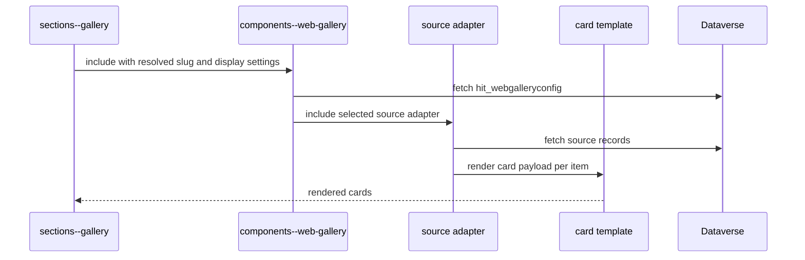
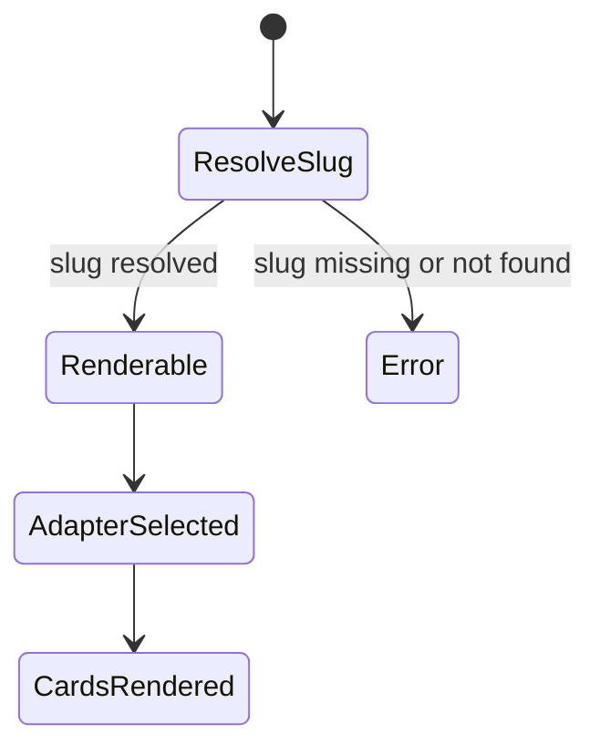

[Top: Documentation Home](../README.md) | [Capabilities](../01-business-capability-model.md) | [Offerings](../offerings/offerings-acceptance.md)

# Web Gallery

## Purpose
Describe the gallery architecture used to render offerings and other catalog content on portal pages.

## Business context
Galleries are a discovery mechanism that routes users into offering detail and acceptance flows.

## Participants and systems
- sections--gallery
- components--web-gallery
- components--web-gallery-source-* adapters
- components--web-gallery-card-* templates
- Dataverse gallery config and source entities

## Preconditions
- slot has gallery configuration or query override.
- corresponding hit_webgalleryconfig record is active.

## Trigger
- Page section render includes sections--gallery.

## High-level process
1. Resolve gallery slug from query override or slot fallback.
2. Load active gallery configuration.
3. Determine source type and display style/variant.
4. Invoke source adapter.
5. Source adapter queries entity records and maps href/card payload.
6. Card template renders final visual cards.

## Sub-processes
- Slug override path:
  - query override wins when allowed.
- Slot fallback path:
  - resolve gallery id to slug then render.
- Hard-fail path:
  - explicit error if override slug does not resolve.

## Business rules
- Query override has priority when enabled.
- If override slug is invalid, do not silently fallback.
- Item href priority in offering source adapter:
  - item web URL
  - otherwise target page + id parameter (+ optional gallery passthrough)

## Dataverse records and relationships
- hit_webgalleryconfig controls source type, style, and card variant.
- adapters query entities such as hit_offering, hit_program, hit_persona, hit_featuredcontent, hit_article, hit_webcontent, hit_impactstory.

## Power Pages components
- sections--gallery
- components--web-gallery
- components--web-gallery-source-offering and peer adapters
- components--web-gallery-card-standard/compact/featured/minimal

## Web templates
- power-pages/nfp-base/web-templates/sections--gallery/sections--gallery.webtemplate.source.html
- power-pages/nfp-base/web-templates/components--web-gallery/components--web-gallery.webtemplate.source.html
- power-pages/nfp-base/web-templates/components--web-gallery-source-offering/components--web-gallery-source-offering.webtemplate.source.html

## Status and state transitions

## Error and exception handling
- Missing or invalid override slug yields explicit error block.
- Unsupported source type yields fallback message.

## Security and permissions
- Visibility relies on entity/table permissions and active record flags.

## Operational considerations
- Display variant and style values are choice-driven; mismatch in values can degrade rendering.

## Known limitations
- Variant fallbacks exist for some values (for example minimal/prominent paths may map to standard card patterns depending on adapter/template implementation).

## Evidence and source references
- ../reference/component-evidence-register.md
- ../../analysis/solution-inventory.md
- ../../analysis/flow-catalogue.md

## Related documents
- [../portal-rendering/portal-rendering.md](../portal-rendering/portal-rendering.md)
- [../offerings/offerings-acceptance.md](../offerings/offerings-acceptance.md)

[Bottom: Back](../navigation/navigation.md) | [Next: Offerings and Acceptance](../offerings/offerings-acceptance.md)
