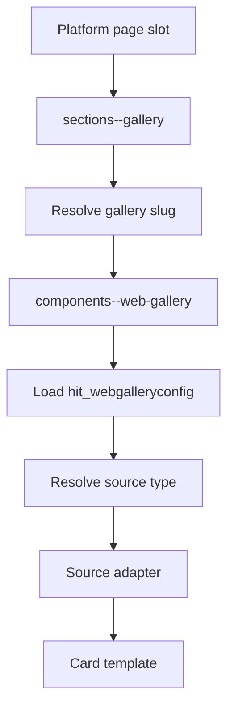

# Gallery Framework

## Purpose

This document defines the modern slot-driven gallery framework used by platform pages and captures the design contract that gallery-related implementation should follow as the renderer is hardened.

Use this document when you need to understand:

- how a slot resolves a gallery configuration
- how a gallery slug resolves to a `hit_webgalleryconfig` record
- how source types dispatch to gallery source adapters
- how display style and display variant flow into rendering
- how to diagnose blank gallery renders

Use the companion documents for upstream and downstream details:

- [page-builder.md](page-builder.md) for page, section, and slot composition
- [section-layout-framework.md](section-layout-framework.md) for the section-layout contract
- [gallery-card-architecture.md](gallery-card-architecture.md) for card-level rendering behavior

## Framework Scope

The modern gallery framework is the primary configurable gallery system for platform pages.

Core templates:

- [sections--gallery](../../power-pages/nfp-base/web-templates/sections--gallery/sections--gallery.webtemplate.source.html)
- [components--web-gallery](../../power-pages/nfp-base/web-templates/components--web-gallery/components--web-gallery.webtemplate.source.html)
- `components--web-gallery-source-*`
- `components--web-gallery-card-*`

This framework is distinct from the legacy offering-gallery path.

## Rendering Path

In a platform page, gallery rendering is a slot-driven behavior inside a section layout.

The upstream composition path is documented in [page-builder.md](page-builder.md) and [section-layout-framework.md](section-layout-framework.md).

## Slot-Level Gallery Contract

The gallery framework assumes the slot has already resolved through the selected layout and has a valid section-type template of `sections--gallery`.

At slot level, the important fields are:

- `hit_webgalleryconfig`
- `hit_allowqueryoverride`
- `hit_displaystyle`
- `hit_displayvariant`
- `hit_maxcolumns`
- `hit_maxrows`

Gallery rendering therefore depends on both:

1. the section-layout contract being satisfied
2. the gallery contract being satisfied

## Gallery Resolution Rules

The current gallery-resolution precedence is intentionally strict.

### Resolution order

1. Query override wins when allowed.
	If the slot allows override and `?gallery=<slug>` is present, that slug becomes the single source of truth.
2. Slot fallback is used otherwise.
	The slot-level `hit_webgalleryconfig` lookup is resolved to a gallery record, and the gallery slug is read from that record.
3. Gallery rendering stops if no slug resolves.

Design intent:

- query override should not silently fall back to the slot config when an override was explicitly requested
- slot fallback should be deterministic and traceable in debug mode

## Gallery Configuration Record

The gallery framework is driven by `hit_webgalleryconfig`.

Important fields include:

- `hit_slug`
- `hit_isactive`
- `hit_gallerysourcetype`
- `hit_cardtemplate`
- `hit_gallerytitle`
- `hit_gallerysubtitle`
- `hit_maxitems`
- `hit_targetpage`
- `hit_idparametername`
- `hit_openinnewtab`

Minimum contract for reliable rendering:

1. the gallery config must exist
2. it must be active
3. its slug must resolve uniquely in practice
4. its source type must map to a supported adapter

## Supported Source Types

The current gallery framework supports the following primary source adapters:

| Source Type | Adapter |
| --- | --- |
| Offerings | `components--web-gallery-source-offering` |
| Personas | `components--web-gallery-source-personas` |
| Programs | `components--web-gallery-source-programs` |
| Featured Content | `components--web-gallery-source-featuredcontent` |
| Articles | `components--web-gallery-source-article` |

Each adapter is responsible for:

1. fetching records for its entity type
2. normalizing title, summary, image, URL, and type metadata
3. applying gallery style and variant context
4. delegating item rendering to the correct card template

## Display Style And Variant Inputs

The gallery shell and its adapters also rely on slot-provided display controls.

Display style inputs:

- grid
- carousel
- tiles
- actions
- masonry
- media

Display variant inputs:

- standard
- compact
- featured
- minimal fallback
- prominent fallback

These values affect both wrapper classes and card-template routing.

## Current Fragility

The current implementation is useful but brittle in several known ways.

### 1. Dataverse choice-shape variation

Choice fields may arrive as:

1. objects with `.value` and `.label`
2. raw values
3. formatted values in OData metadata

This matters for fields such as:

- `hit_gallerysourcetype`
- `hit_cardtemplate`
- slot-level display style and display variant choices

Target hardening rule:

- normalize choice fields using `.value -> raw value -> default`, not `.value` alone

### 2. Dependency on slot-level configuration

A correctly configured gallery record still will not render if the slot itself:

1. is missing from the selected layout
2. uses the wrong section type
3. points to no gallery config
4. is not reachable because of layout slot-index assumptions

### 3. Silent or semi-silent drop-out points

Blank gallery states can be caused by:

1. unresolved gallery slug
2. inactive gallery config
3. unsupported source type
4. zero matching source rows
5. broken source-adapter assumptions

These states are not all equally visible outside debug mode.

## Programs Adapter As Hardening Example

The Programs source adapter is a good example of why the framework docs need to separate architecture from current implementation defects.

It demonstrates:

1. source-specific entity fetching
2. target-page and id-parameter URL generation
3. variant-to-card routing
4. current fragility around implementation details that should be hardened without changing the gallery contract itself

See [components--web-gallery-source-programs](../../power-pages/nfp-base/web-templates/components--web-gallery-source-programs/components--web-gallery-source-programs.webtemplate.source.html).

## Hardened Design Direction

The strengthened gallery framework should preserve the current architecture while tightening the contract.

Recommended direction:

1. keep `sections--gallery` as the slot-level entry point
2. keep `components--web-gallery` as the single gallery-config resolver and source dispatcher
3. standardize Dataverse value normalization across the framework
4. make failure classes distinguishable in debug mode
5. keep the gallery contract independent from any one source-adapter defect

## Troubleshooting Checklist

When a gallery does not render, check the following in order:

1. the parent section and layout rendered at all
2. the gallery slot exists in the expected slot index
3. the slot section type is `sections--gallery`
4. the slot has a valid `hit_webgalleryconfig`
5. query override is either absent or intentionally enabled
6. the resolved gallery slug maps to an active `hit_webgalleryconfig`
7. the gallery source type maps to a supported adapter
8. the source adapter query returns rows
9. `?debug=1` shows the expected slug, source type, and row count

## Related Documents

- [page-builder.md](page-builder.md)
- [section-layout-framework.md](section-layout-framework.md)
- [gallery-card-architecture.md](gallery-card-architecture.md)
