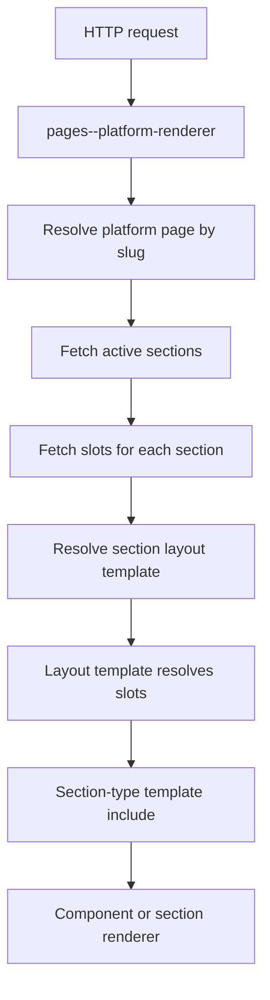

# Page Builder

## Purpose

This document defines the current platform page composition model used by the Power Pages renderer and the target contract we want maintainers to build against as the system is hardened.

Use this document when you need to understand:

- how a request resolves to a platform page
- how a platform page resolves to sections
- how sections resolve to layouts
- how layouts resolve to slots
- how slot section types dispatch to rendering templates

Use the companion documents for deeper detail:

- [section-layout-framework.md](section-layout-framework.md) for the 1-5 column layout family and slot contract
- [gallery-framework.md](gallery-framework.md) for slot-driven gallery rendering
- [gallery-card-architecture.md](gallery-card-architecture.md) for downstream gallery card behavior

## Core Model

The current composition model is Dataverse-driven and resolves content in the following order:

1. `hit_platformpage`
2. `hit_platformpagesection`
3. `hit_platformsectionlayout`
4. `hit_platformpageslot`
5. `hit_platformpagesectiontype`

At runtime, the owning renderer is [pages--platform-renderer](../../power-pages/nfp-base/web-templates/pages--platform-renderer/pages--platform-renderer.webtemplate.source.html).

## Rendering Path

### 1. Page resolution

The renderer resolves the target page slug from:

1. `request.params.page`
2. the current entry-point path when relevant
3. the fallback slug `home` when no explicit page is provided

The renderer then fetches the matching active `hit_platformpage` record.

Current state:

- inactive pages do not render
- missing page records result in no platform-page content path
- debug mode can be enabled with `?debug=1`

### 2. Section resolution

For a resolved page, the renderer fetches all related `hit_platformpagesection` rows ordered by `hit_sortorder`.

Important section fields include:

- `hit_platformpagesectionid`
- `hit_name`
- `hit_sortorder`
- `hit_sectionlayout`
- `hit_isvisible`
- `hit_headingtext`
- `hit_introtext`
- `hit_sectioncolour`
- `hit_backgroundbleed`
- `hit_contentwidthmode`
- `hit_showimage`
- `hit_mediaurl`

The renderer left-joins `hit_platformsectionlayout` to obtain the section layout template name.

Current gating rules:

- a section with `hit_isvisible = false` is skipped
- a section with no resolved layout template cannot render in content mode
- section display chrome such as heading, intro, colour, bleed, and background image are owned at section level

### 3. Slot resolution

For each visible section, the renderer fetches related `hit_platformpageslot` rows ordered by `hit_slotindex`.

Important slot fields include:

- `hit_platformpageslotid`
- `hit_name`
- `hit_slotindex`
- `hit_sectiontype`
- `hit_allowqueryoverride`
- `hit_webgalleryconfig`
- `hit_displaystyle`
- `hit_displayvariant`
- `hit_maxcolumns`
- `hit_maxrows`
- content, CTA, media, and context-specific reference fields

The renderer joins `hit_platformpagesectiontype` to obtain the slot template name via `stype.hit_templatename`.

Slot behavior is layout-dependent. The current layout family does not use one shared slot-resolution strategy. See [section-layout-framework.md](section-layout-framework.md).

### 4. Content mode versus app mode

The renderer has two major execution paths:

1. App mode
	Triggered when any slot template resolves to `sections--acceptance-router`.
2. Content mode
	Used for section-layout rendering through the standard layout templates.

This distinction is important because the acceptance router bypasses normal layout constraints, while content-mode sections are fully dependent on the section-layout and slot contract.

## Section Layout Structure

The current section layout family consists of:

- [layouts--1-column](../../power-pages/nfp-base/web-templates/layouts--1-column/layouts--1-column.webtemplate.source.html)
- [layouts--2-column](../../power-pages/nfp-base/web-templates/layouts--2-column/layouts--2-column.webtemplate.source.html)
- [layouts--3-column](../../power-pages/nfp-base/web-templates/layouts--3-column/layouts--3-column.webtemplate.source.html)
- [layouts--4-column](../../power-pages/nfp-base/web-templates/layouts--4-column/layouts--4-column.webtemplate.source.html)
- [layouts--5-column](../../power-pages/nfp-base/web-templates/layouts--5-column/layouts--5-column.webtemplate.source.html)

Current state observations:

- all layouts dynamically include slot section-type templates
- the 1-column layout has special width and horizontal-alignment behavior based on slot 1
- all 1-5 column layouts now route slot rendering through `helpers--layout-slot-render`
- the 2-5 column layouts resolve slots through sequential slot indexes
- missing-slot and missing-template diagnostics are now consistent in debug mode across the layout family
- all 1-5 column layouts now evaluate slot cardinality through `helpers--layout-slot-state`
- all 1-5 column layouts now resolve slot lookup through `helpers--layout-slot-discovery`
- renderer, section, and layout-slot-state debug pre output now routes through `helpers--debug-pre`

The main remaining brittleness is no longer the slot-rendering or slot-discovery branch itself. It is the higher-level design around one-column specialization, the assumption that slot indexes are sequential and complete, and the absence of a richer layout metadata model.

Target contract:

1. slot indexes should be 1-based and sequential for every layout
2. each layout should have an explicit required slot cardinality
3. slot lookup should use one consistent pattern across all layout templates
4. missing required slots should be treated as configuration errors, not silent no-ops
5. debug output should use consistent messages across the layout family

The full layout contract and hardening target are defined in [section-layout-framework.md](section-layout-framework.md).

## Section Type Dispatch

Within a resolved layout, each slot dispatches to the template named by `stype.hit_templatename`.

Examples include:

- `sections--gallery`
- `sections--hero`
- `sections--acceptance-router`

This makes `hit_platformpagesectiontype` the template-routing contract for slot content. A slot without a valid section type template is structurally incomplete and should be treated as a configuration error.

## Offering Autoload Contract

The offering detail section supports an optional offering-level autoload behavior using `hit_offering.hit_autoloadtemplate`.

Current runtime contract:

1. offering detail still owns acceptance creation
2. router still owns acceptance lifecycle and template routing
3. autoload is currently gated to no-pricing offerings only

Execution path:

1. offering detail fetch resolves `hit_autoloadtemplate`
2. offering detail computes `shouldAutoCreate` when:
	- `hit_autoloadtemplate` is true
	- the offering has no `hit_priceoption` rows
3. when eligible, offering detail auto-creates `hit_offeringacceptance`
4. offering detail redirects to router using:
	- `?page=offering-acceptance&acceptanceid=<guid>`
5. router resolves status and offering type, then includes the correct acceptance template

Why this contract is used:

1. most acceptance templates are PATCH-based and require pre-existing acceptance ids
2. router behavior remains stable and acceptance-id-first
3. no-pricing autoload can be rolled out per offering with lower regression risk than template-first creation

Safety notes:

1. autoload path uses client-side duplicate guards to reduce double creates on refresh
2. manual continue remains the fallback path if autoload create fails
3. paid offerings continue to require explicit user amount selection unless a separate paid-autoload contract is introduced

## Current Brittleness

The current implementation is workable but brittle for several reasons:

1. layout templates use different slot-resolution patterns
2. the slot-index contract is implicit rather than documented
3. one-column behavior is partially special-cased and not generalized
4. render-time diagnostics are debug-oriented rather than contract-oriented
5. content-mode sections are sensitive to missing layout, slot, and section-type configuration

These are not just implementation details. They are design constraints that future work must either preserve deliberately or eliminate deliberately.

## Hardened Design Direction

The strengthened architecture should preserve the Dataverse-driven model while tightening the runtime contract.

Recommended design direction:

1. keep page, section, layout, slot, and section-type as the core composition model
2. explicitly define valid slot indexes per layout
3. preserve the shared slot-resolution helper as the single layout slot-rendering path
4. preserve shared slot discovery and slot-state helpers as the single layout validation path
5. define consistent failure behavior for missing slots, missing templates, and invalid cardinality
6. keep app-mode routing explicit and separate from content-mode layout composition
7. document the layout contract separately from component-specific behavior

## Operator Checklist

When a platform page section does not render, check the following in order:

1. the page slug resolves to an active `hit_platformpage`
2. the section is active and visible
3. the section has a valid `hit_platformsectionlayout`
4. the expected number of slots exist for that layout
5. each required slot has a valid `hit_slotindex`
6. each required slot has a valid `hit_platformpagesectiontype`
7. the resolved section-type template exists and is deployable
8. `?debug=1` shows the expected page, section, layout, and slot information

## Related Documents

- [section-layout-framework.md](section-layout-framework.md)
- [gallery-framework.md](gallery-framework.md)
- [gallery-card-architecture.md](gallery-card-architecture.md)
