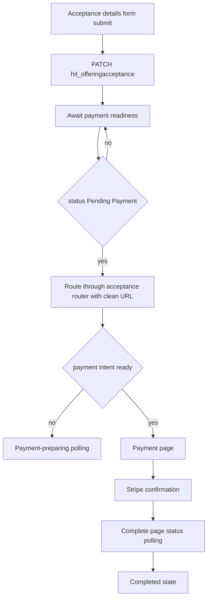
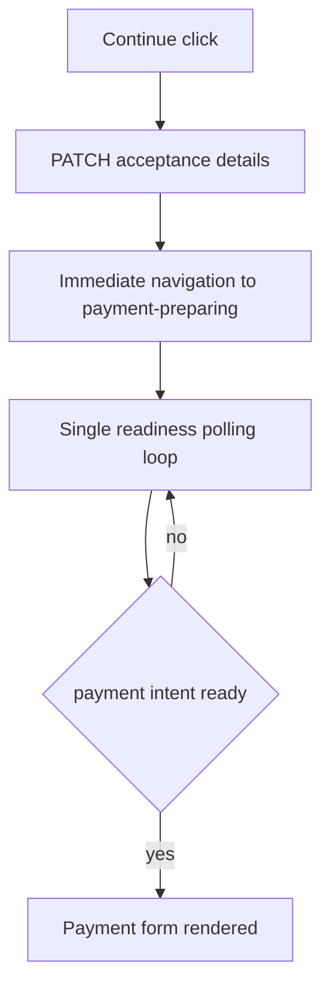
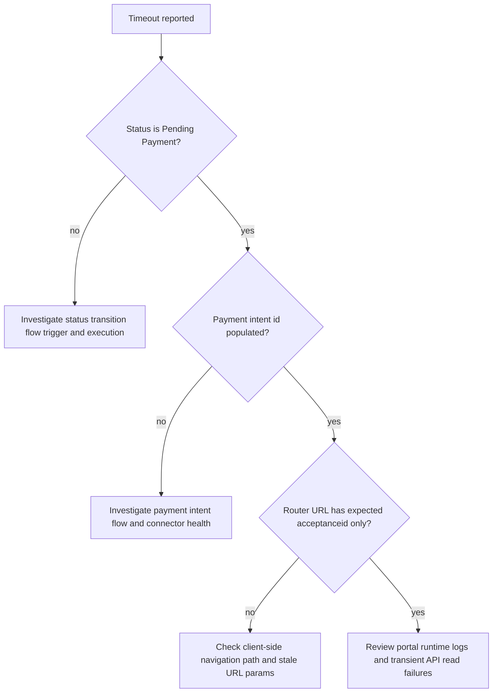

# Payment Processing

## Purpose

This document defines the router-centric acceptance-to-payment processing path for Power Pages and records the timeout remediation implemented for asynchronous transition delays.

Use this document when working on:

- payment-required offering transitions
- acceptance router behavior
- payment session readiness polling
- timeout and retry UX for backend orchestration latency

## Problem Summary

Users were intermittently shown:

"Your details were saved, but the payment page is taking longer than expected to become available. Please refresh the page to continue."

Observed in production-like flow:

1. Acceptance record was saved successfully.
2. Backend orchestration updated acceptance status correctly.
3. Frontend retry window expired before the new state was consistently observable by the routed page.

## Architecture Overview

Primary templates:

- [sections--acceptance-router](../../power-pages/nfp-base/web-templates/sections--acceptance-router/sections--acceptance-router.webtemplate.source.html)
- [sections--acceptance-donation](../../power-pages/nfp-base/web-templates/sections--acceptance-donation/sections--acceptance-donation.webtemplate.source.html)
- [sections--acceptance-membership](../../power-pages/nfp-base/web-templates/sections--acceptance-membership/sections--acceptance-membership.webtemplate.source.html)
- [sections--acceptance-sponsorship](../../power-pages/nfp-base/web-templates/sections--acceptance-sponsorship/sections--acceptance-sponsorship.webtemplate.source.html)
- [sections--acceptance-volunteer](../../power-pages/nfp-base/web-templates/sections--acceptance-volunteer/sections--acceptance-volunteer.webtemplate.source.html)
- [sections--payment-preparing](../../power-pages/nfp-base/web-templates/sections--payment-preparing/sections--payment-preparing.webtemplate.source.html)
- [offering-acceptance---payment](../../power-pages/nfp-base/web-templates/offering-acceptance---payment/Offering-Acceptance---Payment.webtemplate.source.html)
- [offering-acceptance---complete](../../power-pages/nfp-base/web-templates/offering-acceptance---complete/Offering-Acceptance---Complete.webtemplate.source.html)

Configuration:

- [sitesetting.yml](../../power-pages/nfp-base/sitesetting.yml) for Flow and Stripe settings

## Root Cause

### Primary

Acceptance templates used a short router retry loop while waiting for asynchronous status transition:

- 20 attempts
- 1250 ms delay
- approximately 25 seconds total

When backend status propagation exceeded this window, UI exited retry mode and displayed a timeout prompt, even though orchestration completed successfully.

### Secondary contributors

1. Full-page router retries were used as the waiting mechanism, rather than polling the acceptance readiness state directly.
2. First remediation used readiness condition of status OR payment intent, but router progression is status-driven; this caused premature router handoff attempts in some runs.
3. Retry logic was duplicated across multiple acceptance templates.

## Implemented Fix Design

### 1) Replace short router-only waiting with status-based readiness polling

Implemented in payment-capable acceptance templates.

Design:

1. On waitforpayment mode, poll acceptance record for readiness markers:
	 - status equals Pending Payment (815390001)
2. Use cache-safe GET requests.
3. After readiness is detected, route forward through acceptance router using a clean URL with no waitforpayment and no routeattempt parameters.
4. Keep bounded timeout with user-friendly fallback.

### 1a) Hybrid fallback for router re-evaluation

Added after production retest showed cases where URL changed but page remained on acceptance details until timeout.

Design:

1. Keep status-based readiness polling as the primary gate.
2. While waiting, periodically force router re-evaluation using waitforpayment URL refresh with incremented routeattempt.
3. Continue until either:
	 - readiness is detected and clean navigation occurs, or
	 - bounded retry/time budget is reached.

This protects first-click transitions when readiness API reads are delayed or intermittently failing.

### 2) Increase payment-preparing timeout envelope and use cache-safe reads

Implemented in payment-preparing template.

Changes:

1. Max polls changed from 30 to 60 (90 seconds to 180 seconds at 3-second interval).
2. Added cache no-store and explicit OData headers on polling requests.
3. Removed modifiedon filter from singleton key read after verification; key read plus no-store is the stable behavior in this route.

### 3) Second-round correction after production retest

Observed symptom after first remediation:

1. Timeout occurred sooner.
2. Manual refresh did not progress.
3. Second click on Continue progressed quickly.

Interpretation:

1. First click was saving correctly.
2. Frontend readiness gate was still misaligned with router state transition rules.
3. Second click forced a fresh transition path where status had already advanced.

Final correction applied:

1. Acceptance readiness now keys only on Pending Payment status.
2. Once ready, transition uses clean router navigation rather than waitforpayment retry parameters.
3. Payment intent remains a downstream concern handled by payment-preparing and payment templates.

## Next Implementation Phase: Latency Optimization

Current behavior is now reliable, but transition time to payment can still be higher than expected because the flow may pass through multiple wait-and-router convergence steps.

The next phase is focused on reducing both perceived and real latency while preserving correctness.

### UX goal

Immediately after Continue is clicked and acceptance PATCH succeeds, users should see a dedicated payment-loading experience and remain there until payment is ready.

### Target architecture

### Why this change

1. Removes extra acceptance-details wait cycles from the critical path.
2. Consolidates readiness waiting into one place.
3. Keeps user feedback clear and consistent during backend processing.
4. Reduces repeated routeattempt churn and duplicate orchestration pressure.

### Planned implementation steps

1. Router-first refactor:
- after PATCH success in acceptance details, navigate directly to payment-preparing route state.

2. Router waiting simplification:
- when payment is required and waitforpayment mode is active, prefer payment-preparing instead of re-rendering acceptance details.

3. Single source of wait truth:
- keep payment readiness polling only in payment-preparing for payment-required flows.

4. Maintain bounded resiliency:
- keep timeout, retry messaging, and resumable recovery path if backend is delayed.

5. Cross-template alignment:
- apply equivalent behavior to every payment-capable acceptance template, not donation only.

### Performance targets

1. Median time from Continue to payment form: 8-12 seconds.
2. P95 time from Continue to payment form: under 20 seconds.
3. Zero requirement for second Continue click.

### Implementation checkpoints

1. Confirm payment-loading screen appears immediately after first successful submit.
2. Confirm router does not return to acceptance details while waiting under normal operation.
3. Confirm orchestrator runs once per user submit event in normal path.
4. Confirm no regression in payment-preparing timeout behavior.

## Implementation Details

### Updated files

- [sections--acceptance-donation](../../power-pages/nfp-base/web-templates/sections--acceptance-donation/sections--acceptance-donation.webtemplate.source.html)
- [sections--acceptance-membership](../../power-pages/nfp-base/web-templates/sections--acceptance-membership/sections--acceptance-membership.webtemplate.source.html)
- [sections--acceptance-sponsorship](../../power-pages/nfp-base/web-templates/sections--acceptance-sponsorship/sections--acceptance-sponsorship.webtemplate.source.html)
- [sections--acceptance-volunteer](../../power-pages/nfp-base/web-templates/sections--acceptance-volunteer/sections--acceptance-volunteer.webtemplate.source.html)
- [sections--payment-preparing](../../power-pages/nfp-base/web-templates/sections--payment-preparing/sections--payment-preparing.webtemplate.source.html)

### New acceptance readiness settings

Applied per template:

- maximumRouteAttempts = 24
- routeRetryDelayMilliseconds = 1500
- paymentReadinessPollIntervalMilliseconds = 2500
- maximumPaymentReadinessPolls = 72
- routeRefreshEveryPolls = 4

Approximate readiness window: 72 x 2.5 seconds = 180 seconds.
Approximate router refresh cadence while waiting: every 10 seconds.

### Readiness API contract

Acceptance polling reads:

- hit_acceptancestatus

### PaymentIntent flow contract

The `Flow/PaymentIntentUrl` request must include:

- `acceptanceId` as a string
- `clientToken` as a string
- `amount` as a number
- `currency` as a string
- `email` as a string when available
- `description` as a string when available

The required fields match the Power Automate schema used by the payment-intent flow.

Readiness condition:

- status == 815390001

Transition behavior when ready:

- navigate to offering-acceptance router with acceptanceid and timestamp only
- do not include waitforpayment or routeattempt in ready transition URL

Payment-preparing handoff behavior:

- treat `hit_stripepaymentintentid` as the readiness signal
- redirect to the direct payment route once the intent exists
- do not pass `clientsecret` through the URL
- let the payment page read `hit_stripeclientsecret` from Dataverse

Fallback behavior while not ready:

- periodically re-navigate with waitforpayment and incremented routeattempt to force router re-evaluation

## Current Scope Boundaries

### Included

- acceptance-to-payment transition resilience
- consistency across all payment-capable acceptance templates sharing the same wait-for-payment pattern
- payment-preparing cache-safe polling and timeout expansion
- router-centric branch ownership for payment-required flows

### Not changed in this pass

- course acceptance flow internals
- orchestration flow architecture
- Stripe webhook architecture

## Current Ownership Model

1. The acceptance router decides whether a payment-required record should render preparing or payment.
2. Payment-preparing owns the only active wait/retry loop.
3. Payment owns Stripe rendering only when a secret is already available in server-rendered data.
4. Acceptance templates only submit, PATCH, and hand off once.

## Verification Checklist

1. Submit donation acceptance and verify transition to payment without manual refresh.
2. Repeat at least 3 times and verify no false timeout in normal load.
3. Validate delayed backend update scenario still transitions automatically within 180 seconds.
4. Verify membership, sponsorship, and volunteer acceptance follow the same behavior.
5. Confirm payment-preparing page transitions automatically when payment intent appears.
6. Confirm fallback message remains resumable if timeout threshold is actually exceeded.
7. Confirm second click on Continue is no longer required to reach payment page.
8. Confirm routeattempt increases automatically while waiting and transition occurs without user interaction.

## Operational Monitoring Recommendations

1. Track elapsed time from acceptance PATCH to Pending Payment status update.
2. Track elapsed time from Pending Payment to payment intent id population.
3. Alert if 95th percentile of readiness exceeds 120 seconds.
4. Validate [Flow/PaymentIntentUrl](../../power-pages/nfp-base/sitesetting.yml) per environment during release checks.

## Rollout Notes

1. The router contract applies to all payment-capable offerings.
2. Donation, membership, sponsorship, and volunteer should all follow the same direct handoff behavior.
3. Any additional payment-capable acceptance template should be aligned to the same ownership model before rollout.

## Follow-up Enhancements

1. Consider extracting shared wait-for-payment script into a reusable web file to reduce duplication.
2. Add explicit telemetry events for poll start, poll success, poll timeout, and route handoff.
3. Review course acceptance flow for equivalent resilience alignment if required by channel usage.

## Troubleshooting Triage

Use this section for rapid diagnosis when a payment transition issue is reported.

### Quick symptom mapping

1. Symptom: User sees timeout after first Continue click.
Likely zone: acceptance readiness polling did not observe Pending Payment in time.

2. Symptom: Manual refresh does not move to payment.
Likely zone: acceptance status has not advanced to Pending Payment, or router request is not using expected acceptance id.

3. Symptom: Second Continue click moves quickly to payment.
Likely zone: first save worked; readiness-to-router handoff timing or status observability is delayed.

4. Symptom: URL changes to waitforpayment but page remains on details briefly, then progresses.
Likely zone: expected hybrid fallback behavior while awaiting router state convergence.

5. Symptom: User reaches payment-preparing and remains there.
Likely zone: payment intent population is delayed or failed.

### Fast checks

1. Confirm URL contains expected acceptance id.
Expected route format after save:
- /accept/?page=offering-acceptance&acceptanceid=<guid>

During wait fallback, URL may temporarily include:
- waitforpayment=1
- routeattempt=<n>

Expected behavior:
- routeattempt increments over time without user interaction

2. Check acceptance status in Dataverse for that acceptance id.
Expected for payment handoff:
- hit_acceptancestatus = 815390001 (Pending Payment)

3. Check payment intent id field.
Expected for payment form readiness:
- hit_stripepaymentintentid is populated

4. Confirm site setting endpoint configuration.
Check:
- [power-pages/nfp-base/sitesetting.yml](../../power-pages/nfp-base/sitesetting.yml)
Setting:
- Flow/PaymentIntentUrl points to the active environment endpoint

### Decision path

### Capture bundle for incident notes

For each incident, capture:

1. acceptance id
2. first Continue click timestamp
3. first timeout timestamp
4. acceptance status value timeline
5. payment intent id timeline
6. final successful navigation URL
7. highest routeattempt observed before transition or timeout

### Recovery guidance for support teams

1. If status is Pending Payment and payment intent exists, advise user to reload the acceptance route once.
2. If status is not Pending Payment after expected orchestration window, escalate to flow owner with acceptance id and timestamps.
3. If payment intent is missing while status is Pending Payment, escalate to payment intent flow owner.
