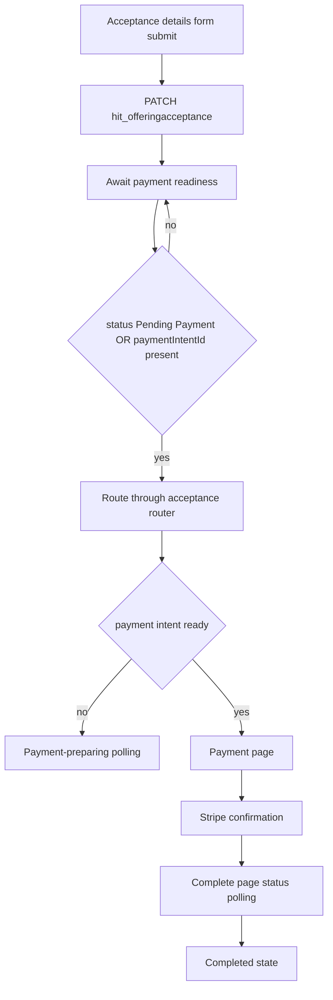

# Payment Processing

## Purpose

This document defines the acceptance-to-payment processing path for Power Pages and records the timeout remediation implemented for asynchronous transition delays.

Use this document when working on:

- donation and acceptance payment transitions
- acceptance router behavior
- payment session readiness polling
- timeout and retry UX for backend orchestration latency

## Problem Summary

Users were intermittently shown:

"Your details were saved, but the payment page is taking longer than expected to become available. Please refresh the page to continue."

Observed in production-like flow:

1. Acceptance record was saved successfully.
2. Backend orchestration updated acceptance status correctly.
3. Frontend retry window expired before the new state was consistently observable by the routed page.

## Architecture Overview

Primary templates:

- [sections--acceptance-router](../../power-pages/nfp-base/web-templates/sections--acceptance-router/sections--acceptance-router.webtemplate.source.html)
- [sections--acceptance-donation](../../power-pages/nfp-base/web-templates/sections--acceptance-donation/sections--acceptance-donation.webtemplate.source.html)
- [sections--acceptance-membership](../../power-pages/nfp-base/web-templates/sections--acceptance-membership/sections--acceptance-membership.webtemplate.source.html)
- [sections--acceptance-sponsorship](../../power-pages/nfp-base/web-templates/sections--acceptance-sponsorship/sections--acceptance-sponsorship.webtemplate.source.html)
- [sections--acceptance-volunteer](../../power-pages/nfp-base/web-templates/sections--acceptance-volunteer/sections--acceptance-volunteer.webtemplate.source.html)
- [sections--payment-preparing](../../power-pages/nfp-base/web-templates/sections--payment-preparing/sections--payment-preparing.webtemplate.source.html)
- [offering-acceptance---payment](../../power-pages/nfp-base/web-templates/offering-acceptance---payment/Offering-Acceptance---Payment.webtemplate.source.html)
- [offering-acceptance---complete](../../power-pages/nfp-base/web-templates/offering-acceptance---complete/Offering-Acceptance---Complete.webtemplate.source.html)

Configuration:

- [sitesetting.yml](../../power-pages/nfp-base/sitesetting.yml) for Flow and Stripe settings

## Root Cause

### Primary

Acceptance templates used a short router retry loop while waiting for asynchronous status transition:

- 20 attempts
- 1250 ms delay
- approximately 25 seconds total

When backend status propagation exceeded this window, UI exited retry mode and displayed a timeout prompt, even though orchestration completed successfully.

### Secondary contributors

1. Full-page router retries were used as the waiting mechanism, rather than polling the acceptance readiness state directly.
2. Payment-preparing API read for payment intent did not use a cache-busting query strategy.
3. Retry logic was duplicated across multiple acceptance templates.

## Implemented Fix Design

### 1) Replace short router-only waiting with readiness polling

Implemented in acceptance templates for donation, membership, sponsorship, and volunteer.

Design:

1. On waitforpayment mode, poll acceptance record for readiness markers:
	 - status equals Pending Payment (815390001)
	 - or hit_stripepaymentintentid is populated
2. Use cache-safe GET requests.
3. After readiness is detected, route forward through acceptance router.
4. Keep bounded timeout with user-friendly fallback.

### 2) Increase payment-preparing timeout envelope and use cache-safe reads

Implemented in payment-preparing template.

Changes:

1. Max polls changed from 30 to 60 (90 seconds to 180 seconds at 3-second interval).
2. Added modifiedon-based cache-busting query pattern.
3. Added cache no-store and explicit OData headers on polling requests.

## Implementation Details

### Updated files

- [sections--acceptance-donation](../../power-pages/nfp-base/web-templates/sections--acceptance-donation/sections--acceptance-donation.webtemplate.source.html)
- [sections--acceptance-membership](../../power-pages/nfp-base/web-templates/sections--acceptance-membership/sections--acceptance-membership.webtemplate.source.html)
- [sections--acceptance-sponsorship](../../power-pages/nfp-base/web-templates/sections--acceptance-sponsorship/sections--acceptance-sponsorship.webtemplate.source.html)
- [sections--acceptance-volunteer](../../power-pages/nfp-base/web-templates/sections--acceptance-volunteer/sections--acceptance-volunteer.webtemplate.source.html)
- [sections--payment-preparing](../../power-pages/nfp-base/web-templates/sections--payment-preparing/sections--payment-preparing.webtemplate.source.html)

### New acceptance readiness settings

Applied per template:

- maximumRouteAttempts = 4
- routeRetryDelayMilliseconds = 1500
- paymentReadinessPollIntervalMilliseconds = 2500
- maximumPaymentReadinessPolls = 72

Approximate readiness window: 72 x 2.5 seconds = 180 seconds.

### Readiness API contract

Acceptance polling reads:

- hit_acceptancestatus
- hit_stripepaymentintentid

Readiness condition:

- status == 815390001
- OR payment intent id is non-empty

## Current Scope Boundaries

### Included

- acceptance-to-payment transition resilience
- consistency across acceptance templates sharing the same wait-for-payment pattern
- payment-preparing cache-safe polling and timeout expansion

### Not changed in this pass

- course acceptance flow internals
- orchestration flow architecture
- Stripe webhook architecture

## Verification Checklist

1. Submit donation acceptance and verify transition to payment without manual refresh.
2. Repeat at least 3 times and verify no false timeout in normal load.
3. Validate delayed backend update scenario still transitions automatically within 180 seconds.
4. Verify membership, sponsorship, and volunteer acceptance follow the same behavior.
5. Confirm payment-preparing page transitions automatically when payment intent appears.
6. Confirm fallback message remains resumable if timeout threshold is actually exceeded.

## Operational Monitoring Recommendations

1. Track elapsed time from acceptance PATCH to Pending Payment status update.
2. Track elapsed time from Pending Payment to payment intent id population.
3. Alert if 95th percentile of readiness exceeds 120 seconds.
4. Validate [Flow/PaymentIntentUrl](../../power-pages/nfp-base/sitesetting.yml) per environment during release checks.

## Follow-up Enhancements

1. Consider extracting shared wait-for-payment script into a reusable web file to reduce duplication.
2. Add explicit telemetry events for poll start, poll success, poll timeout, and route handoff.
3. Review course acceptance flow for equivalent resilience alignment if required by channel usage.
